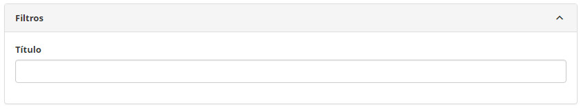
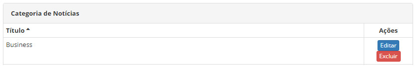
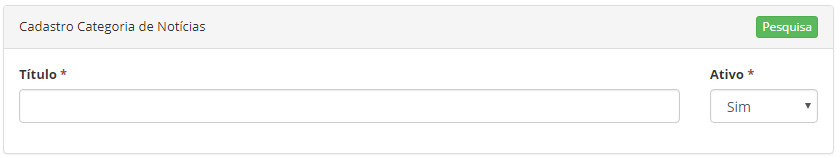

title:  Cadastro e pesquisa de categoria de notícias
Description: Tem o objetivo de registrar as categorias para organização das notícias que serão publicadas no Smart Portal.. 
# Cadastro e pesquisa de categoria de notícias

Esta funcionalidade tem o objetivo de registrar as categorias para organização das notícias que serão publicadas no Smart Portal.

Como acessar
---------------

1. Acesse a funcionalidade de **Categoria de Notícias** através da navegação no menu principal **Cadastros Gerais > Cadastro de 
Notícias > Categoria de Notícias**.

Pré-condições
----------------

1. Não se aplica.

Filtros
----------

1. O seguinte filtro possibilita ao usuário restringir a participação de itens na listagem padrão da funcionalidade, facilitando a 
localização dos itens desejados:

    - Título.

    
    
    **Figura 1 - Tela de pesquisa de categoria de notícias**
    
2. Para realizar a busca de uma categoria de notícias, informe o nome da mesma no campo “Título”. Após isso, será exibido o registro
conforme o nome informado;

3. Para alterar os dados do registro de categoria de notícias, clique no botão "Editar". Feito isso, será direcionado para a tela
de cadastro exibindo o conteúdo referente ao registro selecionado.

Listagem de itens
-------------------

1. O seguinte campo cadastral está disponível ao usuário para facilitar a identificação dos itens desejados na listagem padrão da
funcionalidade: **Título**.

    
    
    **Figura 2 - Tela de listagem de categoria de notícia**
    
2. Existem botões de ação disponíveis ao usuário em relação a cada item da listagem, são eles: "Editar" e "Excluir".

Preenchimento dos campos cadastrais
--------------------------------------

1. Será apresentada a tela de **Categoria de Notícias**;

2. Clique no botão de adicionar nova categoria . Feito isso, será apresentada a tela de **Cadastro
de Categoria de Notícias**, conforme ilustrada na figura a seguir:
 
     
     
     **Figura 3 - Tela de cadastro de categoria de notícias**
     
 3. Preencha os campos conforme orientações abaixo:

    - **Título**: informe o nome da categoria de notícias. Ex.: Economia, Tecnologia;
    - **Ativo**: informa situação da categoria de notícias.
    
4. Após os dados informados, clique no botão de opções   e logo em seguida clique no botão 
 para gravar a categoria de notícias, onde a data, hora e usuário também serão gravados automaticamente para uma futura 
auditoria.

!!! tip "About"

    <b>Product/Version:</b> CITSmart | 7.00 &nbsp;&nbsp;
    <b>Updated:</b>08/08/2019 - Larissa Lourenço
