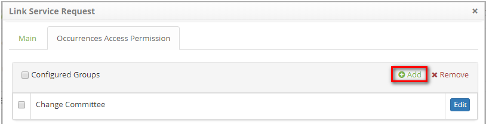
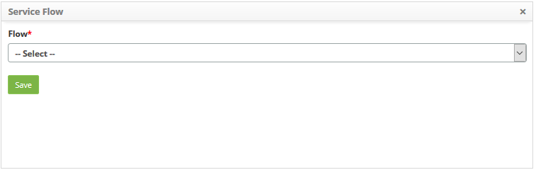
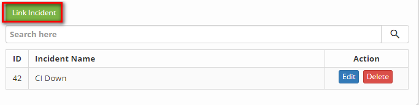
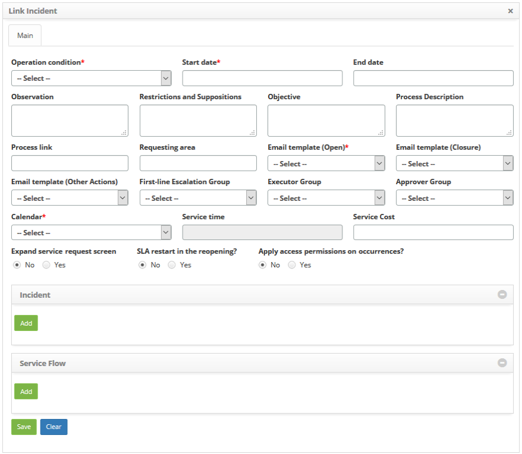

title: Service contract attributes configuration
Description: The guidelines must be followed to configure the attributes of both the *Business/IT Service Agreement* and the Support/Technical Service Agreement.

# Service contract attributes configuration

The guidelines must be followed to configure the attributes of both
the *Business/IT Service Agreement* and the *Support/Technical Service
Agreement*.

Preconditions
-------------

1.  Have permission to access the Portfolio and Catalog Management features (see
    knowledge [Portfolio management access permission][1]);

2.  Have the portfolio with the services registered (see knowledge [Service
    portfolio registration][2], [Service registration][3]);

3.  Have the contract bound to the service (see knowledge [Service attributes
    configuration][4]);

4.  Have the supplier registered (see knowledge [Supplier registration and
    search][5]);

5.  Have the client registered (see knowledge [Customer registration and
    search][6]);

6.  Have the currency registered (see knowledge [Currency registration and
    search][7]);

7.  Have the registered operation condition (see knowledge [Operation condition
    registration and search][8]);

8.  Have the calendar set (see knowledge [Calendar registration and
    search][9]);

9.  Have defined service time (see knowledge [Time attendance registration and
    search][10]);

10. Have e-mail templates defined (see knowledge [E-mail template configuration
    registration and search][11]);

11. Have the workflow defined (see knowledge [Workflow maintenance][12]);

12. Have surveys defined (see knowledge [Satisfaction survey registration and
    search][13]).

Configuring contract attributes
-------------------------------

### How to access

1.  To access the feature click on the main menu **Processes
    Management > Portfolio and Catalog Management > Portfolio
    Management**.

2.  Access the main menu. After that, the Portfolio Management screen will be
    displayed;

3.  Access the Services Portfolio you want by clicking the *Advance* button of
    the same;

4.  Click the *Advance* button of the service to access it. After that,
    the **Service Information** will be displayed;

5.  Click **Contract** and then click the *Advance* button in the service
    contract to access it.

-   The following items will be discussed on "how to" configure contract
    attributes.

### Filters

1.  Not applicable.

### Items list

1.  Not applicable.

### Filling in the registration fields

1.  Following the guidelines in How to Access, the **Contract
    Information** screen will appear, where you can make the necessary settings.
    The figure below illustrates this screen:

   
   
   **Figure 1 - Service agreement configuration screen**

-   **Details**: allows you to check and/or update the contract data;

-   **Requests**: it allows to link the activities of request of the service to
    the contract;

-   **Incidents**: it allows to link the incident activities of the service to
    the contract;

-   **Procedure**: allows to link the procedures of the service to the contract;

-   **Cost of Downtime (Downtime)**: allows to record the value of the time of
    the downtime of the contract services;

-   **Availability Agreement**: it allows to link a service level agreement of
    type "availability" to the contract;

-   **Calendar**: it allows to link a calendar to the contract;

-   **Apportionment**: it allows to report a percentage of apportionment for a
    given service.

Linking request activities to contract
--------------------------------------

### How to access

1.  On the Contract Information screen, click on guide **Requests**. After that,
    a screen will be displayed where you can link the request activity to the
    contract.

### Preconditions

1.  To link the request activities to the contract, they must already be
    registered and linked to the service.

### Filters

1.  The following filter enables the user to restrict the participation of items
    in the standard feature listing, making it easier to find the desired items:

-   Service Request Name.

### Items list

1.  The following cadastral fields are available to the user to make it easier
    to identify the desired items in the standard feature
    listing: **ID** and **Service Request Name**.

2.  There are action buttons available to the user for each item in the listing,
    they are: *Edit* and *Delete*.

**Figure 2 - Contract request link screen**

##### FILLING IN THE REGISTRATION FIELDS

1.  Click on the *Link Service Request* button (according to the previous
    figure). The screen to perform the link for the request activity will be
    displayed, as shown in the figure below:

   
   
   **Figure 3 - Registration screen of the link of the request for contract activity**

2.  Fill in the fields as directed below:

-   **Operation condition**: select the period of availability of the operation
    of the request activity. Example:

-   **24 x 7**: 24 hours a day, 7 days a week, ie, service available all the
    time, without interruption;

-   **Business hours**: available Monday through Friday from 8:00 AM to 6:00 PM.

-   **Start date**: inform the initial date of the request activity in the
    contract;

-   **End date**: the completion of this field can be done at the time of
    registration, informing a future date for inactivation of the request
    activity in the contract or only when inactivating the request activity;

-   **Observation**: describe the possible observations regarding the request
    activity in the contract;

-   **Restrictions and Suppositions**: inform the possible restrictions and
    assumptions for the execution of the request activity in the contract;

-   **Objective**: inform the purpose of the service of request in the contract;

-   **Process Description**: describe the process of the request activity in the
    contract;

-   **Process link**: inform the process designing link of the request activity,
    if any;

-   **Requesting area**: inform who can request the activity of request;

-   **E-mail Template (Open)**: select the open e-mail request template to send
    notification when registering the requests for the request activity;

-   **E-mail Template (Closure)**: select the e-mail template for completing
    requests for notification when you complete the requests for the request
    activity;

-   **E-mail Template (Other Actions)**: select the e-mail template to send
    notification in the other actions performed in the requests regarding the
    activity of request;

-   **First-line Escalation Group**: select the 1st level group to escalate the
    attendance of the request activity;

-   **Executor Group**: define the executing group of the request activity, if
    it does not inform it, the group defined in parameter "9 - ID Group Level 1"
    will be considered;

-   **Approver Group**: define the approving group of the requests of the
    activity of request;

-   **Satisfaction Survey**: define the survey linked to the activity;

-   **Calendar**: Select the work schedule for the request activity.

-   **Service Time**: inform the attendance time of the request activity;

-   **Service Cost**: state the value of the request activity;

-   **Expand service request screen**: if you want the request service request
    screen to be enlarged, check the "yes" option;

-   **SLA restart in the reopening**: define whether the time for attending the
    activity will be restarted when reopening the request of the same;

-   **Apply access permissions on occurrences?**: define whether occurrences of
    requests/incidents will be shown for specific groups of users, or whether
    all users view all occurrences. If the **Apply access permissions on
    occurrences?** has your "Yes" option selected, a new tab appears next to the
    Main tab:

   
   
   **Figure 4 - Permissions tab**

-   When clicking on the new tab a list of Groups that have already had their
    permission configured:

   
   
   **Figure 5- List of linked groups with configured permission**

-   When clicking on *Add* (according to the previous figure) a panel with all
    occurrence categories appears to allow the Administrator to select the ones
    that should be released to the selected Group:

    
      
    **Figure 6- Selection panel of occurrence categories and target group**

   !!! note "NOTE"

     This setting does not change the appearance of other system features at
     all, it only restricts some records from being viewed by users who are not
     in the released groups to the occurrence category.

-   Add the request activity:

-   In the **Request** section, the service request activities are shown, leave
    only those that will be linked to the contract;

-   If I have removed a request activity and want to link it to the agreement,
    click the *Add* button. A window will appear to search for service request
    activities. Perform the search, select the request activity, and click
    the *Submit* button to link the activity to the contract.

-   Add the workflow of the request activity:

-   In the **Service Flow** section, click the *Add* button. A screen will be
    displayed to inform the flow of the request activity (s), as shown in the
    figure below:

   
   
   **Figure 7 - Workflow Log**

-   Select the flow that the activity should follow and click the *Save* button
    to perform the operation.

3.  After entering the required data, click the *Save* button (according to the
    previous figure) to perform the operation. Once this has been done, the
    request activity (y) will be linked to the contract;

4.  To change the link activity data for the request activity with the contract,
    click the *Edit* button of the contract record;

5.  To delete the link from the request activity with the contract, simply click
    on the *Delete* button in the contract record.

Linking incident activities to the contract
-------------------------------------------

### How to access

1.  On the guide **Contract** Information screen, click on *Advance*, after this
    click on the guide **Incidents**. After that, the screen where you can link
    the incident activity to the contract will be displayed.

### Preconditions

1.  In order to link the incident activities to the contract, they must already
    be registered and linked to the service.

### Filters

1.  The following filter enables the user to restrict the participation of items
    in the standard feature listing, making it easier to find the desired items:

-   Incident Name.

### Items list

1.  The following cadastral fields are available to the user to make it easier
    to identify the desired items in the default listing of the
    functionality: **ID** and **Incident Name**.

2.  There are action buttons available to the user for each item in the listing,
    they are: *Edit *and *Delete*.

**Figure 8 - Contract incident activity link screen**

### Filling in the registration fields

1.  Click on the *Link Incident* button (according to the previous figure). The
    screen for linking the incident activity will be displayed, as shown in the
    figure below:

   
   
   **Figure 9 - Link incident activity link record screen**

2.  Fill in the fields according to the guidelines described in the previous
    item "Linking request Activities to the Contract";

3.  After entering the required data, click the *Save* button to perform the
    operation. Once this is done, the incident activity will be tied to the
    contract.

Linking service procedure to contract
-------------------------------------

### How to access

1.  On the guide Contract Information screen, click on the guide **Procedure**.
    After that, the screen will appear where you can link the procedure to the
    contract.

### Preconditions

1.  In order to link the procedures to the contract, they must already be
    registered and linked to the service.

### Filters

1.  The following filter enables the user to restrict the participation of items
    in the standard feature listing, making it easier to find the desired items:

-   Procedure Name.

### Items list

1.  The following cadastral fields are available to the user to make it easier
    to identify the desired items in the default listing of the
    functionality: **ID** and **Procedure Name**.

2.  There are action buttons available to the user for each item in the listing,
    they are: *Edit* and *Delete*.

**Figure 10 - Contract procedure link screen**

### Filling in the registration fields

1.  Click the *Link Procedure* button (according to the previous figure). The
    screen to perform the procedure link will be displayed, as shown in the
    figure below:

   
   
   **Figure 11 - Registration screen of the link of procedure to contract**

2.  Fill in the fields as described in the item "Linking request Activities to
    the Contract";

3.  After entering the required data, click the *Save* button to perform the
    operation. Once this is done, the procedure will be linked to the contract.

Registering cost of downtime
----------------------------

### How to access

1.  On the Contract Information screen, click on the guide **Cost of Downtime
    (Downtime)**. After that, a screen will be displayed to record the cost of
    contract downtime.

   
   
   **Figure 12 - Time downtime value record screen**

2.  Enter the time value of the downtime of contract services. After that, click
    the *Save* button to register.

### Filters

1.  Not applicable.

### Items list

1.  Not applicable.

### Filling in the registration fields

1.  Not applicable.

Linking availability agreement to contract
------------------------------------------

### How to access

1.  On the Contract Information screen, click **Availability Agreement**. After
    that, the screen where you can link the service level agreement of type
    "availability" to the contract will be displayed.

### Filters

1.  The following filter enables the user to restrict the participation of items
    in the standard feature listing, making it easier to find the desired items:

-   SLA Title .

### Items list

1.  The following cadastral fields are available to the user to make it easier
    to identify the desired items in the default listing of the
    functionality: **ID**, **SLA Title**, **Availability Index**, **Start
    Date** and **End Date**;

2.  There are action buttons available to the user in relation to each item in
    the listing, they are: *Deactivate*;

3.  Click the *Link Availability Agreement* button. Once this is done, the
    "availability" service level agreement search screen will be displayed.
    Perform the search and select the availability agreement you want to perform
    the operation. Once this is done, the agreement will be tied to the
    contract;

   
   
   **Figure 13 - Availability agreement screen**

4.  To delete the link from the availability agreement with the contract, simply
    click the *Deactivate* button.

### Filling in the registration fields

1.  Not applicable.

Linking calendar to contract
----------------------------

### How to access

1.  On the Contract Information screen, click **Calendar**. After that, the
    screen where you can link the calendar to the contract will be displayed.

##### Filters

1.  The following filter enables the user to restrict the participation of items
    in the standard feature listing, making it easier to find the desired items:

-   Name.

### Items list

1.  The following cadastral fields are available to the user to make it easier
    to identify the desired items in the standard feature
    listing: **ID**, **Name**, **Start Date**, and **End Date**;

2.  There are action buttons available to the user in relation to each item in
    the listing, they are: *Deactive;*

3.  Click the *Link Calendar* button. Once this is done, the calendar search
    screen will be displayed. Perform the search, select the desired calendar,
    and click the Add button to perform the operation. Once this is done, the
    calendar will be linked to the contract.

   
   
   **Figure 14 - Calendar link to contract screen**

4.  To delete the calendar link to the contract, simply click
    the *Deactivate* button.

### Filling in the registration fields

1.  Not applicable.

Linking apportionment to contract
---------------------------------

*Apportionment is the percentage that the contract pays on the Contracted
Business Service*.

### How to access

1.  On the Contract Information screen, click on the Apportionment tab and after
    that, the screen where you can link the apportionment to the agreement will
    be displayed.

### Preconditions

1.  It is necessary to allow access to the apportionment option
    (see knowledge [Portfolio management access
    permission][1]).

### Filters

1.  Not applicable.

### Items list

1.  The following cadastral fields are available to the user to make it easier
    to identify the desired items in the standard feature
    listing: **Percent** and **Cycle**;

2.  There are action buttons available to the user in relation to each item in
    the listing, they are: *Edit *and *Delete*;

**Figure 15 - Apportionment link Screen**

### Filling in the registration fields

1.  Click on the *Add Apportionment* button (according to the previous figure).
    Once this is done, the apportionment registration screen will be displayed,
    as shown in the figure below:

   
   
   **Figure 16 - Apportionment registration screen**

2.  Fill in the fields as directed below:

-   **Percentage**: report a percentage from 1 to 100%.

    !!! note "NOTE"

        The percentage must be above 0%.

-   **Cycle**: describe the cycle linked to the apportionment.

   !!! note "NOTE"

      Apportionment with different percentages are not allowed for the same
      cycle in the same service/business/contract.

      Apportionment registrations or changes whose cycles are already closed are
      not allowed.

3.  Click the *Save* button to perform the operation;

4.  To change the data of the apportionment link (already registered) with the
    contract, click the *Edit* button of it's record.

   !!! info "IMPORTANT"

     When editing, is possible to change the Percentage and Cycle fields, but
     this percentage must be above 0%.

5.  To exclude the apportionment link to the contract, simply click
    the *Delete* button in the contract record.

!!! note "NOTE"

    It's no possible to exclude an apportionment whose cycle has services
    terminated with the registered configurations.

[1]:/en-us/citsmart-platform-7/processes/portfolio-and-catalog/portfolio-access.html
[2]:/en-us/citsmart-platform-7/processes/portfolio-and-catalog/register.html
[3]:/en-us/citsmart-platform-7/processes/portfolio-and-catalog/services.html
[4]:/en-us/citsmart-platform-7/processes/portfolio-and-catalog/configure-service-attribute.html
[5]:/en-us/citsmart-platform-7/processes/portfolio-and-catalog/provider.html
[6]:/en-us/citsmart-platform-7/processes/portfolio-and-catalog/client.html
[7]:/en-us/citsmart-platform-7/additional-features/contract-management/configuration/currency.html
[8]:/en-us/citsmart-platform-7/processes/portfolio-and-catalog/operating-condition.html
[9]:/en-us/citsmart-platform-7/plataform-administration/time/create-calendar.html
[10]:/en-us/citsmart-platform-7/processes/service-level/time-attendance.html
[11]:/en-us/citsmart-platform-7/plataform-administration/email-settings/configure-email-template.html
[12]:/en-us/citsmart-platform-7/workflow/workflow-management.html
[13]:/en-us/citsmart-platform-7/additional-features/surveys-and-feedback/satisfaction-survey-registration.html

!!! tip "About"

    <b>Product/Version:</b> CITSmart | 8.00 &nbsp;&nbsp;
    <b>Updated:</b>09/01/2019 – Anna Martins
