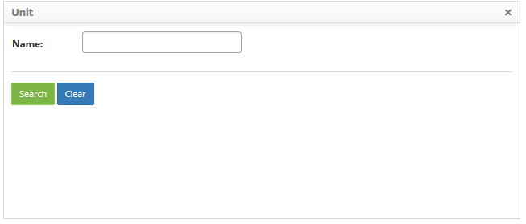
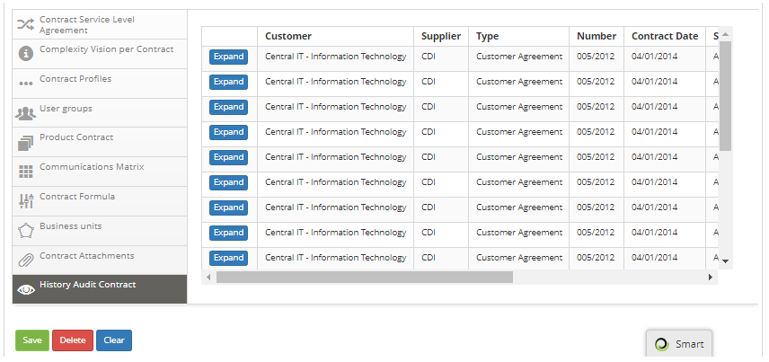

title: Contract registration
Description: The contract is an agreement between two parties, which undertake
to comply with what was agreed between them under certain conditions.

# Contract registration

The contract is an agreement between two parties, which undertake to comply with
what was agreed between them under certain conditions. The contract may be of
the *contract* type (contract between the service provider type and external
customer), *operational level agreement* (internal agreement between departments
of the same organization, internal provider with internal customer) or *support
agreement* (contract between External provider and internal customer).

How to access
-------------

1.  Access the feature click on the main menu **Processes Management > Portfolio and Catalog Management > Contract Registration**.

Preconditions
-------------

1.  Have the provider registered (see knowledge [Supplier registration and
    search][1]);

2.  Have the client registered (see knowledge [Customer registration and
    search][2]);

3.  Have the currency registered (see knowledge [Currency registration and
    search][3]);

4.  Have the operation condition registered (see knowledge [Operation condition
    registration and search][4]).

Filters
-------

1.  The following filter enable the user to restrict the participation of items
    in the standard feature listing, making it easier to locate the desired
    items as shown in the figure below:

-   Contact number.

2.  On the **Contracts** screen, click the **List** tab. The search screen will
    be displayed, as shown in the figure below:

   
   
   **Figure 1 - Contract search screen**

3.  Perform contract search;

-   Enter the contract number and click the *Search* button. After that, the
    contract record will be displayed according to the number entered.

-   If you want to list all the contract records, simply click
    the *Search* button directly.

Items list
----------

1.  The following registration fields are available to the user to make it
    easier to identify the desired items in the standard feature
    listing: Contract Number, Customer Name, and Supplier.

   
   
   **Figure 2 - Item screen**

2.  After searching, select the desired record. Once this is done, it will be
    directed to the registration screen displaying the contents of the selected
    registry;

3.  To change the contract record data, simply modify the information of the
    desired fields and click the *Record* button to make the change made to the
    record.

Filling in the registration fields
----------------------------------

1.  After accessing the functionality, the Contract Master screen will be
    displayed, as shown in the figure below:

   
   
   **Figure 3 - Contract Master Screen**

2.  Fill in the fields as directed below:

    a) **Type of Agreement/Contract**: select the type of agreement/contract;

       -  **Contract**: refers to the contract between the contracting company and
        the company providing services. When selecting this type, only suppliers
        of type "service provider" will be available in the "supplier" field,
        and in the "client" field only "external" clients will be available for
        selection.

       -  **Operational Level Agreement**: refers to the internal agreement
        between the departments of the same company. When selecting this type,
        only the "internal" type suppliers will be available in the "supplier"
        field and in the "client" field only the "internal" type clients for
        selection.

       -  **Underpinning Contract**: refers to the contract between the service
        provider and a third party, external supplier. When selecting this type,
        only suppliers of the "external" type will be available in the
        "supplier" field and in the "client" field only the "internal" clients
        will be available for selection.

    b)  **Supplier**: please inform the service provider;

    c)  **Customer**: inform the client, who contracted/requested the services;

    d)  **Supervisor**: inform the supervisor of the contract, that is, the person
    designated to monitor and supervise the contractual execution for the
    purpose for which it is intended;

    e)  **Manager**: inform the manager of the contract, ie the person responsible
    for managing the contract;

    f)  **Requester Group**: select the group of employees who can request services
    in the contract;

    g)  **Number**: provide the quantitative identification number of the contract;

    h)  **Status**: select the situation of the contract;

    i) **Currency**: select currency;

       -   **Real**: official Brazilian currency;

       -   **UST**: Technical Service Unit, monetary quantification regarding the
        services used in certain federal public contracts, according to IN04, or
        others that may serve as metrics for the valuation of service.

    j) **Currency Quotation (quote)**: enter the currency quote. In the case of the
    use of the UST or other correspondent, quantify the value referring to 1
    unit of the currency. If the value is in Real, the quotation should remain R
    \$ 0.00;

    k) **Estimated Contract Value**: enter the value considered for the contract;

    l) **Monthly Contract Value**: show the result of the calculation;

!!! info "IMPORTANT"

    The Monthly Contract Value field is relevant to the financial assets
    management in CITSmart Enterprise ITSM and its calculation takes into
    account: the total value and the start and end dates of the contract.

m)  **Starts**: state the date the contract was made;

n)  **Ends**: state the date it was stipulated for the end of the contract;

o)  **Renewal**: inform the date of the revision / renewal of the contract;

p)  **Support Hours**: enter the availability time of the support for the
    execution of the service;

q)  **E-mail**: enter the registered e-mail outbox;

r)  **Register new user?**: inform if the system operator can register users of
    services that are not previously registered in the system at the time of
    registration of the request;

s)  **Scope**: describe the scope of the contract, that is, what it is intended
    to achieve;

t)  **Object**: give the generic description of the services included in the
    contract;

u)  Add the additional information of the contract. This information can be
    entered at the time of registration of the contract or later as required.

Liking contract service level agreement
---------------------------------------

**Contract Service Level Agreement**: allows you to specify what was areed in
the contract between the service provider and the customer.

1.  Click the **Contract Service Level Agreement** tab, and then click
    the *New* button. Once this is done, the service level agreement screen will
    be displayed, as shown in the figure below:

   
   
   **Figure 4 - Additional Information - Contract Service Level Agreement Registration**

-   **Agreement Description**: describe what was agreed in the agreement, in a
    macro manner. Example: Monthly availability of services to critical services

-   **Start date**: enter the start date of the agreement. This date may differ
    from the date of the contract itself, as agreements can be inserted later;

-   **End date**: please provide the expected end date of the agreement;

-   **Value Limit**: enter the value limit for gloss. This value can be a
    percentage of attendance or number of events. Example: the service must
    reach 99.7% of availability per month or up to 4 incidents of the contracted
    organization may occur in the month. The excess of this limit will be
    penalized with the value specified in the Description of Glory.

-   **Currency**: enter the unit of the value limit for gloss. Example:
    percentage or quantity of events;

-   **Agreement Details**: describe the details of what was agreed in the
    agreement. Example: Availability of use for critical services should be
    24x7;

-   **Penalty Description**: describe the percentages to be paid on the value of
    the contract in case of non-compliance with the agreement. Example: 0.5%
    gloss for every tenth of service failure or 0.2% for each reporting failure
    above the target up to 10 occurrences, 0.5% up to 20 occurrences, etc.

-   After entering the required data, click *Add* to add the service level
    agreement to the agreement.

Liking vision of contract complexity
------------------------------------

**Vision of Contract Complexity**: allows to identify the values of complexity
referring to the operational costs of the contract. It is widely used in the
case of the management of the Orders of Services related to the UST currency.

1.  Click the** Complexity By Contract** tab, and after that, click on the
    complexity that you want to enter the value;

   
   
   **Figure 5 - Complementary Information - Complexity View**

-   **Value Complexity**: tell how much each level of complexity is worth for
    organization. Example: high = 6, low = 1, expert = 10.

-   If you want to remove complexity value, click *Clear*.

Liking contract profiles
------------------------

**Contract Profiles**: allows defining the profiles of the professionals that
will be fundamental for the development of a project related to the contract;

1.  Click the **Contract Profiles** tab, and then click the *New* button. Once
    this is done, the screen will be displayed to register the profile of the
    professional, as shown in the figure below:

   
   
   **Figure 6 - Supplementary Information - Contract Profiles Registration**

-   **Cost per Hour**: enter the cost of the working time relative to the
    function that will be performed in the project;

-   **Description**: enter the description of the function required for the
    project. Example: Systems Analyst, Development Analyst and others.

-   After the data is entered, click *Add* to add the professional profile to
    the contract.

Liking user groups
------------------

**User Groups**: allows you to link groups to the contract.

1.  Click the **User Groups** tab, and then click *New*. Once this is done, the
    screen will be displayed to link employee group (s) to the contract, as
    shown in the figure below:

    -   Enter the group and click the *Add* button to link it to the agreement.

Liking contract products
------------------------

**Contract Products**: allows you to specify project deliverables related to the
contract.

1.  Click the **Contract Products** tab, and then click the *New* button. After
    that, the screen for product registration will be displayed, as shown in the
    figure below:

   
   
   **Figure 8 - Supplementary Information - Product Registration**

-   Inform the product description, referring to the project, that will be
    delivered. Example: documentation, deploy, script, workflow and so on.

-   Click the *Add* button to add it to the agreement.

Liking matrix communication
---------------------------

**Matrix Communication**: allows to define which documents will be communicated,
to which stakeholders, at what frequency (when) and by what means (like).

1.  Click the **Communication Matrix** tab, and then click the *New* button.
    After that, the communication matrix register screen will be displayed, as
    shown in the figure below:

   
   
   **Figure 9 - Complementary Information - Communication Matrix Registration**

-   **Group involved**: inform the group that should receive the information.
    Example: users, stakeholders, suppliers, sponsors, etc.;

-   **Responsibilities**: inform those responsible for the information. Example:
    project manager, systems analyst, etc.;

-   **Evidence**: select the type of record to be reported;

-   **Frequency**: inform when communication should occur;

-   **Contact type**: select the means of communication;

-   After the entered data, click the *Add* button to add the communication
    matrix to the contract.

Liking contract formula
-----------------------

**Contract Formula**: allows you to link formulas to the contract. These
formulas are used to obtain the value of the total cost of the contract service
activities.

1.  Click the **Contract Formula** tab and click the *New* button. After that,
    the link screen of the formula in the contract will be displayed;

   
   
   **Figure 10 - Complementary Information - Linking Formulas**

-   Perform the search for the formula that will be used to obtain the value of
    the total cost of the service activity(s) of the contract;

-   After the search, select the formula for addition in the contract.

Liking business units
---------------------

**Business Units**: allows the link of business units to the contract.

1.  Click the **Business Units** tab, and then click the *Add* button. After
    that, the screen to link business unit (s) to the contract will be
    displayed, as shown in the figure below:

  
  
  **Figure 11 - Complementary Information - Linking Business Units**

-   Perform the unit search and after that, select the unit to link to the
    contract.

Liking attachaments
-------------------

**Attachments Contract**: allows you to attach files to the contract.

1.  Click the Attachments tab, and after that, the file attachment area will be
    displayed, as shown in the figure below:

  
  
  **Figure 12 - Additional Information - File Attachment**

2.  Enter the description of the attachment, click the *Add File* button and
    select the desired file;

    -   After that, the file will be added to the contract.

3.  After the entered contract data, click the *Record* button to register,
    where the date, time and user will be saved automatically for a future
    audit.

Verifying the history audit contract
------------------------------------

1.  Every time a change is made to the agreement, this change is recorded in the
    history for a future audit. The figure below illustrates the record of
    changes made to the contract:

**Figure 13 - Contract History**

[1]:/en-us/citsmart-platform-7/processes/portfolio-and-catalog/provider.html
[2]:/en-us/citsmart-platform-7/processes/portfolio-and-catalog/client.html
[3]:/en-us/citsmart-platform-7/additional-features/contract-management/configuration/currency.html
[4]:/en-us/citsmart-platform-7/processes/portfolio-and-catalog/operating-condition.html

!!! tip "About"

    <b>Product/Version:</b> CITSmart | 8.00 &nbsp;&nbsp;
    <b>Updated:</b>08/30/2019 – Anna Martins
