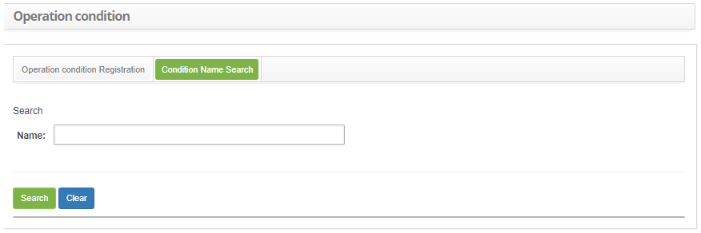
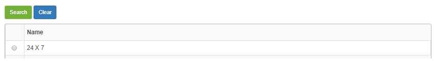
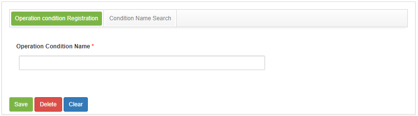

title: Operation condition registration and search
Description: This feature is intended to record and search the availability of the service operation.

# Operation condition registration and search

This feature is intended to record and search the availability of the service
operation.

How to access
-------------

1.  Access the Operation Condition functionality through navigation in the main
    menu **Processes Management > Portfolio and Catalog Management > Operating
    Condition**.

Preconditions
-------------

1.  No applicable.

Filters
-------

1.  The following filter enables the user to restrict the participation of items
    in the standard feature listing, making it easier to find the desired items:

-   Name.

2.  In the **Operation Condition** screen, click on the **Operation Condition
    Search** tab.

   
   
   **Figure 1 - Operation condition search screen**

3.  Perform the operation condition search;

-   Enter the description of the operation condition you want to search and
    click the *Search* button. After this, the record will be displayed
    according to the name entered;

-   If you want to list all the operating conditions, simply click
    the *Search* button directly.

Items list
----------

1.  The following cadastral field is available to the user to facilitate the
    identification of the desired items in the standard feature
    listing: **Name**.

   
   
   **Figure 2 - Operation condition list**

2.  After searching, select the desired record. Once this is done, it will be
    directed to the registration screen displaying the contents of the selected
    registry.

Filling in the registration fields
----------------------------------

1.  The Operation Condition screen will be displayed, as shown below:

   
   
   **Figure 3 - Operation condition screen**

2.  Provide a description of the condition of service operation. e.g.: 24 x 7 or
    Business Hours;

3.  Click the *Save* button to register, where the date, time and user will be
    saved automatically for a future audit.

!!! tip "About"

    <b>Product/Version:</b> CITSmart | 8.00 &nbsp;&nbsp;
    <b>Updated:</b>08/30/2019 – Anna Martins
