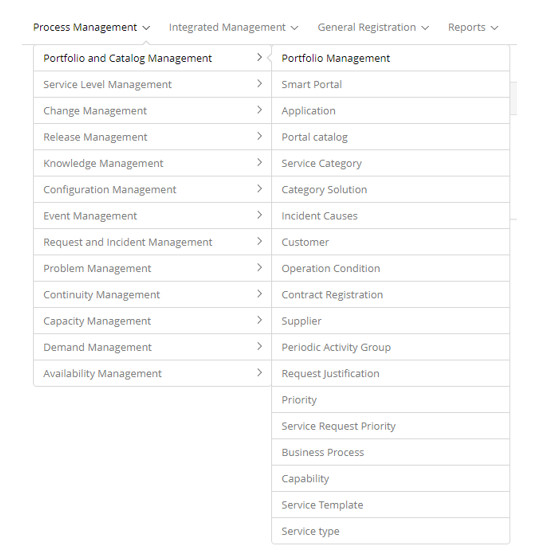

title:  Portfolio and Catalog Management module
Description: The Service Portfolio Management process is responsible for managing the service portfolio . 
# Portfolio and Catalog Management module

Module objective
---------------------

*Service portfolio management*

The Service Portfolio Management process is responsible for managing the service portfolio throughout the life cycle of a 
service, focusing on the value that services deliver to the business.

The Portfolio is the representation of all services and their status. It's command is a dynamic method for managing investment in 
service management throughout the organization and directing those investments to generate value.

*Service catalog management*

Service Catalog Management is intended to maintain the services provided to customers in an integrated manner with all service 
management activities and to provide customers with a view of what services the service provider provides.

The Service Catalog is a subset of the portfolio, listing all IT services in production, including those available for release. 
It is the only part of the Portfolio published for customers used to support the sale and delivery of IT services and includes 
information on deliverables, pricing and contact points.

Where are the features
---------------------------------

To access the functionality click on the main menu **Process Management > Portfolio and Catalog Management**.

**Figure 1 -Portfolio and Catalog Management module menu**

Main feature (in highlight)
----------------------------------------

In the *See also* section you can access the main functionality(ies) of this module, in order to obtain a more detailed 
knowledge.

See also
--------------

- [Service portfolio registration](/en-us/citsmart-platform-7/processes/portfolio-and-catalog/register.html)

!!! tip "About"

    <b>Product/Version:</b> CITSmart | 7.00 &nbsp;&nbsp;
    <b>Updated:</b>09/13/2019 - Larissa Lourenço
