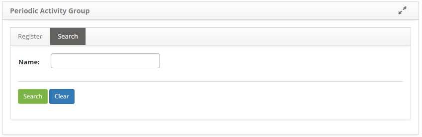

title: Periodic activity group registration and search
Description: This functionality is intended to record the periodic activity groups, which are responsible for performing the periodic activities.

# Periodic activity group registration and search

This functionality is intended to record the periodic activity groups, which are
responsible for performing the periodic activities.

How to access
-------------

1.  Access the Periodic Group functionality through navigation in the main
    menu **Processes Management > Portfolio and Catalog Management > Periodic Activation Group**.

Preconditions
-------------

1.  Not applicable.

Filters
-------

1.  The following filter enable the user to restrict the participation of items
    in the standard feature listing, making it easier to locate the desired
    items as shown in the figure below:

-   Name.

2.  On the Periodic Group Group screen, click the **Search** tab. The respective
    search screen will be displayed as shown in the figure below:

   
   
   **Figure 1 - Periodic activity group search screen**

3.  Perform periodic activity group search:

-   Enter the name of the periodic activity group and click the *Search* button.
    After this, the record will be displayed according to the name entered;

-   If you want to view all periodic activity group records, simply click
    directly on the *Search* button.

Items list
----------

1.  The following cadastral fields are available to the user to facilitate the
    identification of the desired items in the standard list of
    functionality: **Code**, **Name** and **Description**, as shown in the
    figure below:

   
   
   **Figure 2 - Items screen**

2.  After searching, select the desired record. Once this is done, you will be
    directed to the registration screen displaying the contents of the selected
    record;

3.  To change the periodic activity group record data, simply modify the desired
    information and click the *Record* button to save the change made to the
    record, where the date, time and user will be saved automatically for a
    future audit.

Filling in the registration fields
----------------------------------

1.  Access the feature, after that, the **Periodic Activity Group
    Master** screen will be displayed, as shown in the figure below:

   
   
   **Figure 3 - Periodic activity group master record screen**

2.  Fill in the fields as shown below:

-   **Name**: enter the name of the periodic activity group;

-   **Description**: enter the description of the periodic activity group;

-   **Start Date**: enter the start date of the periodic activity group.

3.  Click the *Save* button to register, where the date, time and user will be
    saved automatically for a future audit.

!!! tip "About"

    <b>Product/Version:</b> CITSmart | 8.00 &nbsp;&nbsp;
    <b>Updated:</b>08/30/2019 – Anna Martins
