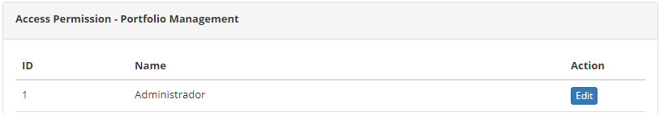
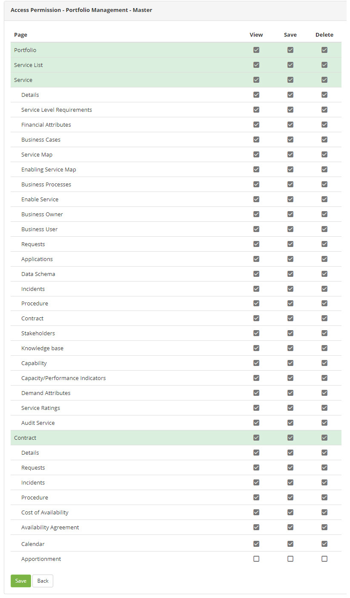

title: Portfolio management access permission
Description: The Portfolio Management feature allows to determine who will have access to the features of the Portfolio Management and which access type is allowed.

# Portfolio management access permission

ITIL recommends that an ITSM product be able to assign specific levels of
responsibilities to a Portfolio Manager or others, based on this recommendation,
CITSmart adopts this differentiated form of permissions control, per module. It
is worth mentioning that the 'Access Profile' functionality continues to exist
and it controls all types of access without unbundling by modules so that the
product administrator can intervene more properly whenever necessary.

The Portfolio Management feature allows to determine who will have access to the
features of the Portfolio Management and which access type is allowed (view,
save and/or delete).

How to access
-------------

1.  Access the Portfolio Management access permission feature navigating through
    the main menu **Access and Permission > Portfolio Management**.

Preconditions
-------------

1.  Have an Access Profile registered (see knowledge [Acess profile registration
    and search][1]).

Filters
-------

1.  Not applicable.

Items list
----------

1.  The following cadastral fields are available to the user to facilitate the
    identification of the desired items in the standard feature
    listing: **ID** and **Name**.

2.  There is an action button available to the user in relation to each item in
    the listing, it is: *Edit*.

3.  The screen to determine the **Access Permission** will be displayed, which
    lists the **Access Profiles** already registered in the database.The image
    below illustrates this screen:

   
   
   **Figure 1 - Access permission screen - Portfolio manager**

4.  Click on the *Edit* button of an access profile to determine the type of
    access to the Portfolio Management. Afterwards, the features of the
    Portfolio Management will be displayed, as illustrated on the image below:

Filling in the registration fields
----------------------------------

1.  For each feature of the Portfolio Management, select the actions (view, sabe
    and/or delete) available to the user:

   
   
   **Figure 2 - Access type determination**

-   **View**: the user with this profile can make queries and view the data;

-   **Save**: the user with this profile can do the "Search" and also include
    and change the data;

-   **Delete**: the user with this profile can "Save" and delete the system
    data.

   !!! warning "ATTENTION"

      When determining the type of access profile, by marking/unmarking a
     checkbox, all checkboxes that are subordinate to it in the structure are
     also marked/unmarked cascade.

   !!! info "IMPORTANT"

     The access profiles will be disabled (the checkboxes of all pre-existing
     access profiles will be unchecked), by default, when new features are
     created, thus requiring the administrator to explicitly enable this for the
     profiles you want, making it available for the desired profiles.

2.  After determining the access permission, click on the *Save* button to
    confirm the entry, where date, time and user will be stored automatically
    for a future audit.

!!! info "IMPORTANT"

    The exclusions executed in the product are logical (and not physical), so
    in extreme cases there is how to recover something excluded, but this will
    require technical support from an analyst/consultant.

    
!!! tip "About"

    <b>Product/Version:</b> CITSmart | 7.00 &nbsp;&nbsp;
    <b>Updated:</b>09/03/2019 - Anna Martins

[1]: /en-us/citsmart-platform-7/initial-settings/access-settings/profile/user-profile.html
