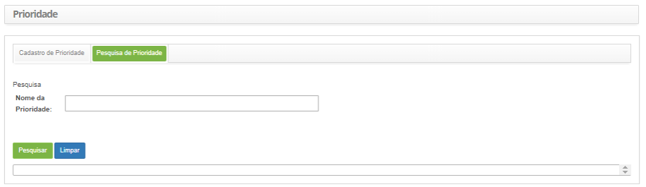
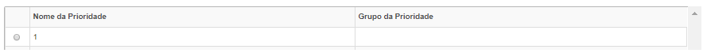
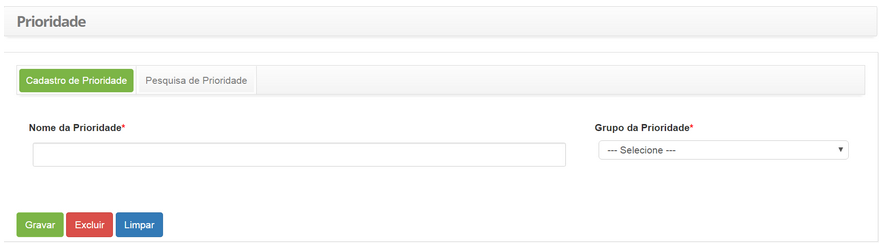

title: Priority registration and search
Description: This feature allows you to define the priority which will be used to identify the importance of the service and identify the times required for appropriate action to be taken.

# Priority registration and search

This feature allows you to define the priority which will be used to identify
the importance of the service and identify the times required for appropriate
action to be taken.

The priority should be 1 to 5, with 1 being the highest priority and 5 being the
lowest.

How to access
-------------

1.  Access the Priority functionality through navigation in the main
    menu **Processes Management > Portfolio and Catalog Management >
    Priority**.

Preconditions
-------------

1.  Not applicable.

Filters
-------

1.  The following filters enable the user to restrict the participation of items
    in the standard feature listing, making it easier to locate the desired
    items as shown in the figure below:

-   Priority Name.

2.  On the **Priority** screen, click on the **Priority Search** tab, as shown
    below:

   
   
   **Figure 1 - Priority search screen**

3.  Perform priority search;

4.  Enter the name of the priority you want to search and click
    the *Search* button. After this, the record will be displayed according to
    the name entered;

5.  If you want to list all the priority records, simply click
    the *Search* button directly.

Items list
----------

1.  The following cadastral fields are available to the user to make it easier
    to identify the desired items in the default listing of
    functionality: **Priority Name** and **Priority Group**.

   
   
   **Figure 2 - Items Screen**

2.  After searching, select the desired record. Once this is done, it will be
    directed to the registration screen displaying the contents of the selected
    registry.

Filling in the registration fields
----------------------------------

1.  After accessing functionality, the **Priority Registration **screen will be
    displayed, as shown in the figure below:

   
   
   **Figure 3 - Priority registration Screen**

2.  Fill in the fields as shown below:

-   **Priority Name**: enter the priority ID, e.g.: 1;

-   **Priority Group**: select the priority group to which priority will belong.

3.  Click the *Save* button to register, where the date, time and user will be
    automatically saved for a future audit.

!!! tip "About"

    <b>Product/Version:</b> CITSmart | 8.00 &nbsp;&nbsp;
    <b>Updated:</b>08/30/2019 – Anna Martins
