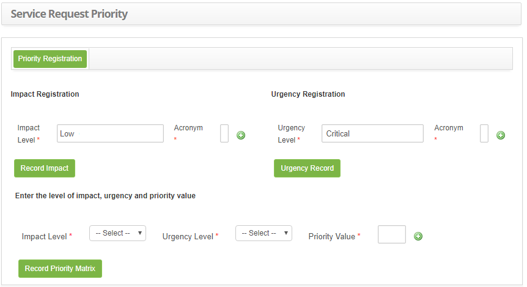
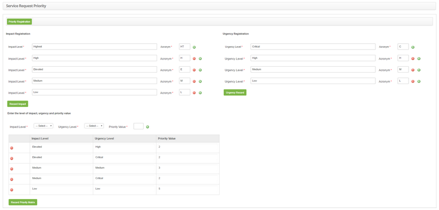

title: Service requests priority registration
Description: The Service Request Priority feature allows you to set the priority array to dynamically calculate service request time (SLA) for the service request. 

# Service requests priority registration

The Service Request Priority feature allows you to set the priority array to
dynamically calculate service request time (SLA) for the service request.
Priority will be used to identify the relative importance of the service request
and to identify the times required for appropriate action to be taken.

How to access
-------------

1.  Access the Service Requests Priority functionality by navigating the main
    menu **Processes Management > Portfolio and Catalog Management > Priority
    Service Requests**

Preconditions
-------------

1.  Set the parameter bellow (see knowledge [Parameterization rules -
    Ticket][1]):

-   Parameter 104: value Y.

Filters
-------

1.  No applicable.

Items list
----------

1.  Not applicable.

Filling in the registrations fields
-----------------------------------

1.  After this, the **Service Requests Priority** screen will be displayed, as
    shown in the figure below:

   
   
   **Figure 1 - Service requests priority master record screen**

2.  Fill in the fields as shown below:

    a)  Impact Register:

       -  **Acronym**: report the acronym related to the impact level;

       -  **Impact Level**: describe the level of impact. Example: High,
            Medium, Low;

   !!! note "NOTE"

      You can add several levels of impact according to your need, just click on
      the positive "+" icon.

-   After reporting impact levels, click the *Record Impact* button to perform
    the operation.

   b)  Emergency Registration:

   -  **Emergency Level**: set the level of urgency. Example: High, Medium,
        Low;

   -  **Acronym**: enter the acronym for the level of urgency;

   !!! note "NOTE"

       You can add several levels of urgency according to your need, just click on
       the icon .  

-   After reporting the urgency levels, click the *Urgency Record *button to
    perform the operation.

   c)  Priority Matrix Registration:

   - Click the Register Priority Matrix button. Once this is done, the fields
        to define the priority matrix;

        -  **Impact Level**: select the impact level;

        -  **Emergency Level**: select the level of urgency;

        -  **Priority Value**: define the priority value, based on the impact
            and urgency informed. Remembering that this value should be from 1
            to 5, with 1 being the highest priority and 5 being the lowest;

   d)  Once this is done, click the icon  to add the priority information in the
    array;

   e)  After setting the priority array, click the *Record Priority Matrix* button
    to perform the operation.

  
  
  **Figure 2 - Priority record of service requests**

!!! note "NOTE"

    After registration of the priority matrix, when registering a service
    request, the service time (SLA) will be established according to the level
    of impact and urgency level reported, being considered the priority matrix.
    Remember that for this to occur parameter must be enabled.

   
[1]:/en-us/citsmart-platform-7/plataform-administration/parameters-list/parametrizaion-ticket.html   
   
!!! tip "About"

    <b>Product/Version:</b> CITSmart | 8.00 &nbsp;&nbsp;
    <b>Updated:</b>09/02/2019 – Anna Martins

