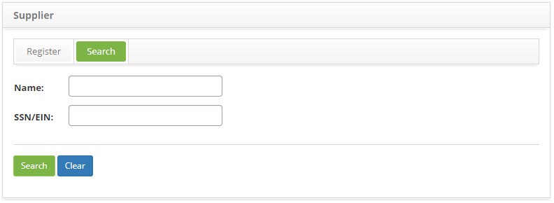
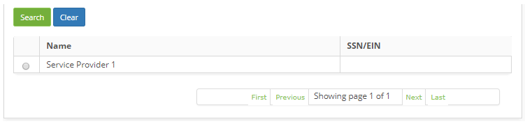
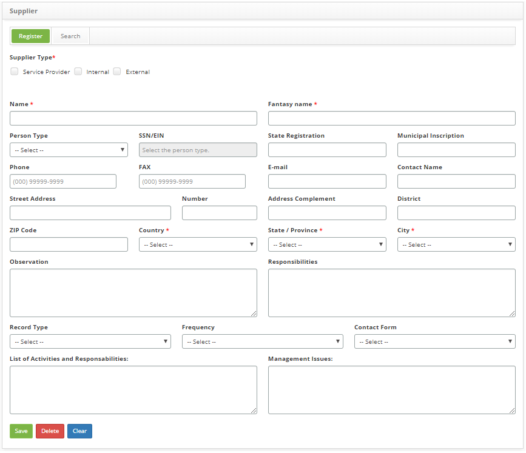

title: Suplier registration and search
Description: This feature is intended to register and search a supplier.

# Suplier registration and search

The supplier is an organization or a person, responsible for providing products
or services to anyone. It may a *service provider*, *internal* and/or *external*.

This feature is intended to register and search a supplier.

How to access
-------------

1.  Access Supplier feature navigating through the main menu **Process
    Management > Portfolio and Catalog Management > Supplier**.

Preconditions
-------------

1.  Perform the country load (see knowledge [Country
    loading][1]).

Filters
-------

1.  The following filters enables the user to restrict the participation of
    items in the standard feature listing, making it easier to find the desired
    items:

    - Name;

    - SSN/EIN.

2. In the **Supplier** screen, click the **Suppliers search** tab, the search screen will be displayed as illustrated on the 
Image below:

    
   
    **Figure 1 - Supplier search screen**

3.  Perform a supplier search:

    - **Name**: insert the supplier’s name;

    - **SSN/EIN**: insert the supplier’s tax or social security number.

4.  After setting the filters, click the *Search* button. Then, the entries will
    be displayed according to the data provided;

5.  To list all supplier entries, just click directly on the *Search* button.

Items list
----------

1. The following cadastral fields are available to the user to facilitate the identification of the desired items in the standard 
feature listing: **Name** and **SSN/EIN**.

    
   
    **Figure 2 - Suppliers listing**

2.  After searching, select the intended entry. Once this is done, you will be
    directed to the registry screen displaying the content of the selected
    entry;

3.  To change the supplier’s registered data, just modify the information in the
    intended fields and click the *Save* button to save the changes made to the
    registry, at which the date, time and user are automatically stored for a
    future audit.

Filling in the registration fields
----------------------------------

1. In the **Supplier** screen, click the **Supplier registration** tab, the **Supplier Registration** screen will be displayed, 
as illustrated on the image below:

    
   
    **Figure 3 - Supplier registration screen**

2. Fill out the fields as instructed below:

    -   **Supplier Type**: select the supplier type;

        -   **Service Provider**: one that provides products or services to
            internal or external customers;

        -   **Internal**: one that provides products or services to their own
            organization;

        -   **External**: one that provides products or services to customers
            from other organizations.

    -   **Name**: if the supplier is an individual, insert their full name, if
        it is a company, insert the organization's registered name;

    -   **Fantasy name**: insert the supplier's organization fantasy name;

    -   **Person Type**: determine if the supplier is an independent contractor
        (individual) or a company (legal);

    -   **SSN/EIN**: if the supplier is an individual, insert its social
        security number, if it is a company, insert the tax registration number;

    -   **State Registration**: insert the supplier’s state registration;

    -   **Municipal Inscription**: insert the supplier’s city registration;

    -   **Phone**: insert the area code and the supplier's phone number;

    -   **FAX**: insert the area code and the supplier's fax number.

    -   **E-mail**: insert the supplier’s e-mail;

    -   **Contact Name**: insert a name for contact with supplier;;

    -   **Street Address**: insert the supplier’s street address;

    -   **Number**: insert the number of the supplier’s address;

    -   **Address Complement**: insert any information which complements the
        address;

    -   **District**: insert supplier’s neighborhood name;

    -   **ZIP Code**: insert the supplier’s zip code (postal address code);

    -   **Country**: select the supplier’s country;

    !!! info "IMPORTANT"

        The contents of the Country, State/Province and City fields are synchronized, therefore, when selecting a country, only 
        its states will appear in the State/Province field. Similarly, when selecting a State/Province, only its Cities will be 
        available.

    -   **State/Province**: select the supplier’s state;

    -   **City**: select the supplier’s city;

    -   **Observation**: please provide any convenient notes about the supplier;

    -   **Responsibilities**: describe the supplier's duties within the
    organization;

    -   **Record Type**: select the supplier’s record type;

    -   **Frequency**: select the frequency the products or services will be
    provided;

    -   **Contact Form**: select the best way to contact the supplier;

    -   **List of Activities and Responsabilities**: describe the supplier’s
    activities and responsibilities after the contract expires. This can be a
    normal termination (within the deadline) or early one (before the end of the
    contracted period) and report the contract’s termination. Example: database
    must be delivered back to the service contractor within a 24-hour-deadline,
    etc.;

    -   **Management Issues**: describe which actions must be taken in case of
    disagreement or contract disputes.

3.  After inserting the data, click the *Save* button to confirm the entry, at
    which date, time and user are automatically stored for a future audit.

[1]:/en-us/citsmart-platform-7/plataform-administration/region-and-language/load-countries.html

!!! tip "About"

    <b>Product/Version:</b> CITSmart | 8.00 &nbsp;&nbsp;
    <b>Updated:</b>09/02/2019 – Anna Martins
