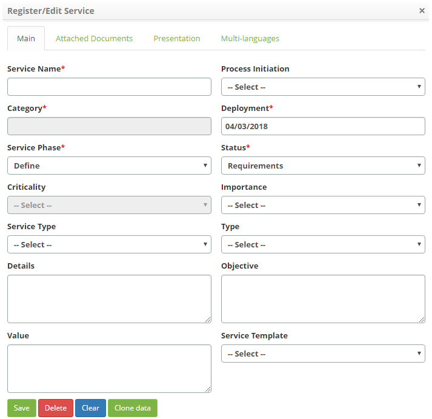
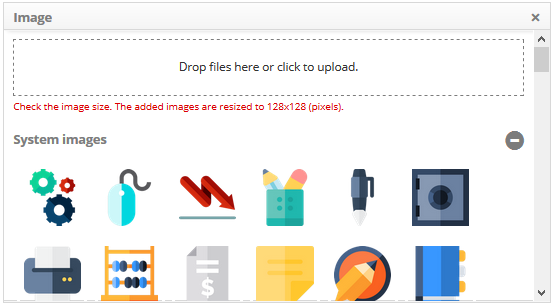
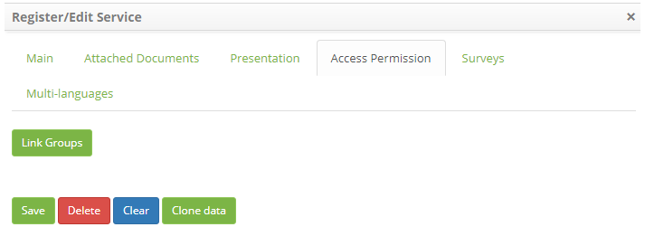
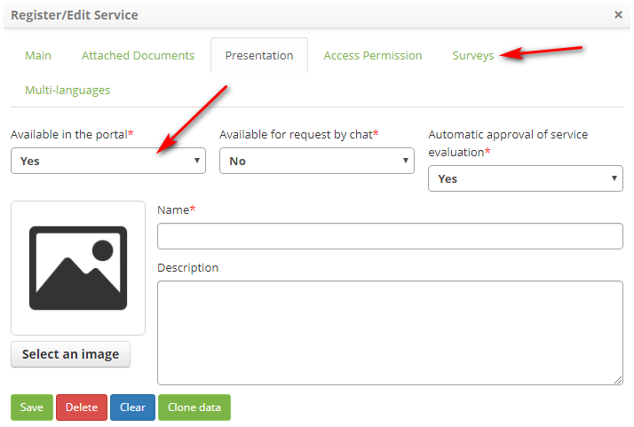
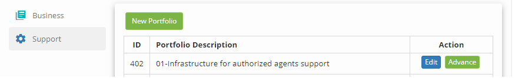

title: Service portfolio registration
Description: Service portfolio registration

# Service portfolio registration

How to access
-------------

1.  Access the Services Portfolio Management functionality by navigating the
    main menu **Processes Management > Portfolio and Catalog
    Management > Portfolio and Catalog Management**.

Preconditions
-------------

1.  You have defined the access permission to the Portfolio Management features
    (see knowledge [Portfolio management access
    permission][1]).

Filters
-------

1.  The following filter enables the user to restrict the participation of items
    in the standard feature listing, making it easier to find the desired items:

-   Portfolio Descripton.

**Figure 1 - Portfolio search screen**

Items list
----------

1.  The following cadastral fields are available to the user to facilitate the
    identification of the desired items in the standard feature
    listing: **ID** and **Portfolio Description**.

2.  There are action buttons available to the user for each item in the listing,
    they are: *Edit* and *Advance*.

**Figure 2 - Portfolio listing screen**

Filling in the registration fields
----------------------------------

1.  Click the *New Portfolio* button, the **Portfolio Register** screen will be
    displayed, as shown in the figure below:

   
   
   **Figure 3 - Portfolio master screen**

2.  Fill in the fields as directed below:

-   **Name**: enter the name of the service portfolio;

-   **Type**: inform the type of service portfolio;

    -   **Business**: provides business/IT services;

    -   **Technical**: provides support/technical services.

-   **Multi-languages**: choose whether or not the portfolio will be available
    in three different languages (Portuguese/English/Spanish). Selecting *YES*,
    a new tab will appear for registering the portfolio on those languages.

   !!! note "NOTE"

      The choice of Business/Technical type must be in line with the type of
      contract to be linked to the portfolio, only contracts of the type
      "Contract" are linked to the type "Business" and only contracts of the type
     "Technical Contract" and "Operational Level Agreement" are linked to the
      "Support" type.

3.  If you want to make the services portfolio available in the 3 available
    languages, the corresponding tab will appear, as shown below:

   
   
   **Figure 4 - Internationalization of the portfolio**

   !!! note "NOTE"

     If one of the 3 languages on this tab is left blank, the information will
      be filled out with the information contained in the "Presentation".

4.  If you want to make the service portfolio available in Smart Portal and/or
    Chat, click on the **Presentation tab**;

   
   
   **Figure 5 - Portfolio availability in the Portal and Chat**

-   **Available in the portal**: select the "Yes" option to make the portfolio
    available on the portal. Selecting the "Yes" option, a new tab called
    "Survey" will appear (For more information, read the section" Linking with
    Surveys ");

-   **Available via chat**: select the "Yes" option to make the portfolio
    available in the chat;

-   **Name**: enter the name of the portfolio to display;

-   **Description**: provide a brief description of the service portfolio, which
    will be displayed;

-   Click the *Select an image* button and a screen will appear to select an
    image that will represent the service portfolio:

   
   
   **Figure 6 - Image selection screen**

   !!! note "NOTE"

    The configuration of the group access permission to view the Service
    Portfolio in the Portal will only be applied if the parameter 293 "Enable
    access permission for user groups in the portal" is enabled.

5.  Click on the **Access Permission** tab, the linkage screen of the groups
    will be displayed, as shown in the figure below:

   
   
   **Figure 7 - Group access permission**

-   Click the *Link Groups* button. After that, the group search screen appears;

-   Perform the search, select the groups that will be allowed to view the
    portfolio in Portal Smart and/or Chat and click the *Add*button to perform
    the operation;

-   To unlink the group, just click on the *Delete* button.

   !!! info "IMPORTANT"

       You can add as many groups as you want.

6.  After entering your portfolio data, click the *Save* button to register.

Linking with surveys
--------------------

By registering a portfolio, you can link it to previously registered surveys.

   !!! Abstract "TIPS"

      For more information on how to register a survey, see
      knowledge [Satisfaction survey registration and
      search][1])

1.  Fill in the cadastral fields referring to the new portfolio. Then, in the
    Presentation tab, select "*Yes*" in the "available in the portal" option, as
    shown in the figure below. The "Surveys" tab will then be displayed:

    
    
    **Figure 8 - Presentation screen**

2.  Click on the *Surveys *tab. The Search Link screen will be displayed, as
    shown in the figure below:

   
   
   **Figure 9 - Search linking screen**

3.  Link surveys to portfolio:

-   Click the *Link Surveys* button. After that, the search query screen will
    appear;

-   Perform the search, select the survey you want to link to the portfolio, and
    click the *Add* button to perform the operation;

-   To remove the selected survey link from the portfolio, click *Delete*.

A quick overview of the main functionality of the module
--------------------------------------------------------

1.  After creating the **Services Portfolio**, click the *Advance* button to
    access the Services Portfolio. The **Services Portfolio** screen will be
    displayed, as shown in the figure below:

   
   
   **Figure 10 - Services portfolio**

2.  Note that the **Services Portfolio** is divided into three parts:

-   **Service Pipeline**: includes all services that are proposed or under
    development. These services are to be applied in the production phase via
    the service transition phase.

   
   
   **Figure 11 - Services Pipeline**

-   **Services Catalog**: includes all the services that IT offers its customers
    and services that have already been released and will come into operation.
    In this part of the service portfolio the services that are in use in
    production and those available for deployment are presented.

   
   
   **Figure 12 - Services Catalog**

-   **Obsolete (Retired) Services**: includes services that are retired and
    those that are out of service. In this part of the portfolio of services are
    registered the services that are no longer in operation. It is used to
    maintain a history of services.

   
   
   **Figure 13 - Obsolete services**

3.  The Portfolio is responsible for managing the service throughout its life
    cycle. The following figure presents a vision of the management of the
    Services Portfolio:

   
   
   **Figure 14- Service Portfolio Management**

!!! info "IMPORTANT"

    The Service Portfolio will control all new services proposed, in
    development, production and retirees.

Overview of main screen functions
---------------------------------

**Figure 15 - Service Portfolio management**

**Menu button**: clicking on this button allows you to hide/display the
Portfolio Management menu;

**Navigation bar**: allows you to navigate between portfolio data;

**Search field**: allows the search of portfolios of services;

**Business**: storage of business services portfolios;

**Support**: storage of portfolios of support services;

**New Portfolio**: allows to create a new portfolio of services;

**Edit**: allows you to edit the service portfolio record;

**Advance**: allows access to the service portfolio.

-   [Cadastro de serviços].

[1]:/en-us/citsmart-platform-7/processes/portfolio-and-catalog/portfolio-access.html
[2]:/en-us/citsmart-platform-7/processes/portfolio-and-catalog/services.html

!!! tip "About"

    <b>Product/Version:</b> CITSmart | 8.00 &nbsp;&nbsp;
    <b>Updated:</b>09/02/2019 – Anna Martins
