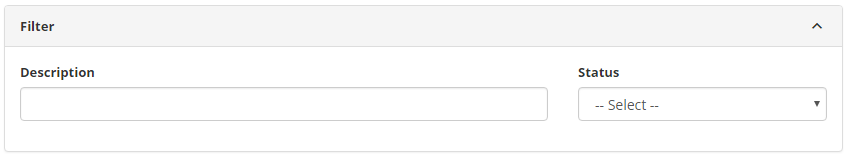
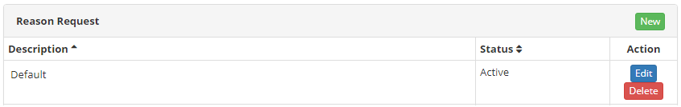
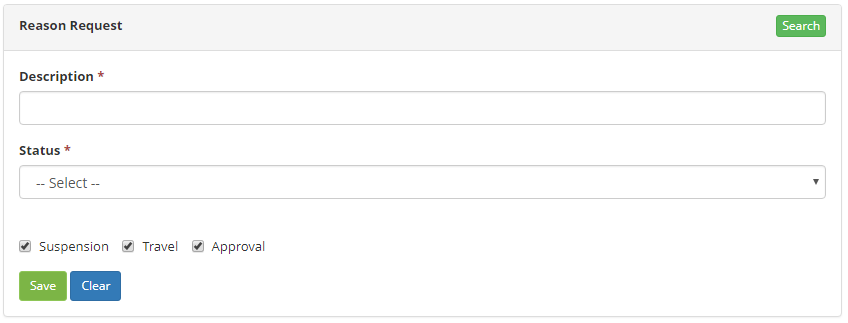

title: Service request justification registration and search
Description: This functionality allows you to record the justifications for requesting services.

# Service request justification registration and search

This functionality allows you to record the justifications for requesting
services.

How to access
-------------

1.  Access the Request Justification feature by navigating to the main
    menu **Processes Management > Portfolio and Catalog
    Management > Request Justification**.

Preconditions
-------------

1.  Not applicable

Filters
-------

1.  The following filters enables the user to restrict the participation of
    items in the standard feature listing, making it easier to find the desired
    items:

-   Description;

-   Status.

2.  To carry out the search for a request justification, inform the description
    and/or situation of the request. After that, the record will be displayed
    according to the data entered.

**Figure 1 - Request justification search screen**

Items list
----------

1.  The following cadastral fields are available to the user to facilitate the
    identification of the desired items in the standard feature
    listing: **Description **and** Status**.

**Figure 2 - Request justification list**

Filling in the registration fields
----------------------------------

1.  The request justification screen will be displayed;

2.  Click the *New* button. Once this is done, the Reason Request screen will be
    displayed, as shown in the following figure:

   
   
   **Figure 3 - Request justification file screeen**

3.  Fill in the fields as directed below:

    -   **Description**: state the description of the request justification;

    -   **Status**: select the situation of the request justification, active or
        inactive;

    -   **Suspension**: define if the justification is to be used in the
        suspension of the request;

    -   **Travel**: define whether the request justification is to be used in
        the approval of a travel request;

    -   **Approval**: define whether the request justification is to be used in
        the approval phase of the service request.

4.  Click on the *Save* button to register, where the date, time and user will
    be saved automatically for a future audit.

!!! tip "About"

    <b>Product/Version:</b> CITSmart | 8.00 &nbsp;&nbsp;
    <b>Updated:</b>09/01/2019 – Anna Martins
