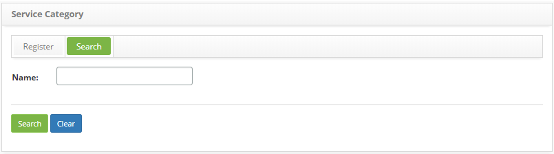
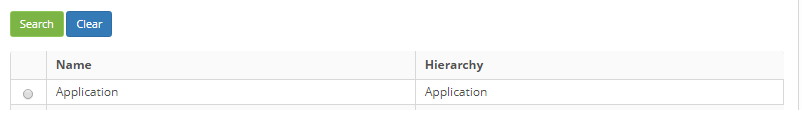
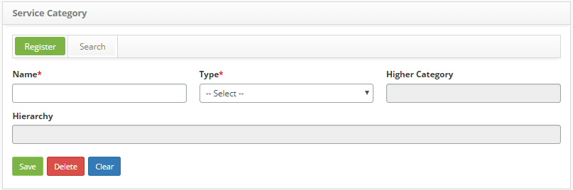

title: Service category registration and search

Description: The Service Category feature allows you to save the categories to classify the business’ services, support, request, incident and procedures, within similar groups of operation.

# Service category registration and search

The Service Category feature allows you to save the categories to classify the
business’ services, support, request, incident and procedures, within similar
groups of operation.

How to access
-------------

1.  Access the service category feature navigating through the main
    menu **Processes Management > Portfolio and Catalog
    Management > Service Category**.

Preconditions
-------------

1.  None.

Filters
-------

1.  The following filter enables the user to restrict the participation of items
    in the standard feature listing, making it easier to find the desired items:

    - Name.

2.  On the **Service Category** screen, click on the **Search Service
    Category** guide as illustrated on the image below:

    

    **Figure 1 - Service Category search screen**

3.  Perform a Service Category search:

    -   Insert the name of the service category and click on
        the *Search* button. After this, the register will be displayed as the
        given name;

    -   To list all the service categories, just click directly on
        the *Search* button.

Items list
----------

1.  The following cadastral fields are available to the user to facilitate the
    identification of the desired items in the standard feature
    listing: Name and Hierarchy.

    
   
    **Figure 2 - Service Category listing screen**

2.  After searching, select the intended entry. Once this is done, you will be
    directed to the registry screen displaying the content of the selected
    entry.

Filling in the registration fields
----------------------------------

1.  The category entry screen will be displayed, as illustrated in the image
    below:

    
   
    **Figure 3 - Service Category entry screen**

2.  Fill out the fields as instructed:

    -   **Name**: insert the name of the service category;

    -   **Type**: select the type of service category;

    -   **Higher Category**: insert higher service category, if the category
        that is being registered belongs to another category. It will only be
        available categories related to the selected "Category type";

    -   **Hierarchy**: this field is for checking purposes only. After saving
        the data, the hierarchy of the service category will be displayed;

2.  After inserting the data, click the *Save* button to save the entry, where
    the date, time and user are automatically saved for future audit.

!!! tip "About"

    <b>Product/Version:</b> CITSmart | 8.00 &nbsp;&nbsp;
    <b>Updated:</b>09/01/2019 – Anna Martins
