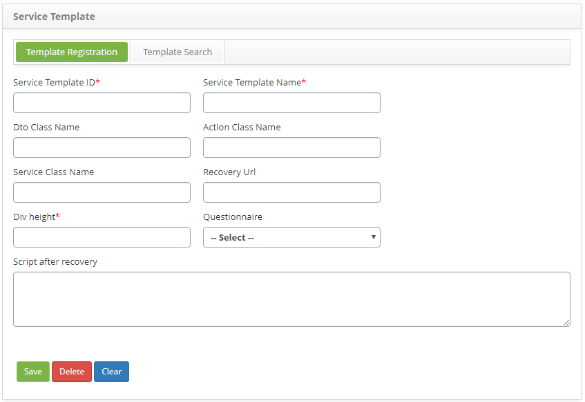

title: Service template registration and search
Description: This feature allows you to register a template, which will be used to customize the service screen.

# Service template registration and search

This feature allows you to register a template, which will be used to customize
the service screen.

How to access
-------------

1.  Access the Service Template functionality by navigating the main
    menu **Processes Management > Portfolio and Catalog Management > Service
    Template**.

Preconditions
-------------

1.  Have the questionnaire registered.

Filters
-------

1.  The following filter enables the user to restrict the participation of items
    in the standard feature listing, making it easier to find the desired items:

-   Service Template Name.

2.  On the **Service Template** screen, click the **Template Search** tab. The
    search screen will be displayed as shown in the figure below:

   
   
   **Figure 1 - Service Template search screen**

3.  Perform service template search:

    -   Enter the name of the service template you want to search and click
        the *Search* button. After this, the record will be displayed according
        to the name entered;

    -   If you want to list all the service template records, just click
        directly on the *Search* button.

Items list
----------

1.  The following cadastral fields are available to the user to facilitate the
    identification of the desired items in the standard feature
    listing: **ID** and **Service Template Name**.

   
   
   **Figure 2 - Service template list**

2.  After searching, select the desired record. Once this is done, it will be
    directed to the registration screen displaying the contents of the selected
    registry;

3.  To change the data of the service template record, simply modify the
    information of the desired fields and click the *Save* button to save the
    change made to the record, where the date, time and user will be saved
    automatically for a future audit.

Filling in the registration fields
----------------------------------

1.  The **Service Template** registration screen will be displayed, as shown in
    the figure below:

   
   
   **Figure 3 - Service Template Registration screen**

2.  Fill in the fields as directed below:

    -   **Service Template ID**: inform the identification of the service
        template;

    -   **Service Template Name**: enter the name of the service template;

    -   **Dto Class Name**: enter the name of the Dto class;

    -   **Action Class Name**: enter the name Action class;

    -   **Service Class Name**: enter the name of the class of service;

    -   **Recovery URL**: enter the recovery URL;

    -   **Div height**: enter the height of the div;

    -   **Questionnaire**: report the service questionnaire. The same is defined
        in the Questionnaire functionality;

    -   **Script after recovery: **report the script after recovery.

3.  After entering all the data, click the *Save* button to register, where the
    date, time and user will be recorded automatically for a future audit.

!!! tip "About"

    <b>Product/Version:</b> CITSmart | 8.00 &nbsp;&nbsp;
    <b>Updated:</b>09/02/2019 – Anna Martins
