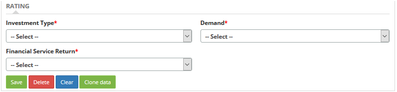
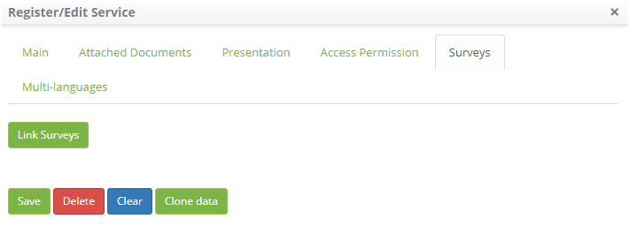
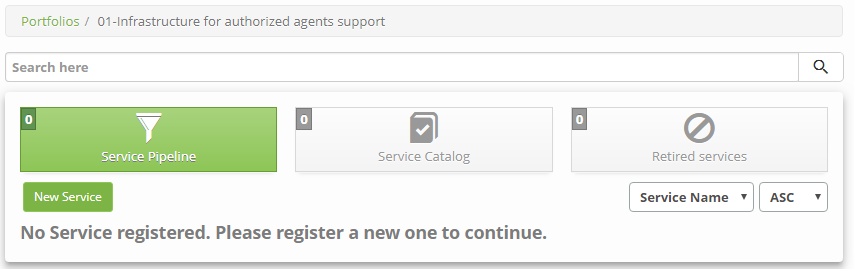
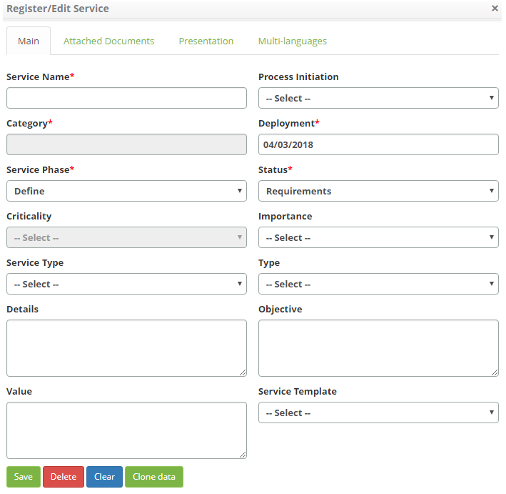

title: Service registration
Description: The service register is divided into two types: Business and Support.

# Service registration

The service register is divided into two types: Business and Support.

Preconditions
-------------

1.  Have access permission to portfolio management functionality (see
    knowledge [Portfolio Management access permission][1]);

2.  Have the portfolio of services registered (see knowledge [Service Portfolio
    registration][2]);

3.  Have the service category registered (see knowledge [Solution Category
    registration and search][3]);

4.  Have the group registered (see knowledge [Group registration and
    search][4]).

How to access
-------------

1.  Access the Services Portfolio Management functionality by navigating the
    main menu **Processes Management > Portfolio
    Management > Portfolio Management**.

Filters
-------

1.  The following filter enables the user to restrict the participation of items
    in the standard feature listing, making it easier to find the desired items:

    - Portfolio Description.

    

    **Figure 1 - Portfolio search screen**

Registering business service
----------------------------

### Items list

1.  The following cadastral fields are available to the user to facilitate the
    identification of the desired items in the standard feature
    listing: **ID** and **Portfolio Description**.

2.  There are action buttons available to the user for each item in the listing,
    they are: *Edit* and *Advance*.

3.  The Portfolio Management screen will appear, click on **Business**, the
    Portfolio of Business Services will be displayed, as shown in the figure
    below:

    
   
    **Figure 2 - Business services portfolio listing screen**

4.  Click on the *Advance* portfolio button to access it. Once this is done,
    the **Business Services Portfolio** screen will be displayed;

**Figure 3 - Business services portfolio**

### Filling in the registration fields

1.  Click on the *New Service* button, the **Business Service
    Registration** screen will be displayed, as shown in the figure below:

    
   
    **Figure 4 - Service screen**

2.  Fill in the fields as directed below:

    - **Service Name**: enter the name of the service;

    - **Process Initiation**: inform of which process the service originated;

    - **Category**: enter the service category. Clicking on this field will
    display the category search screen, perform the search of the desired
    category and select it. But, if you do not have a registered category, you
    can register one from this screen, just click on the "Category of Service"
    tab;

    - **Deployment Date**: inform the date of implementation of the service;

    -  **Service Phase**: select the phase of the service;

        - **Define**: this stage indicates that the service is on startup. At this stage, the collection of information on
           all existing and proposed services, the definition of new services, business cases and the validation of the
           portfolio data begins.

        - **Analyze**: this phase indicates that the service is being analyzed. At this stage it is analyzed whether the service 
          will give return to the business and we make a balance between supply and demand. Also identifying what service 
          represents for the business. In this activity we will make a preliminary macro survey of what resources will be used by 
          these services: people, hardware, software, training, etc. When this option is selected, fields will be displayed to be 
          filled, as shown in the figure below:

    
   
    **Figure 5 - Service analysis screen**

    - **Type of Investment**: indicate the type of investment related to the service;

    - **Demand**: indicate the type of demand for the service;

    - **Financial Return of the Service**: indicate the financial return of the service.

    - **Approve**: this phase indicates that the proposed service is in approval.
    Phase to finalize the proposed service, authorize services and resources and
    make decisions for the future. At this stage the proposed service is
    approved, the service is analyzed and it is verified if it is giving return
    to the business. If it does not return, it means that it has become cost,
    and then we must consider them as obsolete.

    -  **Opening Term**: this phase indicates that the service is moving to the
    service design phase and the existing services are renewed in the service
    catalog. At this stage the decisions are communicated, allocates resources
    and contracts services.

    - **Service Status**: enter the status of the service;

    - **Criticality**: this field will be activated when the service is in the
    analysis phase to inform the critical level of the service;

    - **Importance of the Service to the Business**: inform the importance of the
    service to the business;

        - **High**: inform you if the service is essential for the operation of the business.

        - **Average**: inform it if the service is important for the business, but productivity is not totally dependent on it.

        - **Low**: inform you if the service to be performed is necessary for the day-to-day business of the company, but
        its absence does not cause drastic situations.

        - **Normal**: inform you if the service to be performed does not interfere with the organization's productive daily life.

        - **To combine**: inform you when you do not know the type of importance of service to the business at the time of 
        registration.

    - **Type of Service**: state the type of service;

    - **Place of Execution of the Services**: inform the place where the service
    will be executed;

        - **Internal**: the service will be performed within the organization;

        -   **External**: the service will be performed outside the organization. For example: in another organization or in a 
        branch;

        - **Internal/External**: the service can be performed inside the organization as outside.

    - **Detailing**: describe the details of the service;

    - **Objective**: describe the purpose of the service;

    - **Value**: enter the value of the service for the business;

    - **Service Template**: enter the service template to customize the service registration screen, for example: when selecting 
    a template that includes a questionnaire, a "questionnaire" tab will be displayed on the service 
    registration screen to insert information about the service.

3.  If you want to attach a file, click the **Attachments** tab. The file
    attachment screen will be displayed, as shown in the figure below:

    
   
    **Figure 6 - Document attachment screen**

    - Select the attachment type, click the *Add File* button and select the desired file.

4.  If you want to make the service available in Smart Portal and/or Chat, click
    on the **Presentation** tab:

    
   
    **Figure 7 - Provision of the service in the Portal and/or chat**

    - **Available on the porta**: select the "Yes" option to make the service available on the portal. Selecting the "Yes" 
    option, a new tab called "Survey" will appear (For more information, read the section" Linking with Surveys");

    - **Available via chat**: select the "Yes" option to make the service available in the chat;

    - **Automatic approval of evaluation of the service**: define if the evaluation of the service, performed in the portal, will 
    undergo an automatic approval;

    - **Name**: enter the name of the service to view;

    - **Description**: enter a brief description of the service, which will be displayed;

    - Click the *Select an image* button and a screen will appear to select an image that will represent the service:

    
   
    **Figure 8 - Image selection**

    - Link the groups that will have access to the service in the Portal and/or Chat.

    !!! note "NOTE"

        The configuration of the group access permission to view the Service in the Portal will only be applied if the parameter 
        "Enable accesspermission for user groups in the portal" is enabled.

5.  Click on the **Access Permission** tab, the screen to link the groups will
    be displayed, as shown in the figure below:

    
   
    **Figure 9 - Access permission by group**

    - Click the *Link Groups* button, the Group Search screen appears. In this screen, only the groups that were linked in the 
    service portfolio register will be listed;

    - Perform the search, select the groups that will be allowed to view the service in Smart Portal and/or Chat and click
    the *Send*button to perform the operation;

    - To unlink the group, just click on the *Unlink* it button.

6.  After entering business service data, click the *Save* button. Once this is
    done, the service will be recorded and presented in the **Business Services
    Portfolio**. A list of services will be displayed;

7.  To configure the Business Service attributes, click the *Advance* button;

8.  To delete the Business Service, click the Edit button of the business, and
    then click the *Delete* button to perform the operation.

    !!! note "NOTE"

        When the service meets the status of "requirements", "definition", "analysis", "approved", "opening term", "design", 
        "development", "construction", or "test" Is in the "service pipeline" part. When the service meets the status of 
        "release" or "production", it is in the "Service Catalog" section. When the service meets the status of "retiring" 
        or "retired," it is in the "Obsolete Service" section.

9.  If you want to make the service available in the 3 available languages
    (Portuguese/English/Spanish), click on the Multi-languages tab as shown
    below:

!!! info "IMPORTANT"

    The Multi-languages field will only appear in the service registration/edit
    if it has a SIM option in the Main tab of the chosen portfolio.

   
   
   **Figure 10 - Service internationalization screen**

!!! info "IMPORTANT"

     If one of the 3 languages on this tab is left blank, the information will
     be filled out with the information contained in the "Presentation" tab.

Linking with surveys
--------------------

By registering a service, you can link it to previously registered surveys.

!!! Abstract "KNOW MORE"

     For more information on how to register a survey, see
     knowledge [Satisfaction survey registration and
     search][6])

1.  Fill in the cadastral fields referring to the new service. Then, in the
    Presentation tab, select "*Yes*" in the "available in the portal" option, as
    shown in the figure below. The "Surveys" tab will then be displayed:

    
   
    **Figure 11 - Presentation screen**

2.  Click on the *Surveys* tab. The Search Link screen will be displayed, as
    shown in the figure below:

    
   
    **Figure 12 - Search Linking screen**

3.  Link surveys to service:

    - Click the *Link Surveys* button. After that, the search query screen will appear;

    - Perform the search, select the survey you want to link to the service, and click the *Add* button to perform the operation;

    - To remove the selected survey link from the servie, click *Delete*.

Registering support service
---------------------------

### Items list

1.  The following cadastral fields are available to the user to facilitate the
    identification of the desired items in the standard feature
    listing: **ID** and **Description**.

2.  There are action buttons available to the user for each item in the listing,
    they are: *Edit* and *Advance*.

3.  After that, the Portfolio Management screen will appear, click
    on **Support**, the Portfolios of Support Services will be displayed, as
    shown in the figure below:

    
   
    **Figure 13 - Portfolio listing screen**

4.  Click the *Advance* portfolio button to access it. Once this is done,
    the **Support Services Portfolio** screen will be displayed;

**Figure 14 - Support service portfolio**

### Filling in the registration fields

1.  Click the *New Service* button, the **Support Service Registration** screen
    will be displayed, as shown in the figure below:

    
   
    **Figure 15 - Support Technical service registration screen**

2.  Fill in the fields following the guidelines described in the item
    "Registering Business Service";

3.  After entering the Support service data, click the *Save* button to perform
    the operation. Once this is done, the service will be saved and displayed on
    the screen in the **Support Services Portfolio**;

4.  To configure Support service attributes, click the *Advance* button.

See also
--------

-   [Service Attributes configuration][5].

[1]:/en-us/citsmart-platform-7/processes/portfolio-and-catalog/portfolio-access.html
[2]:/en-us/citsmart-platform-7/processes/portfolio-and-catalog/register.html
[3]:/en-us/citsmart-platform-7/processes/portfolio-and-catalog/solution-category.html
[4]:/en-us/citsmart-platform-7/initial-settings/access-settings/user/group.html
[5]:/en-us/citsmart-platform-7/processes/portfolio-and-catalog/configure-service-attribute.html
[6]:/en-us/citsmart-platform-7/additional-features/surveys-and-feedback/satisfaction-survey-registration.html

!!! tip "About"

    <b>Product/Version:</b> CITSmart | 8.00 &nbsp;&nbsp;
    <b>Updated:</b>09/01/2019 – Anna Martins
