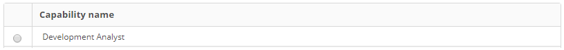

title: Skill registration and search
Description: This feature lets you record the skills of the employees.

# Skill registration and search

This feature lets you record the skills of the employees.

How to access
-------------

1.  Access the Resources/Skills feature by navigating the main menu **Process
    Management > Portfolio and Catalog Management > Capability**.

### Preconditions

1.  Not applicable.

Filters
-------

1.  The following filter enable the user to restrict the participation of items
    in the standard feature listing, making it easier to locate the desired
    items as shown in the figure below:

-   Name.

2.  On the **Resources/Skills** screen, click the **Skills Search** tab. The
    respective search screen will be displayed as shown in the figure below:

   
   
   **Figure 1 - Skill Search Screen**

3.  Perform skills search:

    -   Enter the name of the skill you want to search and click
        the *Search* button. After this, the record will be displayed according
        to the name entered.

    -   If you want to list all the skill records, simply click
        the *Search* button directly.

Items list
----------

1.  The following cadastral field is available to the user to make it easier to
    identify the desired items in the standard feature listing: **Capability
    Name**.

   
   
   **Figure 2 - Items Screen**

2.  After searching, select the desired record. Once this is done, it will be
    directed to the registration screen displaying the contents of the selected
    registry;

3.  To change the data of the skill record, simply modify the information of the
    desired fields and click on the *Record* button to save the change made in
    the record, where the date, time and user will be saved automatically for a
    future audit.

Filling in the registration fields
----------------------------------

1.  Access the feature, after that, the** Capability Master** screen will be
    displayed, as shown below:

   
   
   **Figure 3 - Skill Registration screen**

2.  Fill in the fields as directed below:

-   **Skill Name**: enter the skill name;

-   **Description**: describe the details about the skill;

-   Link the contributors to the skill.

3.  Click the *Link Employees* button. Once this is done, a screen for employee
    search will be displayed, as shown in the figure below:

   
   
   **Figure 4 - Employee search screen**

-   Perform the search, select the contributor (s) and click the *Add* button to
    link the contributor (s) to the skill.

4.  After entering all the data, click the *Save* button to register, where the
    date, time and user will be saved automatically for a future audit.

!!! tip "About"

    <b>Product/Version:</b> CITSmart | 8.00 &nbsp;&nbsp;
    <b>Updated:</b>09/02/2019 – Anna Martins
