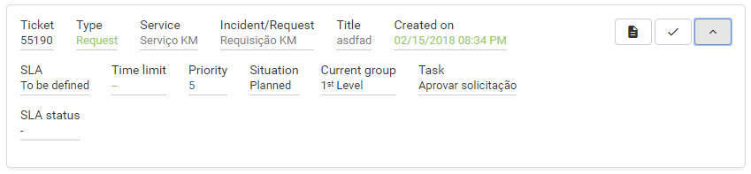

title: Service request approval using Smart Portal
Description: Service request approval using Smart Portal

# Service request approval using Smart Portal

How to access
-------------

1.  On the **Smart Portal** home screen, click the menu button  , and then click
    on the tab **Approvals**.

Preconditions

1.  Have the service request registered (see knowledge [Ticket management
    (services)][1]);

2.  Be a member of the service request approving group.

Filters
-------

1.  The following filters enable the user to restrict the participation of items
    in the standard feature listing, making it easier to locate the desired
    items:

-   Search;

-   Sort by;

-   Order.

**Figure 1 - Requests search screen**

Items list
----------

1.  The following cadastral fields are available to the user to facilitate the
    identification of the desired items in the standard listing of the
    functionality: **Ticket, Type, Service, Incident/Request, Title, Created
    on, SLA, Time limit, Priority, Situaion, Current grop, Task **and** SLA
    status.**

2.  There are action buttons available to the user in relation to each item in
    the listing, they are: *Register opinion*, *Reopen request*, *Satisfaction
    survey*, *Description*, *Attachments*, *Occurrences*, *Register
    Occurrence*, *Cancel Request* and *Message*.

**Figure 2 - Request listing screen**

Filling in the registration fields
----------------------------------

1.  Not applicable.

Service request approval
------------------------

1.  The **Service Requests** will be displayed for approval, as shown in the
    figure below:

   
   
   **Figure 3 - Approval of service request**

2.  Click the icon  of the request that you will approve to be answered. After
    that, the information registration screen for the approval of the same will
    be displayed, as shown in the following image:

   
   
   **Figure 4 - Service request approval record**

-   Check one of the approval options: **Approved** or **Not Approved**;

-   If you have marked "*Approved*", describe the observations, if necessary;

-   If you have marked "*Not approved*", describe the observations, inform the
    justification and complement the justification.

3.  After recording the information about the approval of the request, click the
    radio button (images/simb-3dots.jpg) and then click the button (images/simb-go.jpg) to save and advance the flow. Once
    the request has been approved, it will be sent to the execution phase, that
    is, to attend the request. But, if the request is not approved, it will be
    closed.

!!! tip "About"

    <b>Product/Version:</b> CITSmart | 7.00 &nbsp;&nbsp;
    <b>Updated:</b>09/03/2019 - Anna Martins

[1]:/en-us/citsmart-platform-7/processes/tickets/ticket-management.html
