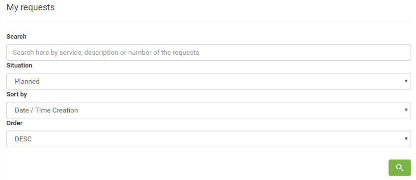
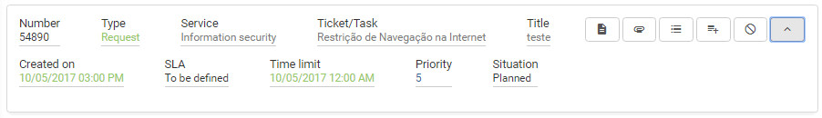
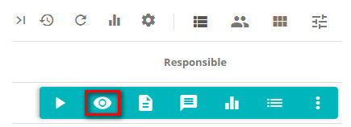
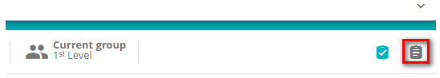
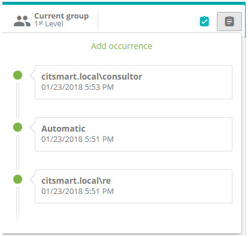

title: Management attachments in Smart Portal
Description: This feature is intended to manage request attachments.

# Management attachments in Smart Portal

This feature is intended to manage request attachments.

How to access
-------------

1.  On the homepage click the icon  in the upper left corner, select the My
    Requests option.

Preconditions
-------------

1.  Enter the following content in the parameters:

    - Parameter 44: e.g: Windows - C:/temp (see knowledge [Parameterization rules - system][1]);

    -   Parameter 46: should be set to 'S' (see knowledge [Parameterization rules - Smart Portal][2]);

2.  The user must have service requests opened on his name (see
    knowledge [Service request registration using Smart Portal][3]);

3.  The request should be "open";

4.  Access to folders when uploading JBOSS must be enabled.

Filters
-------

1.  The following filters enable the user to restrict the participation of items
    in the standard feature listing, making it easier to locate the desired
    items as shown in the figure below:

    - Search,;

    - Situation;

    - Sort by ;

    - Order.

    

    **Figure 1 - Request search screen**

Items list
----------

1.  The following cadastral fields are available to the user to facilitate the
    identification of the desired items in the standard listing of the
    functionality: Number, Type, Service, Ticket, Title, Created on, SLA, Time
    limit, Priority and Situation.

2.  There are action buttons available to the user for each item in the listing,
    they are: *Description*, *Attachments*, *Occurrences*, *Register
    Occurrence* and *Cancel Request*.

**Figure 2 - Request list**

Filling in the registration fields
----------------------------------

1.  No applicable.

Managing attachments
--------------------

1.  Clicking the icon  allows you to attach or remove files.

Viewing the history of a ticket
-------------------------------

1.  In **Processes management > Request and Incident Management > Service
    request and incidents**, search for the request in which the attachment was
    added and click the *View* button, as shown on the figure below:

    
   
    **Figure 3 - Request screen**

2.  The ticket will be opened, click on the *Request Occurrence* button, as
    shown below:

    
   
    **Figure 4 - Request view screen**

3.  Then all the ticket record history will be demonstrated:

**Figure 5 - Request log sheet**

    
!!! tip "About"

    <b>Product/Version:</b> CITSmart | 7.00 &nbsp;&nbsp;
    <b>Updated:</b>09/03/2019 - Anna Martins
   
    
[1]:/en-us/citsmart-platform-7/plataform-administration/parameters-list/parametrization-system.html
[2]:/en-us/citsmart-platform-7/plataform-administration/parameters-list/parametrization-smart-portal.html
[3]:/en-us/citsmart-platform-7/processes/portfolio-and-catalog/smart-portal/service-request.html
