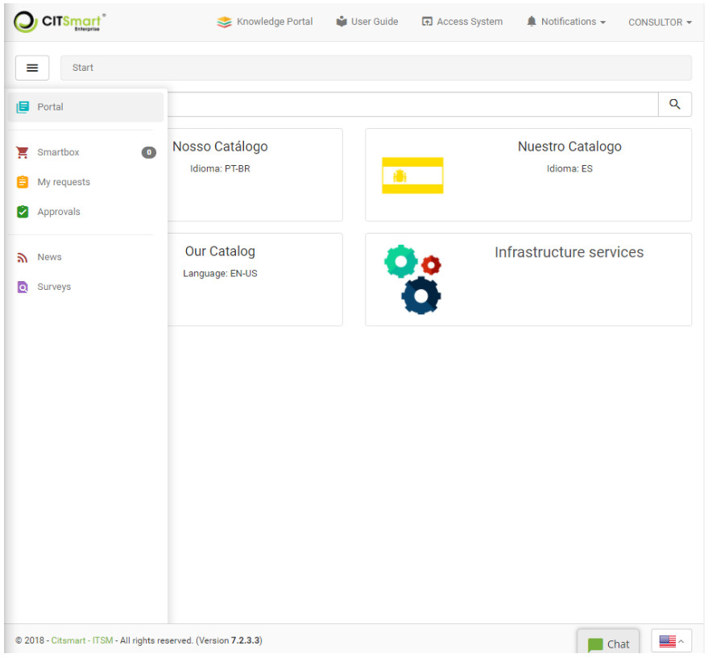
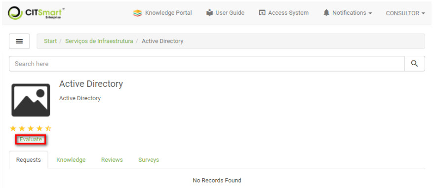
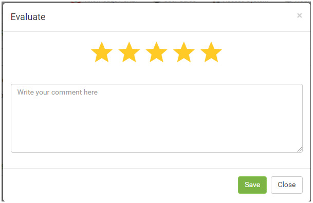
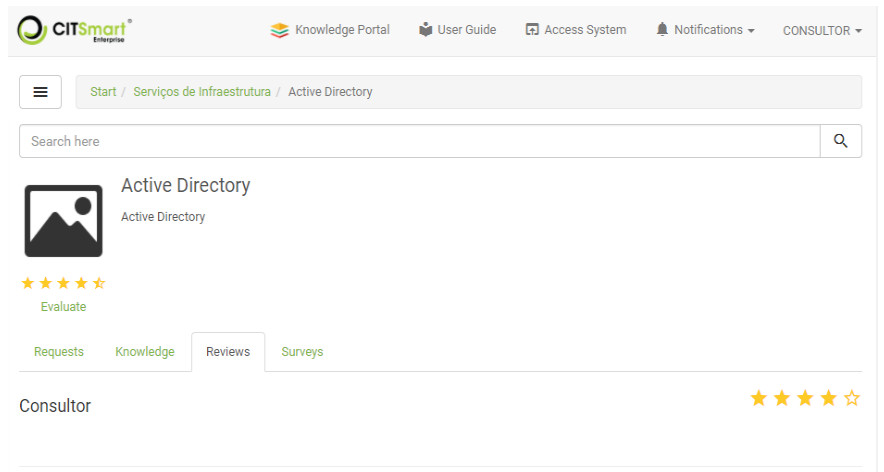

title: Services evaluation using Smart Portal
Description: Services evaluation using Smart Portal

# Services evaluation using Smart Portal

How to access
-------------

1.  On the **Smart Portal** home screen, click the menu button .

  
Preconditions
-------------

1.  Have the portfolio with the services and request/incident activities
    registered and made available in the Smart Portal (see knowledge [Service
    portfolio registration][1]).

Evaluating the services
-----------------------

1.  Clic on Portal, your respective services will be presented, as shown in the
    figure below:

   
   
   **Figure 1 - Service catalog**

2.  Select the service you will evaluate;

   
   
   **Figure 2 - Service**

3.  Click *Evaluate*. After that, the service evaluation screen will be
    displayed, as shown in the figure below:

   
   
   **Figure 3 - Service evaluation**

-   Report a note to the service by scoring the stars and write a review if you
    feel you need to. Once this is done, click the *Save*button to perform the
    operation.

4.  To view the service evaluations that have been performed,
    click *Evaluations*.

**Figure 4 - Screen Service evaluation**

    
!!! tip "About"

    <b>Product/Version:</b> CITSmart | 7.00 &nbsp;&nbsp;
    <b>Updated:</b>09/03/2019 - Anna Martins

[1]:/en-us/citsmart-platform-7/processes/portfolio-and-catalog/register.html
