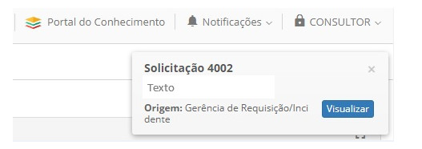
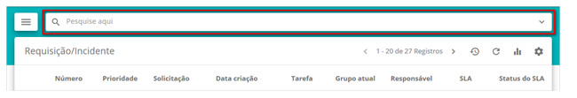
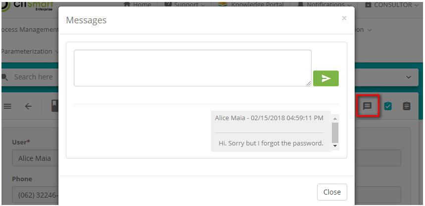

title: Message communication within a ticket by Smart Portal

Description: This functionality aims the exchange of messages between the
Requester (Sender) and the Recipient (Receiver) within the service request.

\# Message communication within a ticket by Smart Portal

This functionality aims the exchange of messages between the Requester (Sender)
and the Recipient (Receiver) within the service request.

Preconditions
-------------

1.  Enter the content below into the parameters (see knowledge [Parameterization
    rules - ticket][1]));

-   Parameter 299: must be set to 'Yes' ;

-   Parameter 300: must be set to 'Yes' .

1.  There is at least one service request open by the Service Portal (see
    knowledge [Service request registration using Smart Portal][2]);

2.  Have permission to execute service request (see knowledge [Group
    registration and search][3]);

3.  To have a message exchange, the request must be captured by the attendant.

Exchanging message - applicant
------------------------------

### How to access

1.  On the **Smart Portal** home screen, click the menu button  and then click
    on **My Requests**, locate the request you want, and then click on  it's
    icon.

### Filters

1.  The following filters enables the user to restrict the participation of
    items in the standard feature listing, making it easier to find the desired
    items:

-   Search;

-   Situation;

-   Sirt by;

-   Order.

**Figure 1 - Ticket search screen**

### Items list

1.  The following cadastral fields are available to the user to facilitate the
    identification of the desired items in the standard feature
    listing: Ticket, Type, Service, Incident/Request, Title, Created on, Task,
    Current group, Situation, SLA, Time limit, SLA status and Priority.

2.  There are action buttons available to the user for each item in the listing,
    they are: *Record opinion*, *Reopen service request*, *Satisfaction
    Survey*, *Description*, *Attachments*, *Occurrence*, *Register
    occurrence*, *Cancel Request* and *Message*.

   
   
   **Figure 2 - Request list screen**

3.  Click on the icon highlighted in the previous figure, soon after the message
    exchange screen will appear and then send the desired information.

**Figure 3 - Message screen**

### Filling in the registration fields

1.  No applicable.

Exchanging message - attendant
------------------------------

1.  After the requestor sends the message, the attendant (receiver) will be
    notified about it in his/her work window, as shown in the figure below (in
    order for the notifications sent by the applicant to be viewed by the
    attendant and answered in the shortest amount of time, the work window must
    be updated periodically):

   
   
   **Figure 4 - Message notifications screen**

2.  The attendant then clicks the *View* button. Once this is done, a new screen
    will open, informing the content of the message previously sent by the
    Applicant.

3.  To reply to some message, you must follow the steps in the next subsections.

### How to access

1.  Access the main menu **ITIL Processes > Request and Incident Management >
    Service request and incident**;

### Filters

1.  The following filter enables the user to restrict the participation of items
    in the standard feature listing, making it easier to find the desired items:

-   Number

2.  In the search field, it is possible to search by number, task description
    and responsible for the service.

3.  If you perform the search using other filters, simply click on the icon 

     of the search field.

**Figure 5 - Quick request search screen**

### Items list

1.  The following cadastral fields are available to the user to facilitate the
    identification of the desired items in the default listing of the
    functionality: **Number**, **Priority**, **Activity**, **Creation
    date**, **Task**, **Current group** and **Responsible**.

   
   
   **Figure 6 - Request list screen**

2.  Clicking on the button highlighted in the previous figure will open the
    message exchange screen between the applicant and receiver.

3.  The communication between the sender and receiver can also be initiated by
    clicking on the  of the request. Once this is done, the request and incident
    screen opens, click on  to start exchanging messages.

**Figure 7 - Message exchange screen by service view mode**

    
!!! tip "About"

    <b>Product/Version:</b> CITSmart | 7.00 &nbsp;&nbsp;
    <b>Updated:</b>09/03/2019 - Anna Martins

[1]:/en-us/citsmart-platform-7/plataform-administration/parameters-list/parametrizaion-ticket.html
[2]:/en-us/citsmart-platform-7/processes/portfolio-and-catalog/smart-portal/service-request.html
[3]:/en-us/citsmart-platform-7/initial-settings/access-settings/user/group.html

