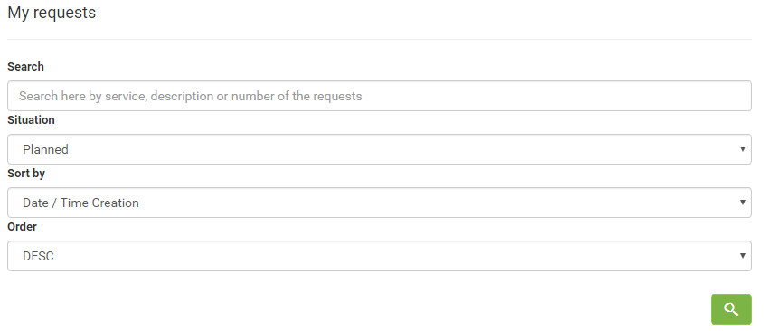
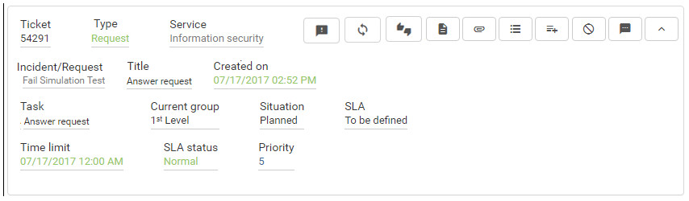
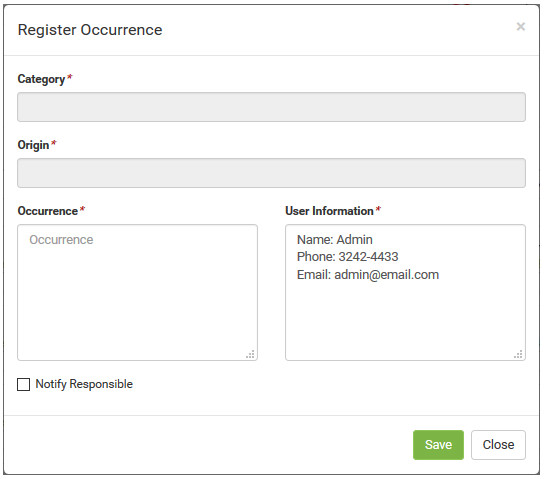

title: Service request occurrence registration using Smart Portal
Description: Service request occurrence registration using Smart Portal

# Service request occurrence registration using Smart Portal

How to access
-------------

1.  On the **Smart Portal** home screen, click the menu button  and then
    click **My Requests**. After this, the service requests will be displayed;

Preconditions
-------------

1.  Have the service request registered and it must have the status "in
    progress" (see knowledge [Ticket management (services)][1]),
    section "Filling In The Registration Fields - Ticket Registration");

2.  Have the parameter "**Register Occurrence Per Portal**" enabled;

3.  Have set the parameter bellow (see knowledge [Parameterization rules - Smart
    Portal][2]):

-   Parameter 253.

Filters
-------

1.  The following filters enables the user to restrict the participation of
    items in the standard feature listing, making it easier to find the desired
    items:

-   Search;

-   Situation;

-   Sort by;

-   Order.

**Figure 1 - Ticket search screen**

Items list
----------

1.  The following cadastral fields are available to the user to facilitate the
    identification of the desired items in the standard feature
    listing: Ticket, Type, Service, Incident/Request, Created on, Task,
    Current group, Situation, SLA, Time limit, SLA status and Priority.

2.  There are action buttons available to the user for each item in the listing,
    they are: *Register opinion*, *Reopen service request*, *Satisfaction
    Survey*, *Description*, *Attachments*, *Occurrence*, *Register
    occurrence*, *Cancel Request* and *Message*.

**Figure 2 - Ticket listing screen**

Filling in the registration fields
----------------------------------

!!! info "IMPORTANT"

     Only if the "Record Occurrence Per Portal" parameter is enabled, the   
     icon  will be displayed in the "in progress" request, which allows the
     occurrence to be registered.

1.  Find the service request (in progress) that you want to record an occurrence
    and click the  of the same. Once this is done, the **Occurrence
    Register** screen will be displayed, as shown in the figure below:

   
   
   **Figure 3 - Record of occurrence screen**

2.  Enter the occurrence data;

-   **Category**: select the category of the service request occurrence;

-   **Origin**: select the origin of the occurrence of the service request;

-   **Occurrence**: describe the occurrence related to the service request;

-   **Notify Responsible**: check this option if you want the service requestor
    to receive an e-mail notification regarding the occurrence of the request.

3.  After entering the data, click the *Save* button to register.

!!! tip "About"

    <b>Product/Version:</b> CITSmart | 7.00 &nbsp;&nbsp;
    <b>Updated:</b>09/03/2019 - Anna Martins

[1]:/en-us/citsmart-platform-7/processes/tickets/ticket-management.html
[2]:/en-us/citsmart-platform-7/plataform-administration/parameters-list/parametrization-smart-portal.html
