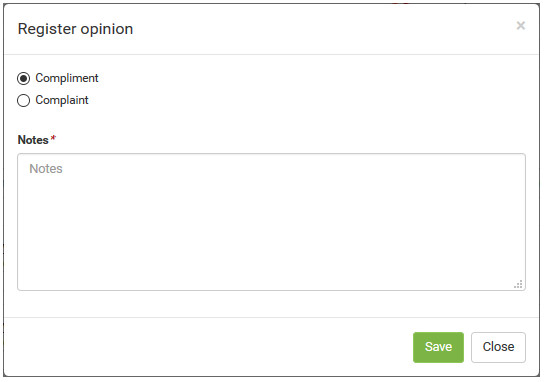

title: Register opinion about service request for a service using Smart Portal
Description: Register opinion about service request for a service using Smart Portal

# Register opinion about service request for a service using Smart Portal

How to access
-------------

1.  On the **Smart Portal** home screen, click the menu button  and then
    click **My Requests**.

Preconditions
-------------

1.  The service request must be "closed" (see knowledge [Ticket management
    (Services)][1]), section "Filling In The Registration Fields - Ticket Registration") .

Filters
-------

1.  Not applicable.

Items list
----------

1.  Not applicable.

Filling in the registration fields
----------------------------------

1.  The service requests will be displayed;

2.  Find the service request (closed) that you want to register your opinion and
    click icon   of the same. Once this is done, the Opinion Registration screen
    will be displayed, as shown in the figure below:

   
   
   **Figure 1 - Opinion log screen**

3.  Fill in the required fields and click the *Save* button to register. After
    that, a message will be displayed thanking registered opinion.

!!! tip "About"

    <b>Product/Version:</b> CITSmart | 7.00 &nbsp;&nbsp;
    <b>Updated:</b>09/03/2019 - Anna Martins
        
[1]:/en-us/citsmart-platform-7/processes/tickets/ticket-management.html
