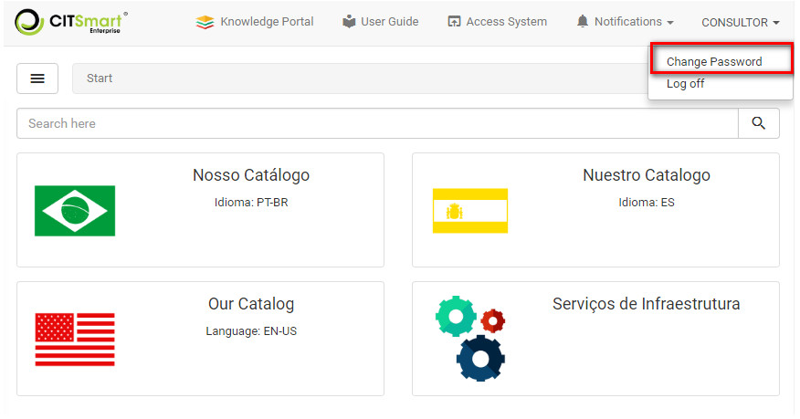
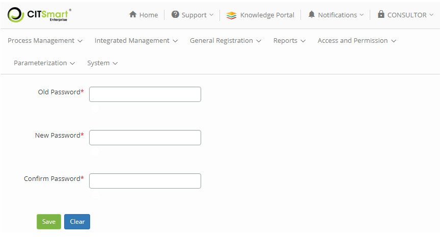

title: System access password change using Smart Portal
Description: System access password change using Smart Portal

# System access password change using Smart Portal

Changing the password
---------------------

1.  On the **Smart Portal** home screen, click on the user ID and then
    on *Change Password*, as shown in the figure below:

   
   
   **Figure 1 - Change password**

2.  The system password change screen will be displayed, as shown in the figure
    below:

   
   
   **Figure 2 - System access password change screen**

-   **Old Password**: enter the current system access password;

-   **New Password**: set in the new system access password;

-   **Confirm Password**: enter the new password for confirmation; After the
    data is entered, click the *Save* button to perform the operation.

!!! tip "About"

    <b>Product/Version:</b> CITSmart | 7.00 &nbsp;&nbsp;
    <b>Updated:</b>09/03/2019 - Anna Martins
