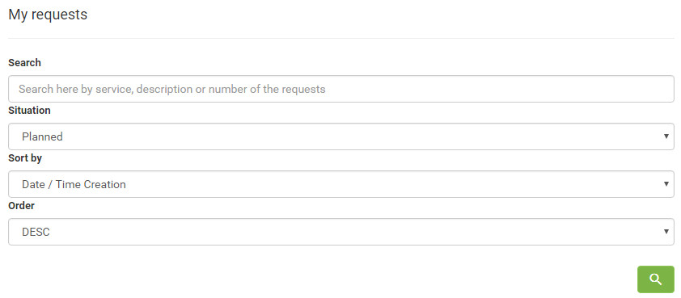

title: Reopen service request using Smart Portal
Description: Reopen service request using Smart Portal

# Reopen service request using Smart Portal

How to access
-------------

1.  On the **Smart Portal** home screen, click the menu button , and then
    click **My Requests**.

Preconditions
-------------

1.  The service request must be "closed" (see knowledge [Ticket management
    (services)][1]), precisely the section Filling In The Registration Fields - Ticket
    Registration);

2.  Have permission in the workflow that links to the Request/incident activity
    to reopen request. This permission is defined in the group register (see
    knowledge [Group registration and search][2]);

3.  Configure the parameter (see knowledge [Parameterization rules -
    ticket][3]):

-   Parameter 171.

Filters
-------

1.  The following filters enables the user to restrict the participation of
    items in the standard feature listing, making it easier to find the desired
    items:

-   Search;

-   Situation;

-   Sort by;

-   Order.

**Figure 1 - Request search screen**

Items list
----------

1.  The following cadastral fields are available to the user to facilitate the
    identification of the desired items in the standard feature
    listing: Ticket, Type, Service, Incident/Request, Title, Created on, Task,
    Current group, Situation, SLA, Time limit, SLA status and Priority.

2.  There are action buttons available to the user for each item in the listing,
    they are: *Register opinion*, *Reopen service request*, *Satisfaction
    Survey,* *Description*, *Attachments*, *Occurrence*, *Register
    occurrence*, *Cancel Request* and *Message.*

**Figure 2- Request listing screen**

Reopening the service request
-----------------------------

1.  Find the (closed) service request you want to reopen, click on the service
    request , and confirm the reopening. Once this is done, the request will be
    reopened to allow a new service to be performed.

!!! tip "About"

    <b>Product/Version:</b> CITSmart | 7.00 &nbsp;&nbsp;
    <b>Updated:</b>09/03/2019 - Anna Martins

[1]:/en-us/citsmart-platform-7/processes/tickets/ticket-management.html
[2]:/en-us/citsmart-platform-7/initial-settings/access-settings/user/group.html
[3]:/en-us/citsmart-platform-7/plataform-administration/parameters-list/parametrizaion-ticket.html
