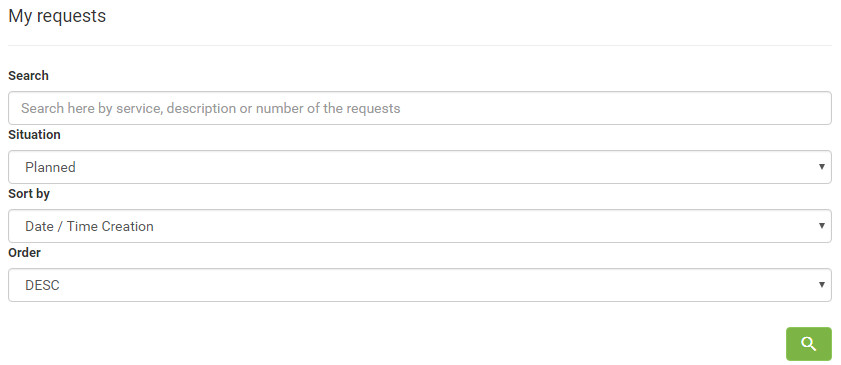
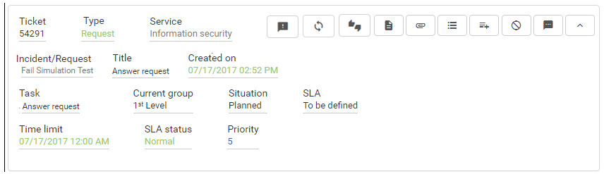
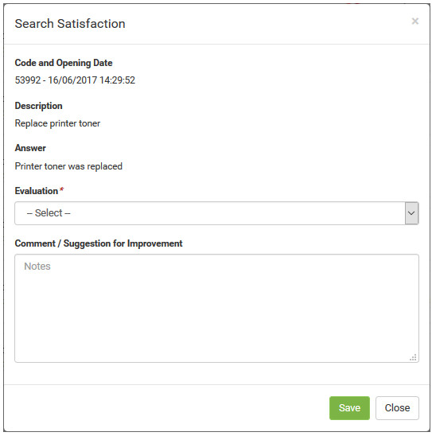

title: Service request satisfaction for a service registration using the Smart Portal
Description: Service request satisfaction for a service registration using the Smart Portal

# Service request satisfaction for a service registration using the Smart Portal

How to access
-------------

1.  On the **Smart Portal** home screen, click the menu button  and then
    click **My Requests**. After this, the service requests will be displayed;

Preconditions
-------------

1.  The service request must be "closed" (see knowledge [Ticket management
    (services)][1]), section "Filling In The Registration Fields - Ticket Registration").

Filters
-------

1.  The following filters enables the user to restrict the participation of
    items in the standard feature listing, making it easier to find the desired
    items:

-   Search;

-   Situation;

-   Sort by;

-   Order.

**Figure 1 - Ticket search screen**

Items list
----------

1.  The following cadastral fields are available to the user to facilitate the
    identification of the desired items in the standard feature
    listing: **Ticket, Type, Service, Incident/Request, Title, Created on, Task,
    Current group, Situation, SLA, Time limit, SLA status **and **Priority.**

2.  There are action buttons available to the user for each item in the listing,
    they are: *Register opinion*, *Reopen service request*, *Satisfaction
    Survey*, *Description*, *Attachments*, *Occurrence*, *Register
    occurrence*, *Cancel Request* and *Message*.

**Figure 2 - Ticket listing screen**

Filling in the registration fields
----------------------------------

1.  Find the (closed) service request you want to evaluate and click the  of the
    same. Once this is done, the **Satisfaction Survey** screen will be
    displayed, as shown in the figure below:

   
   
   **Figure 3- Satisfaction record screen**

2.  Record satisfaction survey information;

-   **Evaluation**: select the degree of satisfaction of the service request
    fulfillment;

-   **Comment/Suggestion of Improvement**: describe your observations regarding
    the service request fulfillment, if necessary.

3.  After the data is entered, click the *Save* button to register.

!!! info "IMPORTANT"

    If the "Reopen Request by Satisfaction Survey" parameter is enabled, the
    "Unanswered" option will be displayed in the "Evaluation" field which, when
    selected, displays the button that allows the reopening of the service
    request.

!!! tip "About"

    <b>Product/Version:</b> CITSmart | 7.00 &nbsp;&nbsp;
    <b>Updated:</b>09/03/2019 - Anna Martins

[1]:/en-us/citsmart-platform-7/processes/tickets/ticket-management.html
