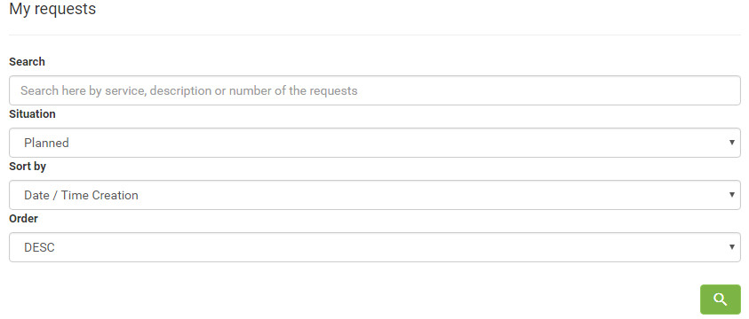
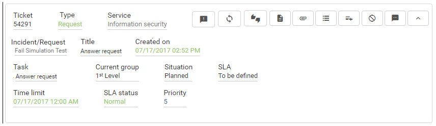

title: Service request cancellation using Smart Portal
Description: Service request cancellation using Smart Portal

# Service request cancellation using Smart Portal

How to access
-------------

1.  On the **Smart Portal** home screen, click the menu button , and then
    click **My Requests**.

Preconditions
-------------

1.  Have the service request registered (see knowledge [Ticket management
    (services)][1]);

2.  Have permission in the workflow that links to the Request/incident activity
    to cancel the request. This permission is defined in the group register (see
    knowledge [Group registration and search][2]);

3.  Enter the content below into the parameter (see knowledge [Parameterization
    rules - Smart Portal][3]);

    - Parameter 302: with the value "Y".

Filters
-------

1.  The following filters enables the user to restrict the participation of
    items in the standard feature listing, making it easier to find the desired
    items:

    - Search;

    - Situation;

    - Sort by;

    - Order.

    

    **Figure 1 - Ticket search screen**

Items list
----------

1.  The following cadastral fields are available to the user to facilitate the
    identification of the desired items in the standard feature
    listing: Ticket, Type, Service, Incident/Request, Title, Created on, Task,
    Current group, Situation, SLA, Time limit, SLA status and Priority.

2.  There are action buttons available to the user for each item in the listing,
    they are: *Register opinion*, *Reopen service request*, *Satisfaction
    Survey*, *Description*, *Attachments*, *Occurrence*, *Register
    occurrence*, *Cancel Request* and *Message*.

**Figure 2 - Ticket listing screen**

Filling in the registration fields
----------------------------------

1.  Not applicable.

Canceling the service request
-----------------------------

1.  Once this is done, service requests will be displayed;

2.  Find the service request you want to cancel, click the service icon  and
    confirm the cancellation. After this, the request will be canceled.

!!! tip "About"

    <b>Product/Version:</b> CITSmart | 7.00 &nbsp;&nbsp;
    <b>Updated:</b>09/03/2019 - Anna Martins

[1]:/en-us/citsmart-platform-7/processes/tickets/ticket-management.html
[2]:/en-us/citsmart-platform-7/initial-settings/access-settings/user/group.html
[3]:/en-us/citsmart-platform-7/plataform-administration/parameters-list/parametrization-smart-portal.html
