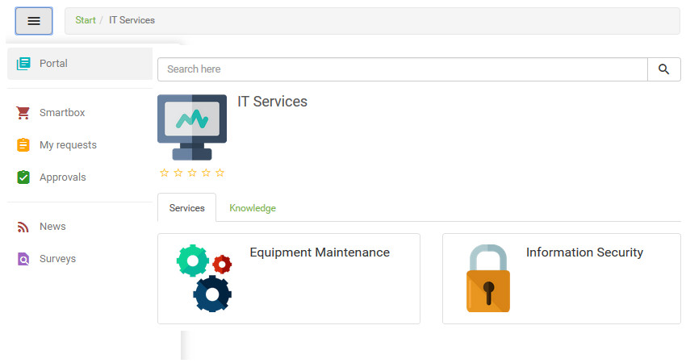

title: Service request registration using Smart Portal
Description: Service request registration using Smart Portal

# Service request registration using Smart Portal

How to access
-------------

1.  On the **Smart Portal** home screen, click the menu button  and select the
    services you want.

Preconditions
-------------

1.  Have the contract registered (see knowledge [Contract registration and
    search][1]);

2.  Have the portfolio with the services and Request/incident activities
    registered and made available in the Smart Portal (see knowledge [Service
    portfolio registration][2]; [Service registration][3]); [Service
    activity registration][4]);

3.  Have the time of attendance of the Request/incident activities defined (see
    knowledge [Time attendance registration and search][5]);

4.  Have permission in the workflow that links to the Request/incident activity
    to create request. This permission is defined in the group register (see
    knowledge [Group registration and search][6]);

5.  Be a member of the group that is allowed access to the portfolio, services
    and Request/incident activities that are available in Smart Portal, if the
    parameter "**Enable access permission for user groups in the portal**" is
    enabled;

6.  You have set the parameter "**Identifies the origin id of the service
    request default call**" with the origin identification number;

7.  Have the unit (to which the logged-in user is related) bound to the contract
    related to the service request/incident activity, if the "**Binds unit
    contracts**" parameter is enabled (see knowledge [How to relate unit to
    contract?][7]);

8.  Be a member of the group that makes the contract related to the service
    request/incident activity, if the parameter "**Make the employee control of
    contracts**" is enabled (see knowledge [How to relate group to contract?][8]).

9.  Have parameterized the priority and request deadline (see knowledge [Service
    activity registration][9])

Filters
-------

1.  No applicable.

List items
----------

1.  No applicable.

Filling in he registration fields
---------------------------------

1.  After this, your respective services will be presented, as shown in the
    figure below:

    
   
    **Figure 1 - Service catalog**

2.  Select the desired service. After that, the Request and/or incident related
    activities will be displayed, as shown in the figure below:

    
   
    **Figure 2 - Service**

3.  Select the service activity to request the service and after that, the
    request registration screen will be displayed, as shown in the figure below:

    
   
    **Figure 3 - Request register screen**

4.  Enter request data:

    !!! note "NOTE"

        The fields related to Impact, Urgency, Description, Configuration Item and Attachment will only be displayed in the 
        request log screen if the request/incident activity log is enabled to display them.

    - The information on the impact and urgency fields is established as configured in the time service record linked to the 
    Request/incident activity;

    - **Title**: enter the title of the request;

    - Add the configuration item for the request, if necessary;

    - **Description**: enter the description of the request. The description must be objective, including all the information 
    necessary to attend to it;

    - After informing the description of the request, the system searches for the knowledge related to the description and 
    displays them for visualization;

    - Attach a file to the request if you find it necessary.

    !!! info "IMPORTANT"

        If the "Enable Add and Continue" button in the new request popup in the portal is enabled, the "Add and Continue" button 
        will be displayed on the service request log screen. This button allows you to add the service in Smartbox and continue 
        selecting more services for request.

5.  After the data is entered, click the *Add and Finish* button to perform the
    operation.

6.  When registering a new service request via Smart Portal a new tab with the
    information related to it is opened, such as its number, priority and
    deadline, as shown below:

**Figure 4 - Created requests screen**

!!! note "NOTE"

    Information about the deadline of the request created (priority and
    deadline) can be removed according to the customer's needs.

        
!!! tip "About"

    <b>Product/Version:</b> CITSmart | 7.00 &nbsp;&nbsp;
    <b>Updated:</b>09/03/2019 - Anna Martins
    
[1]:/en-us/citsmart-platform-7/additional-features/contract-management/use/register-contract.html
[2]:/en-us/citsmart-platform-7/processes/portfolio-and-catalog/register.html
[3]:/en-us/citsmart-platform-7/processes/portfolio-and-catalog/services.html
[4]:/en-us/citsmart-platform-7/processes/portfolio-and-catalog/activity.html
[5]:/en-us/citsmart-platform-7/processes/service-level/time-attendance.html
[6]:/en-us/citsmart-platform-7/initial-settings/access-settings/user/group.html
[7]:/en-us/citsmart-platform-7/processes/tickets/relate-unit.html
[8]:/en-us/citsmart-platform-7/processes/tickets/relate-group.html
[9]:/en-us/citsmart-platform-7/processes/portfolio-and-catalog/activity.html
        
