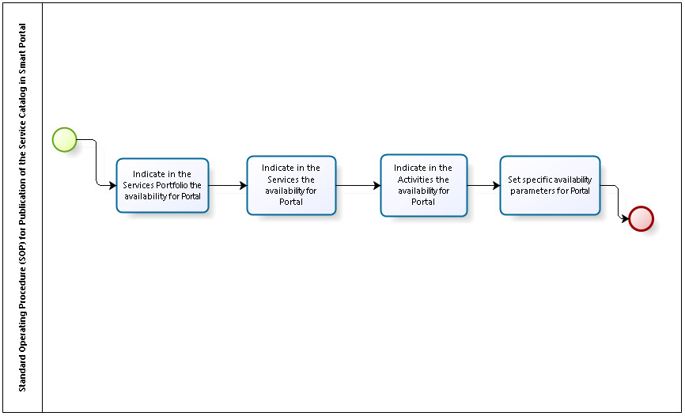

title: Recommended steps to publish the services catalog in Smart Portal
Description: Recommended steps to publish the services catalog in Smart Portal

# Recommended steps to publish the services catalog in Smart Portal

Standard Operating Procedure (SOP) for publication of service catalog in Smart Portal
-------------------------------------------------------------------------------------

**Figure 1 - SOP diagram to publish catalog in the Portal**

Preconditions
-------------

1.  The Portfolio with its Services and Activities, desired in the Portal, must
    already be created and available for use within the system (see
    knowledge [Service portfolio registration][1]).

Details of activities/tasks flow
--------------------------------

Indicate in the service portfolio the availability for portal
-------------------------------------------------------------

1.  Access the **ITIL Processes menu > Portfolio and Catalog Management >
    Portfolio Management** and configure the portfolio of services to be
    released on the portal.

Indicate in the services the availability for portal
----------------------------------------------------

1.  Access the **ITIL Processes menu > Portfolio and Catalog Management >
    Portfolio Management** click the *Next Portfolio* button, and configure each
    service to be released on the portal.

Indicate in the activities the availability for portal
------------------------------------------------------

1.  For each Business/IT Service, the request and incident activities are
    registered. Access the Portfolio Management screen (**ITIL Processes >
    Portfolio and Catalog Management > Portfolio Management**), click the *Next
    Portfolio* button, advance Service, and configure each activity to be
    released in the portal.

Configure specific availability parameters for portal
-----------------------------------------------------

1.  Configure the "**Identifies service id for service requests and incidents**"
    parameter by informing the default service ID for opening the
    service/incident request;

2.  Configure the parameter "**Identifies the source id of the service request's
    default call**", informing the source identification for opening the request
    for services/incidents;

3.  Configure the "**[Portal] Default Contract ID for Call Opening**" setting
    the default agreement ID for opening the service/incident request;

4.  Configure the "**Enable Portal as Citsmart home screen? (Ex: Y or N)** "
    must be enabled in 'Y', to display the Portal URL as the main page;

5.  To set the "**Binds contracts to unit (Ex: Y or N)" parameter is set to
    'Y**', then the User Unit must collapse bound to the contract so that it can
    open service request through Portal;

6.  Configuring the "**Filter by Request in Progress**" parameter returns a list
    of requests only with a request whose task is equal to 'In Progress';

7.  Configure the "**Enable New Portal**?" Parameter Only if the parameter is
    equal to N can you use this other parameter that is not required:

    -   Configure the "**Hide New Request**" button in the "Portal" parameter,
        which sets the display of the "New Request" button. Enter the "N" value,
        to display the "New Request" button to register the service request.

    -   Configure the "**Display full service list screen in Portal"
        parameter**, which defines the display of the "Service" columns. Enter
        the "N" value to display the options for answering a questionnaire (if
        linked to the service) and file attachment;

8.  Configure the parameter "**Enable access permission for user groups in the
    portal - Values:" Y "or" N "Default:" N**"

9.  Configure the "**Enable Add and Continue" button in the new request popup in
    the portal - Values: "Y" or "N" Default: "N**".

!!! tip "About"

    <b>Product/Version:</b> CITSmart | 7.00 &nbsp;&nbsp;
    <b>Updated:</b>09/03/2019 - Anna Martins

[1]:/en-us/citsmart-platform-7/processes/portfolio-and-catalog/register.html
