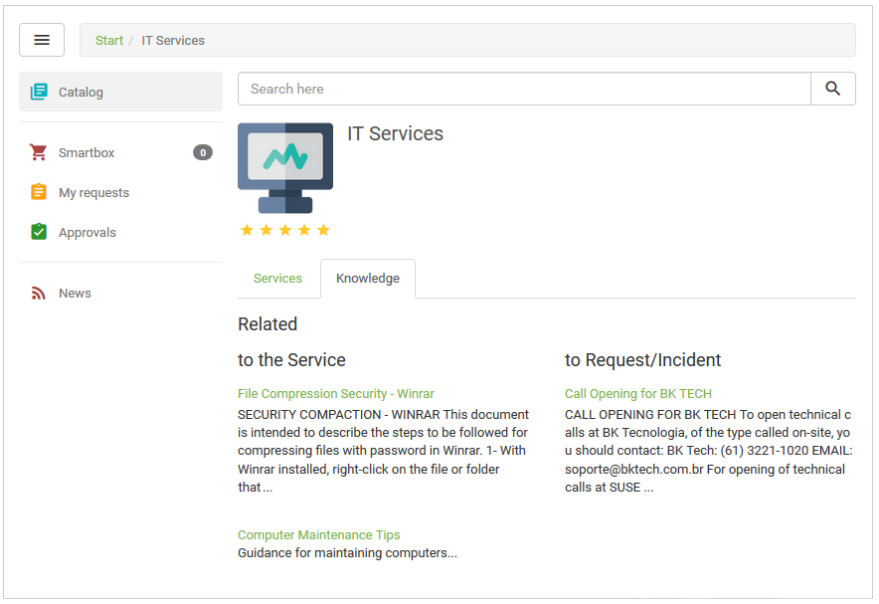
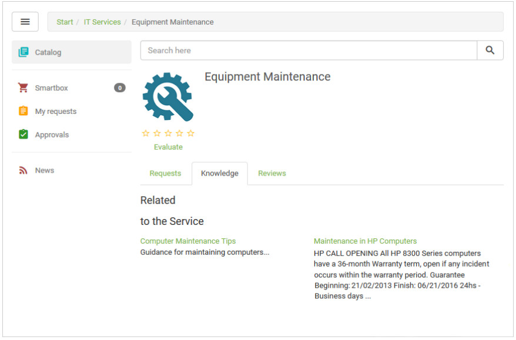

title: Check knowledge related to services using Smart Portal
Description: Check knowledge related to services using Smart Portal

# Check knowledge related to services using Smart Portal

How to access
-------------

1.  On the **Smart Portal** home screen, click the menu button ,
and then click on the **Portal**.

Preconditions
-------------

1.  Have the portfolio with the services and request / incident activities
    registered and made available in the Smart Portal (see knowledge [Service
    portfolio registration][1]; [Service registration][2]; [Service
    activity registration][3]);

2.  Have knowledge related to the service (see knowledge [Service attributes
    configuration][4], section "Linking knowledge to service");

3.  Have knowledge related to the request regarding the request/incident
    activity (see knowledge [Service activity registration][5]).

Filters
-------

1.  No applicable.

Items list
----------

1.  No applicable.

Filling in the registration fields
----------------------------------

1.  No applicable.

Verifying the knowledge related to the services
-----------------------------------------------

1.  The Service Catalogs will be presented;

2.  Select the desired Catalog and click on the **Knowledge** tab to check the
    knowledge related to the services and activities (request/incident) of the
    catalog, as shown in the figure below:

    
   
    **Figure 1 - Knowledge related to catalog services**

3.  To check the knowledge of a particular service, click the **Services** tab,
    select the service you want and then click on the **Knowledge** tab.

4.  The knowledge related to the service and its activities (request/incident)
    will be presented, as shown in the figure below:

**Figure 2 - Service-related knowledge**

!!! tip "About"

    <b>Product/Version:</b> CITSmart | 7.00 &nbsp;&nbsp;
    <b>Updated:</b>09/03/2019 - Anna Martins
    
[1]:/en-us/citsmart-platform-7/processes/portfolio-and-catalog/register.html
[2]:/en-us/citsmart-platform-7/processes/portfolio-and-catalog/services.html
[3]:/en-us/citsmart-platform-7/processes/portfolio-and-catalog/activity.html
[4]:/en-us/citsmart-platform-7/processes/portfolio-and-catalog/configure-service-attribute.html
[5]:/en-us/citsmart-platform-7/processes/portfolio-and-catalog/activity.html
