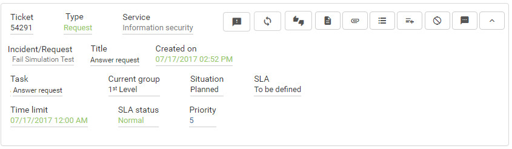

title: Service request occurrences check using Smart Portal
Description: Service request occurrences check using Smart Portal

# Service request occurrences check using Smart Portal

How to access
-------------

1.  On the **Smart Portal** home screen, click the menu button  and then
    click **My Requests**.

Preconditions
-------------

1.  Have the service request registered (see knowledge [Service request registration using Smart Portal][1]);

2.  You have enabled the parameter below (see knowledge [Parameterization rules - Smart Portal][2]):

    - Parameter 298: "Y".

Filters
-------

1.  The following filters enables the user to restrict the participation of
    items in the standard feature listing, making it easier to find the desired
    items:

    - Search;

    - Situation;

    - Sort by;

    - Order.

    

    **Figure 1 - Occurrences search screen**

Items list
----------

1.  The following cadastral fields are available to the user to facilitate the
    identification of the desired items in the standard feature
    listing: Ticket, Type, Service, Incident/Request, Title, Created on, Task,
    Current group, Situation, SLA, Time limit, SLA status and Priority.

2.  There are action buttons available to the user for each item in the listing,
    they are: *Register opinion*, *Reopen service request*, *Satisfaction
    Survey*, *Description*, *Attachments*, *Occurrence*, *Register
    occurrence*, *Cancel Request* and *Message*.

**Figure 2 - Occurrences listing screen**

Filling in the registration fields
----------------------------------

1.  No applicable.

Checking the occurrences
------------------------

1.  Click the icon  desired request. Once this is done,
    the **Occurrences** screen will be displayed, as shown in the figure below:

    

    **Figure 3 - Occurrences screen**

    !!! note "NOTE"

        Only the last 10 occurrences of the request are displayed.

2.  To check the details of the occurrence, click on the icon  .

!!! tip "About"

    <b>Product/Version:</b> CITSmart | 7.00 &nbsp;&nbsp;
    <b>Updated:</b>09/03/2019 - Anna Martins

[1]:/en-us/citsmart-platform-7/processes/portfolio-and-catalog/smart-portal/service-request.html
[2]:/en-us/citsmart-platform-7/plataform-administration/parameters-list/parametrization-smart-portal.html
