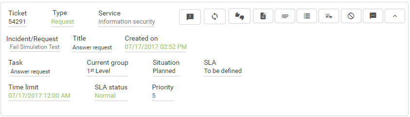
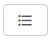

title: View my requests (tickets) by Smart Portal
Description: View my requests (tickets) by Smart Portal

# View my requests (tickets) by Smart Portal

How to access
-------------

1.  On the **Smart Portal** home screen, click the menu button  and then
    click **My Requests**.

Preconditions
-------------

1.  Have registered service requests (see knowledge [Service request
    registration using Smart Portal][1]).

Filters
-------

1.  The following filter enables the user to restrict the participation of items
    in the standard feature listing, making it easier to find the desired items:

-   Search;

-   Situation;

-   Sort by;

-   Order.

**Figure 1 - Request search screen**

Items list
----------

1.  The following cadastral fields are available to the user to facilitate the
    identification of the desired items in the standard feature listing:
    Ticket, Type, Service, Incident/Request, Title, Created on, Task, Current
    group, Situation, SLA, Time limit, SLA status and Priority.

2.  There are action buttons available to the user for each item in the listing,
    they are:

   
   
   **Figure 2 - Request listing screen**

 - Check the description of the service request;

 - Check the occurrences of the service request. This icon will only be
displayed in the request if the "Show Request/Incident Occurrences"
parameter is enabled;

 - Record the occurrences related to the service request. This icon will
only be displayed in the request if the "Log Occurrence Per Portal"
parameter is enabled;

 - Cancel the service request. This icon will only be displayed in the
request if the "Enable request cancellation/incident by portal" parameter is
enabled;

- Interact, through the exchange of messages, with the person responsible
for the service request. This icon will only be displayed in the request, if
it has already been captured for the service and the parameter
"Request/Incident - Activate exchange of messages" is enabled;

 - Record opinion regarding the fulfillment of the service request;

- Record the degree of satisfaction regarding the fulfillment of the
service request;

 - Reopen the service request. This icon will only be displayed in the
request if the "Limit, in days, to reopen na incident or service request."
parameter is configured correctly.

 - Attachments

!!! note "NOTE"

    You must have permission to perform these actions. For the title of the
    activity to appear in the list of service requests, it is necessary to
    configure parameter 301 - Display request/incident title (Values: "Y" for
    "Yes" or "N" for "No" ) in Yes and that the title has already been
    registered previously.

Filling in the registration fields
----------------------------------

1.  No applicable.

See also
--------

-   [Register Opinion about Service Request for a Service using Smart Portal][2];
-   [Service Request Satisfaction for a Service registration using the Smart Portal][3];
-   [Service Request Occurrences check using Smart Portal][4];
-   [Service Request cancellation using Smart Portal][5];
-   [Reopen Service Request using Smart Portal][6].

!!! tip "About"

    <b>Product/Version:</b> CITSmart | 7.00 &nbsp;&nbsp;
    <b>Updated:</b>09/03/2019 - Anna Martins
    
[1]:/en-us/citsmart-platform-7/processes/portfolio-and-catalog/smart-portal/service-request.html
[2]:/en-us/citsmart-platform-7/processes/portfolio-and-catalog/smart-portal/opinion.html
[3]:/en-us/citsmart-platform-7/processes/portfolio-and-catalog/smart-portal/satisfaction.html
[4]:/en-us/citsmart-platform-7/processes/portfolio-and-catalog/smart-portal/verify-occurrences.html
[5]:/en-us/citsmart-platform-7/processes/portfolio-and-catalog/smart-portal/service-request-cancellation.html
[6]:/en-us/citsmart-platform-7/processes/portfolio-and-catalog/smart-portal/reopen.html

