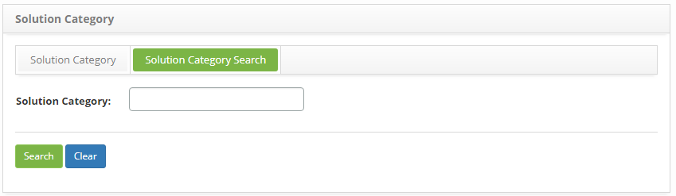
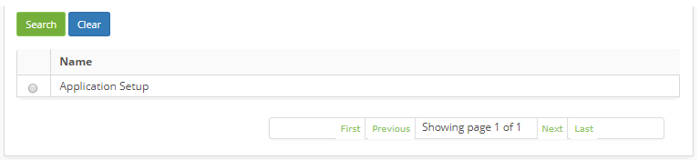
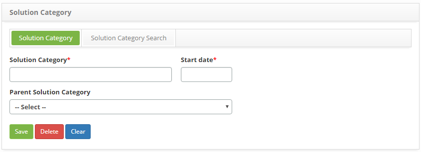

title: Solution category registration and search
Description: This feature allows you to register and search the categories of solutions.

# Solution category registration and search

This feature allows you to register and search the categories of solutions.

How to access
-------------

1.  Access the Category Solution feature navigating through the main
    menu **Processes Management > Portfolio and Catalog
    Management > Solution Category**.

Preconditions
-------------

1.  None.

Filters
-------

1.  The following filter enables the user to restrict the participation of items
    in the standard feature listing, making it easier to find the desired items:

-   Name.

2.  Click on the **Solution Category Search** tab, then, the solution category
    search screen will be displayed as illustrated in the image below:

   
   
   **Figure 1 - Solution Category search screen**

3.  Perform solution category search:

    -   insert the description of the intended solution category and click
        the *Search* button. Afterwards, the entry will be displayed according
        to the description provided;

    -   To view all solution category entries, just click directly on
        the *Search* button.

Items list
----------

1.  The following cadastral field is available to the user to facilitate the
    identification of the desired items in the standard feature
    listing: **Name**;

   
   
   **Figure 2 - Solution Category listing**

2.  After searching, select the intended entry. Once this is done, the user will
    be directed to the registry screen displaying the content of the selected
    entry;

3.  To change the data of the solution category entry, just modify the intended
    information and click the *Save* button to save the changes made to the
    registry, at which the date, time and user are automatically stored for
    future audit.

Filling in the registration fields
----------------------------------

1.  The **Solution Category Registration** screen will be displayed, as
    illustrated in the image below:

   
   
   **Figure 3 - Category Solution entry screen**

2.  Fill out the fields as instructed:

   -  **Solution Category**: insert the description of the solution category;

   -  **Start Date**: insert the date when the solution category is being
        saved;

   -  **Parent Solution Category**: select a higher solution category. If the
        category that is being registered is part of another category.

3.  Click the *Save* button to save the entry, at which the date, time and user
    are automatically stored for a future audit.

!!! tip "About"

    <b>Product/Version:</b> CITSmart | 8.00 &nbsp;&nbsp;
    <b>Updated:</b>09/02/2019 – Anna Martins
