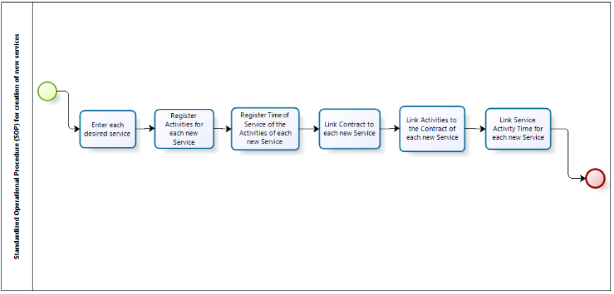

title: Recommended steps to create new services
Description: Standarized operational procedure (SOP) for creation of new services

# Recommended steps to create new services

**Figure 1 - SOP diagram for creation of new services**

Preconditions
-------------

1.  The access profile must have been created to control user access to system
    features. Access the **Access and Permission** > **Access Profile** and
    create the profile with permission to search, save and/or delete system
    features (see knowledge [Access Profile registration and search][1]).

2.  Each employee who will interact with the new service must have been created.
    Access the **General Registration > Staff Management > Staff** (see knowledge [Staff registration and search][2]).

3.  Each employee who will interact with the new service must have their login
    user created. Access the **General Registration > Staff Management >
    User** (see knowledge [User registration and search][3]).

4.  The working day related to the new service must be created. Access
    the **General Registration > Staff Management > Workday** (see
    knowledge [Workday registration and search][4]).

5.  The work schedule (scales) that will be linked in the activities of the new
    service. Access the **General Registration > Staff Management >
    Calendar** (see knowledge [Calendar registration and search][5]).

6.  Each client (internal or external) that can request / contract the new
    service must be registered in the system. Access the **Processes Management > Catalog Portfolio Management > Customer** menu (see knowledge [Customer registration and search][6]).

7.  Each provider (internal or external service provider) that can support the
    new service must be created on the system. Access the **Processes Management > Catalog Portfolio Management > Supplier** menu (see knowledge [Supplier registration and search][7]).

8.  Each contract that may be related to the new service must be created in the
    system. Access the **Processes Management > Catalog Portfolio Management > Contract** menu (see knowledge [Contract registration and search][8]).

    -   It is an agreement between two parties, which are obliged to comply with
        what was agreed between them under certain conditions. The contract may
        be of the contract type (contract between the "service provider" type
        and "external" customer), operational level agreement (internal
        agreement between departments of the same organization, internal
        supplier with internal customer) or support agreement (Contract between
        the external supplier and internal customer).

9.  Each group of collaborators that will interact with the new service must
    have been created. Access the **Access and Permission > Group** (see
    knowledge [Group registration and search][9]).
    And each group created must be linked to each Contract of each new Service
    **Processes Management > Catalog Portfolio Management > Contract > User
    Groups** (see knowledge [Contract registration and search][10]).

10. Each Portfolio that will contain the new service must be created. Access
    the **Processes Management > Portfolio and Catalog Management > Portfolio
    Management** menu (see knowledge [Service portfolio registration][11]).

11. Permission to access each Portfolio for each new Service must be set to
    release or restrict user profile access to the existing functionality on the
    Portfolio Management screen. Access the **Access and
    Permission > Portfolio Management** (see knowledge [Portfolio management
    access permission][12]).

Details of flow activities/tasks
--------------------------------

**Register each desired service**

After creating the portfolio, register the Business/IT services. Access
the **Processes Management >Portfolio and Catalog Management > Portfolio
Management**, click the Next Portfolio button, and register the Business/IT
Services.

**Register Activities for each new Service**

For each Business/IT Service, the request and incident activities are
registered. Access the Portfolio Management screen **(Processes Management >
Portfolio and Catalog Management > Portfolio Management)**, click
the *Advance* button, of the desired Portfolio, and then click *Advance* again,
and record the Request and Incident activities.

**Register Time of Service of the Activities of each new Service**

The service time is defined to control the execution time of the service
activities. Access the **Processes Management > Service Level Agreement
Management > Service Time** menu and record the service time.

**Link Contract to each new Service**

Link the contract that provides the Business/IT service. Access the Portfolio
Management screen **Processes Management > Portfolio and Catalog Management >
Portfolio Management**, click the Advance button on the desired Portfolio, and
the click *Advance* and link the contract to the service.

**Link Activities to the Contract of each new Service**

After the contract is linked to the service, link the activities (request and
incident) to the service contract. Access the Portfolio Management
screen **Processes Management > Portfolio and Catalog Management > Portfolio
Management**, click the *Advance* button on the desired portfolio, then click
on *Advance* on the desired service, click again and *Advance* contract, and
link request and incident activities.

**Link Service Activity Time for each new Service**

Access the Portfolio Management screen **Processes Managament > Portfolio and
Catalog Management > Portfolio Management**, click the *Advance* button on the
desired portfolio, click *Advance* on the desired service, click on *Advance* on
the desired contract, and enter the log of the request activity or incident
activity and report The defined service time for these activities.

!!! note "NOTE"

    The service service time will be calculated according to the schedule.

### See also

-   [Calendar registration and search][5];

-   [Workday registration and search][4];

-   [Group registration and search][9];

-   [Access profile registration and search][4];

-   [Staff registration and search][2];

-   [User registration and search][3];

[1]:/en-us/citsmart-platform-7/initial-settings/access-settings/profile/user-profile.html
[2]:/en-us/citsmart-platform-7/initial-settings/access-settings/user/employee.html
[3]:/en-us/citsmart-platform-7/initial-settings/access-settings/user/user-register.html
[4]:/en-us/citsmart-platform-7/plataform-administration/time/create-working-day.html
[5]:/en-us/citsmart-platform-7/plataform-administration/time/create-calendar.html
[6]:/en-us/citsmart-platform-7/processes/portfolio-and-catalog/client.html
[7]:/en-us/citsmart-platform-7/processes/portfolio-and-catalog/provider.html
[8]:/en-us/citsmart-platform-7/additional-features/contract-management/use/register-contract.html
[9]:/en-us/citsmart-platform-7/initial-settings/access-settings/user/group.html
[10]:/en-us/citsmart-platform-7/additional-features/contract-management/use/register-contract.html
[11]:/en-us/citsmart-platform-7/processes/portfolio-and-catalog/register.html
[12]:/en-us/citsmart-platform-7/processes/portfolio-and-catalog/portfolio-access.html

!!! tip "About"

    <b>Product/Version:</b> CITSmart | 8.00 &nbsp;&nbsp;
    <b>Updated:</b>08/30/2019 – Anna Martins
