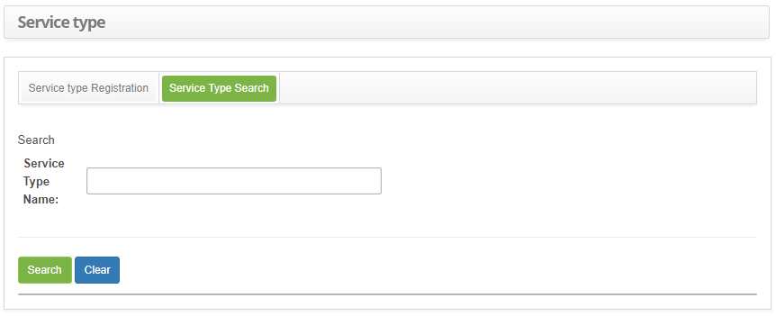
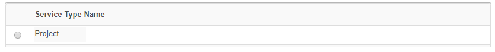
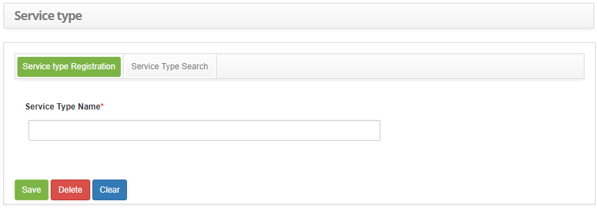

title: Service type registration and search
Description: This functionality is intended to record the types of service that will be used in other system routines.

# Service type registration and search

This functionality is intended to record the types of service that will be used
in other system routines.

How to access
-------------

1.  Access the Service Type functionality by navigating the main
    menu **Processes Management > Portfolio and Catalog Management > Service
    Type**.

Preconditions
-------------

1.  Not applicable.

Filters
-------

1.  The following filter enables the user to restrict the participation of items
    in the standard feature listing, making it easier to find the desired items:

-   Service Type Name.

2.  On the **Service Type** screen, click the **Service Type Search** tab, the
    respective search screen will be displayed as shown in the figure below:

   
   
   **Figure 1 - Service Type search screen**

3.  Perform service type search:

    -   Enter the name of the type of service you want to search and click
        the *Search* button. After this, the record will be displayed according
        to the name entered;

    -   If you want to list all service type records, simply click
        the *Search* button directly.

Items list
----------

1.  The following cadastral field is available to the user to facilitate the
    identification of the desired items in the standard listing of the
    functionality: **Service Type Name**.

   
   
   **Figure 2 - Items screen**

2.  After searching, select the desired record. Once this is done, you will be
    directed to the registration screen displaying the contents of the selected
    record;

3.  To change the data of the service type record, simply modify the information
    of the desired fields and click the *Save* button to save the change made in
    the record, where the date, time and user will be saved automatically for a
    future audit.

Filling in the registration fields
----------------------------------

1.  The Service Type Master screen will be displayed, as shown in the figure
    below:

   
   
   **Figure 3 - Service Type Master data screen**

2.  Fill in the field as directed below:

-   Enter the name of the service type. E.g.: Routine.

3.  Click the *Save* button to register, where the date, time and user will be
    saved automatically for a future audit.

!!! tip "About"

    <b>Product/Version:</b> CITSmart | 8.00 &nbsp;&nbsp;
    <b>Updated:</b>09/02/2019 – Anna Martins
