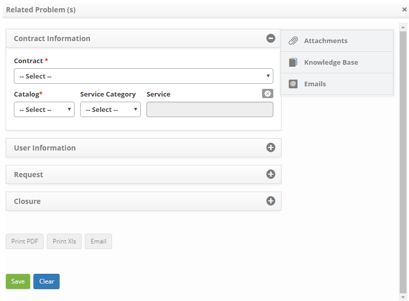

title: Registering a problem from another problem
Description: This feature allows you to log a problem from a problem.

# Registering a problem from another problem

This feature allows you to log a problem from a problem.

How to access
-------------

1.  Access problem logging functionality from a problem by navigating the main
    menu **Process Management > Problem Management > Problem Management**.

Preconditions
-------------

1.  Not applicable.

Filters
-------

1.  The following filter enables the user to restrict the participation of items
    in the standard feature listing, making it easier to find the desired items:

-   Problem Number.

**Figure 1 - Problem search screen**

Items list
----------

1.  The following cadastral fields are available to the user to facilitate the
    identification of the desired items in the standard listing of the
    functionality: Number, Title, Contract, Created on, Priority, Time
    limit, User, Status, Current Task, Executor Group and Current
    Responsible.

2.  There are action buttons available to the user in relation to each item in
    the listing, they are: *View*, *Reports* and *Action*.

**Figure 2 - Problem listing screen**

Filling in the registration fields
----------------------------------

1.  On the **Management **tab, locate the problem you want, click
    the *Action* button and select the *Start/Run Task* from it, as shown in the
    figure below:

   
   
   **Figure 3 - Action button**

2.  The** Problem Registration screen will appear, click
    the **Processes/Options** tab, and then click **Relate Problem**, located on
    the right-hand corner of the screen, as shown in the figure below:

   
   
   **Figure 4 - Problem selection**

3.  The problem relationship screen is displayed;

   
   
   **Figure 5 - Relate problem**

4.  Click on the *Register* button, the Problem log screen will appear, as shown
    in the figure below:

   
   
   **Figure 6 - Problem registration screen**

   -   Fill in the fields with the required information and click the *Save* button
    to register;

   -   A message confirming the success of the registration will be displayed.

5.  To link a problem to an issue you have already entered, click the *Search
    Problem* button. The screen will be displayed to search for it, as shown in
    the figure below:

   !!! info "IMPORTANT"

      The system allows you to relate one or more problems to the main
      problem. Problems to be listed must have status other than "Canceled" and
      "Completed".

   
   
   **Figure 7 - Problem search screen**

-   Enter the number and/or title of the problem you want to search and click
    the *Search* button;

-   Select the desired record and it will appear on the problem relationship
    screen;

-   Once you have done this, simply click on the *Save and Forward the
    flow* or *Save and Keep the Current Task* *button* if you want to record
    only the recorded information about the incident relationship and keep the
    current request task.

!!! tip "About"

    <b>Product/Version:</b> CITSmart | 8.00 &nbsp;&nbsp;
    <b>Updated:</b>08/29/2019 – Anna Martins
