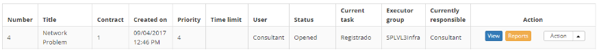

title: Problem cancellation
Description: This functionality allows you to cancel the problem log.

# Problem cancellation

This functionality allows you to cancel the problem log.

How to access
-------------

1.  Access the problem log cancellation feature by navigating the main
    menu **Process Management > Problem Management > Problem
    Management**.

Preconditions
-------------

1.  Have registered problem (see knowledge [Problem registration][1]).

Filters
-------

1.  The following filter enables the user to restrict the participation of items
    in the standard feature listing, making it easier to find the desired items:

-   Problem Number

**Figure 1 - Filters screen**

Items list
----------

1.  The following cadastral fields are available to the user to facilitate the
    identification of the desired items in the standard listing of the
    functionality: Number, Title, Contract, Created on, Priority, Time
    limit, User, Status, Current Task, Executor Group and Current
    Responsible.

2.  There are action buttons available to the user in relation to each item in
    the listing, they are: *View*, *Reports* and *Action*.

**Figure 2 - Problem listing screen**

Filling in the registration fields
----------------------------------

1.  Not applicable.

Cancelling
----------

1.  On the Management tab, locate the problem record that you want to cancel,
    click the *Action* button and the *Start/Run task* option, as shown in the
    image below:

   
   
   **Figure 3 - Problem Management Screen**

2.  The** Problem Log** screen will appear with the fields filled, with content
    related to the selected problem. In the **Closing** table, record the
    necessary information;

-   In the **Status **field, select the option "Canceled";

-   In the **Closing** field, describe the details of the problem cancellation;

-   After recording the trouble-cancelling information, click the *Save and
    Forward Flow* to perform the operation, where the trouble ticket will be
    canceled successfully;

-   If you want to save only the logged information about cancelling the problem
    and keep the current job, click the *Save and Keep the Current Task*;

-   In both cases above, clicking the *Save* button will automatically record
    the date, time and user for a future audit.

[1]:/en-us/citsmart-platform-7/processes/problem/register-problem.html

!!! tip "About"

    <b>Product/Version:</b> CITSmart | 8.00 &nbsp;&nbsp;
    <b>Updated:</b>08/28/2019 – Anna Martins
