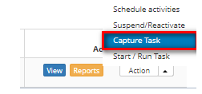

title:Problem capturing
Description:This functionality allows you to capture the task, that is, to become the current person in charge of the problem.

# Problem capturing

How to access
-------------

1.  Access problem capture functionality by navigating the main menu **Process
    Management > Problem Management > Problem Management**.

Preconditions
-------------

1.  Have problems registered (see knowledge [Problem registration][1]).

Filters
-------

1.  The following filter enables the user to restrict the participation of items
    in the standard feature listing, making it easier to find the desired items:

-   Problem Number.

**Figure 1 - Problem search screen**

Items list
----------

1.  The following cadastral fields are available to the user to facilitate the
    identification of the desired items in the standard listing of the
    functionality: Number, Title, Contract, Created on, Priority, Time
    limit, User, Status, Current Task, Executor Group and Current
    Responsible.

2.  There are action buttons available to the user in relation to each item in
    the listing, they are: *View*, *Reports* and *Action*.

**Figure 2 - Problem listing screen**

Filling in the registration fields
----------------------------------

1.  No applicable.

Capturing problems
------------------

1.  On the **Management** tab, locate the problem log that you want to capture,
    click the *Action* button and select the *Capture task* option, as indicated
    in the image below:

   
   
   **Figure 3 - Problem management screen**

2.  A task capture confirmation message will be displayed. Click *OK* to perform
    the operation. The current person responsible for attending the problem will
    be presented in the list of problem records.

[1]:/en-us/citsmart-platform-7/processes/problem/register-problem.html

!!! tip "About"

    <b>Product/Version:</b> CITSmart | 8.00 &nbsp;&nbsp;
    <b>Updated:</b>08/28/2019 – Anna Martins
