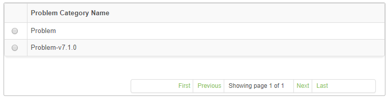

title:Problem category registration and search
Description:This functionality is intended to record the problem category that will be used to define the entire workflow configuration that the problem will follow.

# Problem category registration and search

This functionality is intended to record the problem category that will be used
to define the entire workflow configuration that the problem will follow.

Preconditions
-------------

1.  Define the flow related to problem management (see the knowledge [Workflow
    maintenance][1]);

2.  Create the problem template;

3.  Register the executor group (see knowledge [Group registration and
    search][2]).

How to access
-------------

1.  Access the problem category functionality by navigating the main
    menu **Process Management > Problem Management > Problem
    Category**.

Filters
-------

1.  The following filter enables the user to restrict the participation of items
    in the standard feature listing, making it easier to find the desired items:

   -   Problem Category Name.

   
   
   **Figure 1 - Category search screen**

2.  Perform the problem category search;

-   Enter the name of the problem category you want to search for and click
        the *Search* button. After this, the problem category record will be
        displayed according to the name entered;

-   If you want to list all of the problem category records, simply click
        the *Search* button directly;

Items list
----------

1.  The following cadastral field is available to the user to facilitate the
    identification of the desired items in the standard feature
    listing: **Problem Category Name**.

   
   
   **Figure 2 - Category listing screen**

2.  After searching, select the desired record. Once this is done, it will be
    directed to the registration screen displaying the contents of the selected
    registry;

3.  To change the problem category record data, simply change the information of
    the desired fields and click the *Save* button to save the change made to
    the record, where the date, time and user will be saved automatically for a
    future audit.

Filling in the registration fields
----------------------------------

1.  The problem category registration screen will be displayed, as shown in the
    figure below:

   
   
   **Figure 3- Problem category registration screen**

2.  Fill in the fields as shown below:

    -   **Name**: enter the name of the problem category;

    -   **Flow**: select the flow so that it is associated with the problem
        category being registered;

    -   **Executor group**: select the executor group, which will be the default
        group, responsible for executing the problem activity;

    -   **Problem Template**: select the problem template, if necessary;

    -   **Impact**: select the impact of the problem category;

    -   **Urgency**: select the urgency of the problem category.

3.  Click on the *Save* button to register, where the date, time and user will
    be saved automatically for a future audit.

[1]:/en-us/citsmart-platform-7/workflow/workflow-management.html
[2]:/en-us/citsmart-platform-7/initial-settings/access-settings/user/group.html

!!! tip "About"

    <b>Product/Version:</b> CITSmart | 8.00 &nbsp;&nbsp;
    <b>Updated:</b>08/28/2019 – Anna Martins
