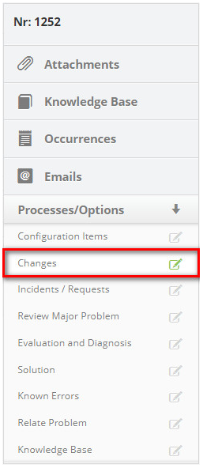
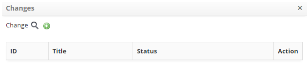
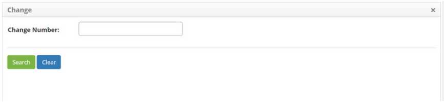

title: Registering request for change from a problem
Description: This functionality allows you to record a change request from a problem.

# Registering request for change from a problem

This functionality allows you to record a change request from a problem.

How to access
-------------

1.  Access the change request registration functionality from a problem by
    navigating the main menu **Process Management > Problem
    Management > Problem Management**.

Preconditions
-------------

1.  No applicable.

Filters
-------

1.  The following filter enables the user to restrict the participation of items
    in the standard feature listing, making it easier to find the desired items:

    - Problem number

    

    **Figure 1 - Problem search screen**

Items list
----------

1.  The following cadastral fields are available to the user to facilitate the
    identification of the desired items in the standard listing of the
    functionality: Number, Title, Contract, Created on, Priority, Time
    limit, User, Status, Current Task, Executor Group and Current
    Responsible.

2.  There are action buttons available to the user in relation to each item in
    the listing, they are: *View*, *Reports* and *Action*.

**Figure 2 - Problem listing screen**

Filling in the registration fields
----------------------------------

1.  On the **Management** tab, locate the problem you want, click
    the *Action* button and select the *Start/Execute task* from it, as shown in
    the figure below:

    
   
    **Figure 3- Action button**

2.  The **Problem Log** screen appears, click the **Processes/Options** tab, and
    then click **Changes** in the right corner of the screen, as shown in the
    figure below:

    
   
    **Figure 4 - Selection of changes**

3.  The change relationship screen is displayed;

    
  
    **Figure 5 - Relating change**

4.  To register a change, click the icon  . The Change Request registration
    screen will be displayed, as shown in the figure below:

   

   **Figure 6 - Change request record screen**

-   Fill in the step by step with the necessary information and click *Save* to
    register;

-   A message confirming the successful registration of the new change request
    will be displayed;

Linking change requirement to problem
-------------------------------------

1.  To link the change request to the problem, click the icon . The screen to
    search for it will be displayed, as shown in the figure below:

   
   
   **Figure 7 - Request for change search screen**

-   Enter the number of the change Request you want to search and click
    the *Search* button. If you want to list all the records of change requests,
    simply click directly on the *Search* button;

-   Select the desired record and it will appear on the change relationship
    screen;

-   Once you have done this, simply click on the *Save and Forward
    Flow* or *Save and Keep the Current Task* button if you want to save only
    the registered information about the relationship of the change request and
    maintain the current request task.

!!! tip "About"

    <b>Product/Version:</b> CITSmart | 8.00 &nbsp;&nbsp;
    <b>Updated:</b>08/29/2019 – Anna Martins
