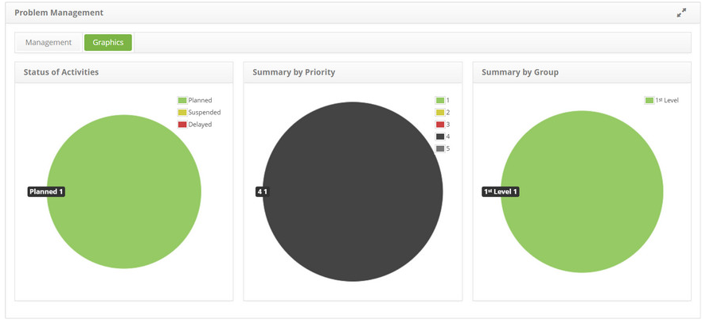

title: Problem graph visualization
Description: Problem graph visualization

# Problem graph visualization

How to access
------------

1.  Access problem graphing functionality by navigating the main menu **Process Management > Problem Management > Problem Management**.

Acessing graphics
------------------

1.  Click on the **Graphs** tab and the information of the problem records by situation (in progress, suspended and delayed), by priority and by executor group will be displayed, these being shown in graphs as shown in the figure below:

   

**Figure 1 - Problem Graphs screen**

!!! tip "About"

    <b>Product/Version:</b> CITSmart | 8.00 &nbsp;&nbsp;
    <b>Updated:</b>08/28/2019 – Anna Martins
