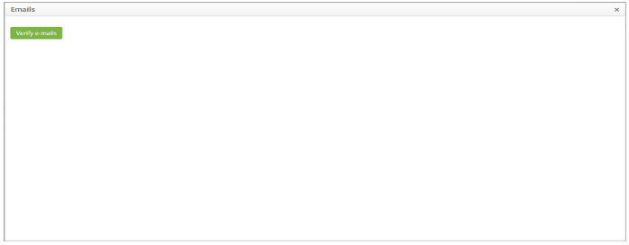
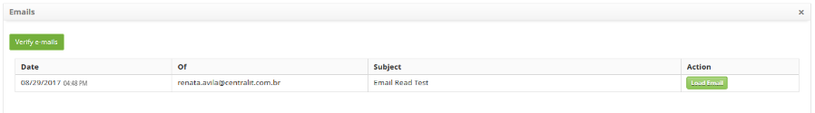

title: Registering problems via e-mail reading
Description: This feature allows you to log a problem by reading e-mail.

# Registering problems via e-mail reading

This feature allows you to log a problem by reading e-mail.

How to access
-------------

1.  Access the main menu **Process Management > Problem Management > Problem
    Management**.

Preconditions
-------------

1.  Register contract (see knowledge [Contract registration and search][1]);

2.  Register unit (see knowledge [Unit registration and search][2]);

3.  Register applicant (collaborator) (see knowledge [Staff registration and search][3]);

4.  Group membership (see knowledge [Group registration and search][4]);

5.  Enter category of problem, which should have the link with the flow
    referring to the problem (see knowledge [Problem category registration and
    search][5]);

6.  Link unit to contract so that the drive is listed on the problem log screen
    (see knowledge [How to relate unit to contract?][6]);

7.  Define the flow related to problem management (see knowledge [Workflow maintenance][7]);

8.  Register the executor group;

9.  Create the problem template;

10. Link the group to the contracts, associating the applicants (collaborators)
    already registered to this group, so that the contracts and related
    applicants are listed on the problem log screen. If it is necessary to
    create a new employee, it is necessary to include it in the group of the
    applicant in which it is related to the contract so that it can register a
    problem, that is, to have its name listed on the problem registration screen
    (see knowledge [How to relate group to contract?][8]);

11. The following parameters have to be configured: 23, 24, 25, 26, 27, 28 e 72
    (see knowledge [Paramerization rules-E-mail][9]).

Filters
-------

1.  No applicable.

Itens list
----------

1.  No applicable.

Filling in the registration fields
----------------------------------

1.  After the configured parameters, in the **Problem Management** screen click
    the *New Problem* button. The **Problem Registration** screen appears, enter
    the contract for which the problem registration will be made, and click
    the *E-mails* button located at the top of the problem log screen as shown
    in the figure below:

    
   
    **Figure 1 - Selection of reading e-mails**

2.  A screen will appear to check incoming e-mails, as shown in the figure
    below:

    
  
    **Figure 2 - E-mail reading screen**

   -   Click the *Verify E-mails* button. The e-mails will be displayed, as shown
    in the figure below:

   
   
   **Figure 3 - Reading e-mails**

   -   Click the *Load E-mail* button, which allows the problem to be created based
    on the chosen e-mail;

   -   If the sender of the chosen e-mail is a collaborator registered in the
    system, after clicking on the *Load E-mail* button, the fields **Applicant,
    Contact Name, E-mail, Unit and Source** will be filled automatically with
    the information regarding the employee, as Shown in the figure below. But if
    the sender is not a registered employee in the system, he/she must fill in
    the fields with the necessary information;

   -   Regardless of whether or not the sender is a registered employee in the
    system, the **Description** field will be populated with the contents of the
    e-mail, after clicking on the *Load E-mail* button, as shown in the figure
    below:

   
   
   **Figure 4 - Problem registration screen**

   -   Record the remaining information of the problem and click the *Save* button
    to register, where the date, time and user will be saved automatically for a
    future audit;

   -   A message confirming the success of the problem registration appears.

!!! note "NOTE"

    When registering a problem by reading e-mail, the chosen e-mail will not
    appear again in the e-mail list.

[1]:/en-us/citsmart-platform-7/additional-features/contract-management/use/register-contract.html
[2]:/en-us/citsmart-platform-7/plataform-administration/region-and-language/register-unit.html
[3]:/en-us/citsmart-platform-7/initial-settings/access-settings/user/employee.html
[4]:/en-us/citsmart-platform-7/initial-settings/access-settings/user/group.html
[5]:/en-us/citsmart-platform-7/processes/problem/category.html
[6]:/en-us/citsmart-platform-7/processes/tickets/relate-unit.html
[7]:/en-us/citsmart-platform-7/workflow/workflow-management.html
[8]:/en-us/citsmart-platform-7/processes/tickets/relate-group.html
[9]:/en-us/citsmart-platform-7/plataform-administration/parameters-list/parametrization-email.html

!!! tip "About"

    <b>Product/Version:</b> CITSmart | 8.00 &nbsp;&nbsp;
    <b>Updated:</b>08/29/2019 – Anna Martins
