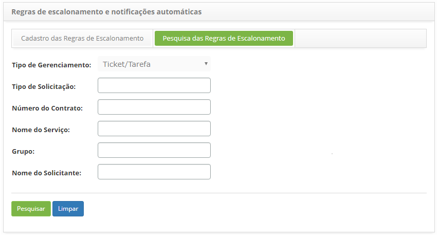
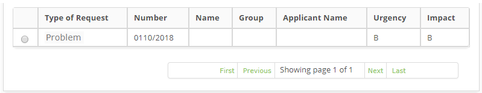
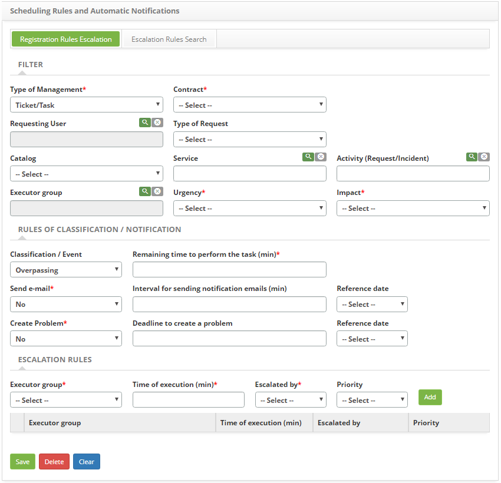

title: Registration and search of rules for scheduling of a problem

Description: Registration and search of rules for scheduling of a problem

\# Registration and search of rules for scheduling of a problem

How to access
-------------

1.  Access the main menu **ITIL Processes > Problem Management > Escalation
    Rules**.

Preconditions
-------------

1.  In the citsmart.cfg file, you have set
    the **START_MONITORA_INCIDENTES** property to the parameter **TRUE**.

2.  Enter the content below into the parameter (see knowledge [Parameterization
    rules - ticket][1]);

-   Parameter 190: with the value Y

1.  Have the contract registered (see knowledge [Contract registration and
    search][2]);

2.  Have the staff registered (see knowledge [Staff registration and
    search][3]);

3.  Have the group registered (see knowledge [Group registration and
    search][4]);

4.  Have the service portfolio defined (see knowledge [Service Portfolio
    registration][5]).

Filters
-------

1.  The following filters enables the user to restrict the participation of
    items in the standard feature listing, making it easier to find the desired
    items:

   -   Type of Management;

   -   Type of Request;

   -   Contrac Number;

   -   Service name;

   -   Group;

   -   Applicant Name.

2.  Click on the **Scheduling Rules Search** tab, the search screen will be
    displayed, as shown in the figure below:

   

   **Figure 1 - Scheduling rules search screen**

3.  Perform scoping rule record search;

    -   Enter the type of management, type of request, contract number, service
        name, group and/or name of the requester for the scheduling rule you
        want to search for and click the *Search* button. After this, the
        scheduling rules record will be displayed according to the given data
        (s).

    -   If you want to list all the scheduling rule records, simply click
        the *Search* button directly.

Items list
----------

1.  The following cadastral fields are available to the user to facilitate the
    identification of the desired items in the standard feature listing: **Type
    of Request, Contract Number, Service name, Group, Applicant Name,
    Urgency **and** Impact.**

   
   
   **Figure 2 - Items list screen**

2.  After searching, select the desired record. Once this is done, you will be
    directed to the registration screen displaying the contents of the selected
    record.

Filling in the registration fields
----------------------------------

1.  Once this is done, the **Scheduling Rules Master **screen will be displayed,
    as shown in the figure below:

   
   
   **Figure 3 - Scheduling rules master screen**

2.  Fill in the fields as directed below:

   a. Enter Filters data:

   -   **Type of Management **: select the "Request" option for which the rule will
    be applied;

   -   **Contract**: select the contract;

   -   **Requesting User**: report or applicant, if you wish to filter by
    applicant;

   -   **Type of request**: enter a request type if you want to filter by request
    type;

   -   **Catalog**: select the type of catalog, if you want to filter by catalog;

   -   **Service**: inform the catalog service, if you wish to filter by service;

   -   **Activity (Request/Incident)**: inform the type of service (Request or
    incident) to which the filter will be applied;

   -   **Executor group**: report an executor group, if you want to filter by
    executor group;

   -   **Urgency**: inform the level of urgency, if you wish to filter by degree of
    urgency;

   -   **Impact**: enter the impact level if you wish to filter by impact level.

   b. Enter Classification/Notification Rule data:

   -   **Classification/Event: **select the desired option to be sent notification
    to the person in charge:

   -   If the option selected is "Winning", the field "Remaining time for
        execution (min)" will be enabled. Enter the time, in minutes, that must
        remain for the end of the activity from the creation date to be sent a
        notification;

   -   If the option selected is "SLA Percentage", the field "Value (%)" will
        be enabled. Report, in percentage, how long the SLA of the activity must
        be to be sent a notification;

   -   **Send e-mail**: enable this option if you want to send notification
    messages via e-mail to the requesting user of the activity;

   -   **Interval for sending notification e-mails (min)**: inform the time, in
    minutes, that the user will be informed by e-mail of the occurrences of the
    selected items;

   -   **Reference date**: enter the reference date for sending the e-mail;

   -   **Create Problem**: enable this option if you want to launch a problem type
    occurrence, obeying the deadline for creating a problem;

   -   **Deadline to create a Problem (min)**: enter the deadline, in minutes, that
    the system will issue a problem type instance, provided the Create Problem
    field is enabled;

   -   **Reference date**: enter the reference date for creating the problem.

   c. Enter the data of the Scheduling Rules:

   -   **Executor Group**: inform to which group will be scaled the items filtered
    by the scheduling rule;

   -   **Time of execution (min)**: define when to schedule the filtered items to
    the Executor Group informed;

   -   **Escalated By**: define the date of the activity that will be used to
    calculate the execution time for scheduling;

   -   **Priority**: set escalation priority;

   -   Click *Add* to insert the escalation rule.

3.  After the data is entered, click on the *Save* button to register, where the
    date, time and user will be saved automatically for a future audit.

[1]:/en-us/citsmart-platform-7/plataform-administration/parameters-list/parametrizaion-ticket.html
[2]:/en-us/citsmart-platform-7/additional-features/contract-management/use/register-contract.html
[3]:/en-us/citsmart-platform-7/initial-settings/access-settings/user/employee.html
[4]:/en-us/citsmart-platform-7/initial-settings/access-settings/user/group.html
[5]:/en-us/citsmart-platform-7/processes/portfolio-and-catalog/register.html

!!! tip "About"

    <b>Product/Version:</b> CITSmart | 8.00 &nbsp;&nbsp;
    <b>Updated:</b>08/29/2019 – Anna Martins
