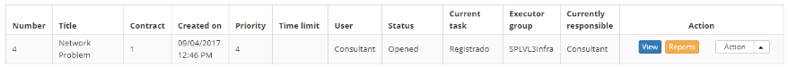
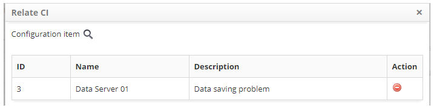
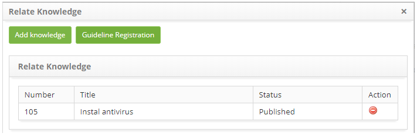
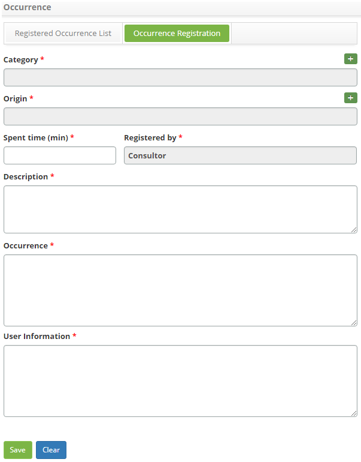

title: Problem execution
Description: Esta funcionalidade permite realizar a execução de problema.

# Problem execution

This functionality allows you to perform the problem execution.

How to access
-------------

1.  Access the problem execution functionality by navigating the main
    menu **Process Management > Problem Management > Problem
    Management**.

Preconditions
-------------

1.  Have problem registered (see knowledge [Problem registration][1]).

Filters
-------

1.  The following filter enables the user to restrict the participation of items
    in the standard feature listing, making it easier to find the desired items:

-   Problem Number.

**Figure 1 - Problem search screen**

Items list
----------

1.  The following cadastral fields are available to the user to facilitate the
    identification of the desired items in the standard listing of the
    functionality: Number, Title, Contract, Created on, Priority, Time
    limit, User, Status, Current Task, Executor Group and Current
    Responsible.

2.  There are action buttons available to the user in relation to each item in
    the listing, they are: *View*, *Reports* and *Action*.

**Figure 2 - Problem listing screen**

Executing problem
-----------------

!!! note "NOTE"

    In this step, the problem classification is performed and will designate
    the appropriate area to treat the problem according to the IT Service
    Catalog.

!!! info "IMPORTANT"

    You should link the problem to existing incidents and record the problem
    to make it easier to prioritize troubleshooting. Evaluate the impact on the
    business and determine the urgency of the solution. This assessment
    determines the classification of the problem.

!!! info "IMPORTANT"

    You must ensure that all information necessary for investigation and
    diagnosis is recorded in the problem.

!!! info "IMPORTANT"

    The task execution actions will only be allowed to users that are
    contained within the execution grou.

1.  Access the problem execution functionality by navigating the main
    menu **Process Management > Problem Management > Problem
    Management**. On the Management tab, locate the problem log that you want to
    log the task execution to, click the *Action*button and the *Start/Run
    Task* option, as shown in the image below:

   
   
   **Figure 3 - Problem management screen**

2.  The Problem Log screen appears with the fields filled in, with the contents
    of the selected record;

3.  In the **Closure** frame, record the information needed to complete the
    task;

-   Click the *Add an Execution Register* button;

-   Please describe the information about the issue.

Linking configuration items to the problem
------------------------------------------

1.  Enter the configuration items (CIs) affected by the problem:

   -   Click the **Processes/Options** tab, and then click **Configuration Items**,
    located on the right-hand corner of the screen, as shown in the figure
    below:

   
   
   **Figure 4 - Selection of configuration items**

   -   The configuration item relationship screen will be displayed. Click the
    icon  to add the configuration item;

   -   The window for searching for configuration items will be displayed. Perform
    the search, select the configuration item for the problem;

   -   A window will be displayed to briefly describe the problem of the
    configuration item. Describe the problem and click *OK* to complete the
    operation. After this, the configuration item will be related to the
    problem;

   
   
   **Figure 5 - Configuration item relationship to problem**

   -   If you want to remove a configuration item that was related to the change
    request, simply click on the change icon .
    

Linking a knowledge to the problem
----------------------------------

1.  Relate knowledge about the problem:

   -   Click on the Processes/Options tab and then on Knowledge Base, located in
    the right corner of the screen, as shown in the figure below:

   
   
   **Figure 6 - Knowledge base selection**

   -   Click the *Add Knowledge* button to add knowledge;

   -   A window for knowledge search will be displayed. Perform the survey and
    select the knowledge. Once this is done, knowledge will be related to the
    problem;

   
   
   **Figure 7 - Knowledge relationship to problem**

   -   If you want to create a new knowledge about the problem, just click the
    Knowledge Registry button;

   -   If you want to remove a related knowledge, simply click on the icon  .

Linking attachments
-------------------

1.  If you want to attach a file to the problem, proceed as follows:

   -   Click the **Attachments** tab, located in the upper right corner of the
    screen, as shown in the figure below:

   

   **Figure 8 - Selection of attachments**

   -   The file attachment screen is displayed, as shown in the figure below:

   
   
   **Figure 9 - Attachments screen**

-   Click the *Choose File* button and select the desired file;

-   Enter the description of the file and click the *Add* button;

-   After adding the file, click the *Close* button to return to the problem log
    screen.

Linking occurrence to the problem
---------------------------------

1.  If you want to insert an instance of the problem log, proceed as follows:

   -   Click the **Occurrence** tab, located in the upper right corner of the
    screen, as shown in the figure below:

   
   
   **Figure 10 - Selection of occurrence**

   -   The **Occurrences** screen containing two tabs will be displayed, one for
    displaying the list of recorded occurrences and another for recording new
    occurrences. Click on the **Register of Occurrences** tab and fill in the
    fields as below:

   
   
   **Figure 11 - Occurrence record**

   -   **Category**: select the category of the occurrence. If the category is not
    found, it is possible to perform a quick registration by clicking the
    Category icon ;

   -   **Origin**: select the source of the occurrence. If the source is not
    found, you can perform a quick registration by clicking the Source icon ;

   -   **Spent time (min)**: report the time spent in minutes;

   -   **Registered by**: automatically populated by the user who is running the
    activity;

   -   **Description**: report the description of the occurrence;

   -   **Occurrence**: report the occurrence;

   -   **User Information**: describe the contact information;

   -   After the data has been entered, click on the *Save* button to perform the
    operation, where the date, time and user will be saved automatically for a
    future audit;

   -   A message confirming the success of the operation will be displayed and will
    return to the problem log screen.

2.  After recording the information of the execution of the problem task, click
    on the button *Save and Forward*, to carry out the operation, where the
    problem will be sent to the investigation and diagnostic phase;

3.  If you want to save only the logged information about running the problem
    task and keep the current task, click the *Save and Keep the Current
    Task* button;

4.  In both cases above, clicking the *Save* button will automatically record
    the date, time and user for a future audit.

[1]:/en-us/citsmart-platform-7/processes/problem/register-problem.html

!!! tip "About"

    <b>Product/Version:</b> CITSmart | 8.00 &nbsp;&nbsp;
    <b>Updated:</b>08/28/2019 – Anna Martins
    
