title: Conducting investigation and problem diagnosis
Description: This functionality is intended to investigate and diagnose a problem.

# Conducting investigation and problem diagnosis

This functionality is intended to investigate and diagnose a problem.

How to access
-------------

1.  Access the problem investigation and diagnosis functionality by navigating
    the main menu **Process Management > Problem Management > Problem
    Management**.

Preconditions
-------------

1.  Have problem registered (see knowledge [Problem
    registration][1]).

Filters
-------

1.  The following filter enables the user to restrict the participation of items
    in the standard feature listing, making it easier to find the desired items:

    - Description

    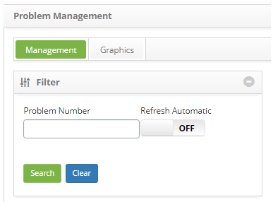

    **Figure 1 - Problem search screen**

Items list
----------

1.  The following cadastral fields are available to the user to facilitate the
    identification of the desired items in the standard listing of the
    functionality: Number, Title, Contract, Created on, Priority, Time
    limit, User, Status, Current Task, Executor Group and Current
    Responsible.

2.  There are action buttons available to the user in relation to each item in
    the listing, they are: *View*, *Reports* and *Action*.

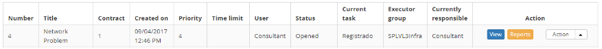

**Figure 2 - Problem listing screen**

Filling in the registration fields
----------------------------------

1.  No applicable.

Conducting investigation and problem diagnosis
----------------------------------------------

In this stage, the investigation of the problem and the diagnosis of the main
cause is carried out. All available resources and problem-solving techniques
will be used to identify the root cause, the identified failure, and a solution.

!!! info "IMPORTANT"

    The group member assigned to conduct the investigation and diagnosis must capture the problem and start the activity.

1.  On the **Management** tab, locate the problem log that you want to log the
    investigation and diagnosis, click the *Action* button and select
    the *Start/Execute task* option, as indicated in the image below:

    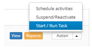
    
    **Figure 3 - Problem management screen**

2.  The **Problem Log** screen will appear with the fields filled, with the
    contents of the problem selected;

3.  Consult the knowledge base to obtain the knowledge needed to solve the
    problem;

4.  Click the **Knowledge Base** tab, located in the upper right corner of the
    screen, as shown in the figure below:

    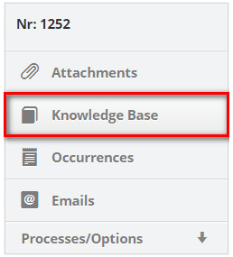
    
    **Figure 4 - Knowledge base guide**

    -   The knowledge base query screen will be displayed to perform the necessary
    knowledge search, as shown in the figure below:

    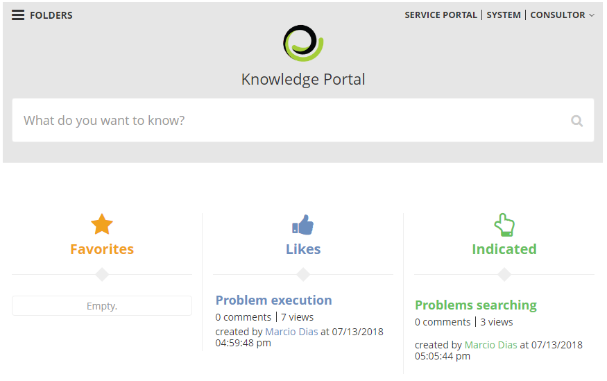
    
    **Figure 5 - Knowledge base**

5.  Record information about the evaluation and diagnosis of the problem:

    -   Click on the **Processes/Options** tab and then on **Evaluation and
    Diagnosis**, located in the right corner of the screen, as indicated in the
    figure below:

    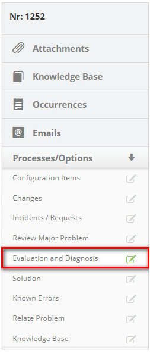
    
    **Figure 6 - Assessment and diagnosis guide**

    -   The evaluation and diagnosis registration screen is displayed, as shown in
    the figure below:

    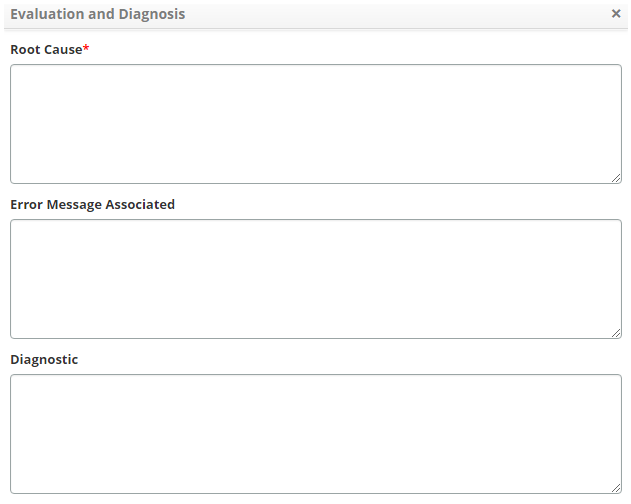
    
    **Figure 7- Evaluation and diagnostic record**

    -   **Root Cause**: tell the main cause of the problem;

    -   **Error Message Associated**: describe the error message associated with the
    problem;

    - **Diagnosis**: describe the diagnosis of the problem.

6.  Inform the change if necessary to solve the problem:

    - Click on the **Processes/Options** tab and then on **Changes**, located in the right corner of the screen, as indicated in 
    the figure below:

   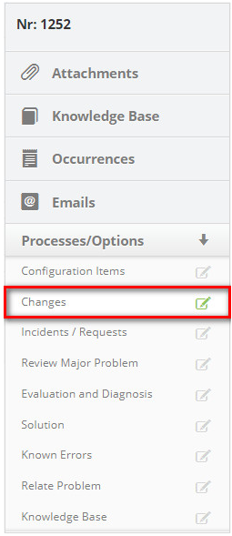
   
   **Figure 8 - Change guide**

   -   Click on the icon  to search for the change that will be made to solve the
    problem;

   -   A change search screen will be displayed. Perform the search and select the
    desired change. After this, the change will be related to the problem

   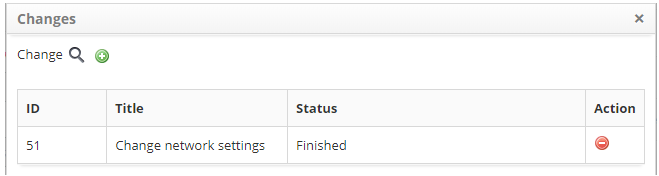
   
   **Figure 9 - Change relationship screen**

- If you want to remove a change that was related to solve the problem, just click the change icon
.

- If you do not find the change and need to register a change request, you can register it in the system from this 
screen, just click the change icon .

7.  After recording the evaluation and diagnostic information, inform the
    workaround solution:

    !!! info "IMPORTANT"

        A boundary solution should be temporary until a definitive solution to the problem is found.

   -   Click the **Processes/Options** tab, and then click **Solution**, located on
    the right-hand corner of the screen, as shown in the figure below:

   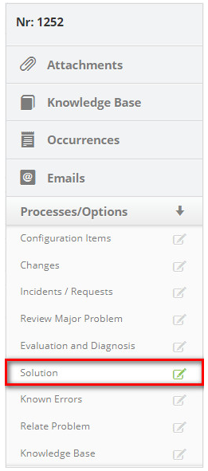
   
   **Figure 10 - Solution guide**

   -   The solution registration screen is displayed, as shown in the figure below:

   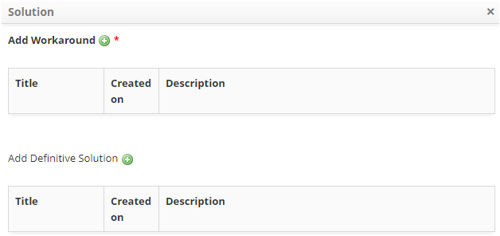
   
   **Figure 11 - Workaround solution problem solution record**

   -   Click the workaround solution icon  to record the information for a
    corkaround;

   -   A screen will appear to record the information of the workaround solution;

       -   **Title**: define the title of the boundary solution;

       -   **Description**: describe the proposed corkaround;

       -   After the data has been entered, click the *Save* button to register the
        corkaround information, where the date, time and user will be
        automatically saved for a future audit.

   -   If you have a definitive solution to the problem, click the definitive
    solution icon  to record the information for a definitive solution;

   -   A screen will be displayed to record the final solution information;

       -   **Title**: define the title of the final solution;

       -   **Description**: describe the proposed final solution;

       -   After the data is entered, click on the *Save* button to register the
        final solution information, where the date, time and user will be saved
        automatically for a future audit.

8.  After recording the investigation information and diagnosing the problem,
    click on the button *Save and Forward Flow*, to carry out the operation,
    where the problem will be referred to the phase of recording the known
    error;

9.  If you want to save only the recorded information about the investigation
    and diagnosis of the problem and keep the current task, click the *Save and
    Keep the Current Task*;

!!! note "NOTE"

    In both previous cases, when you click on the Save button the date, time
    and user will be automatically stored.

[1]:/en-us/citsmart-platform-7/processes/problem/register-problem.html

!!! tip "About"

    <b>Product/Version:</b> CITSmart | 8.00 &nbsp;&nbsp;
    <b>Updated:</b>08/28/2019 – Anna Martins
