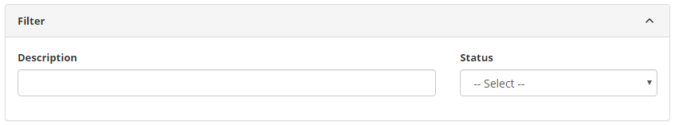

title: Problem justification registration and search
Description: This functionality is intended to record the justifications for problems that will be used in other system routines.

# Problem justification registration and search

This functionality is intended to record the justifications for problems that
will be used in other system routines.

How to access
-------------

1.  Access the Problem Justification feature by navigating the main
    menu **Process Management > Problem Management > Problem
    Justification**.

Preconditions
-------------

1.  No applicable.

Filters
-------

1.  The following filters enable the user to restrict the participation of items
    in the standard feature listing, making it easier to locate the desired
    items as shown in the figure below:

    - Description;

    - Status.

2.  On the Issue Rationale screen, click *Search*. Once this is done,
    the **Problem Justification** screen will be displayed, as shown in the
    following figure. In this screen, the justifications of problems registered
    for visualization are displayed.

    
   
    **Figure 1 - Problem justification search screen**

3.  To carry out the search for a problem justification, inform the description
    and/or situation of the same.

Items list
----------

1.  The following cadastral fields are available to the user to make it easier
    to identify the desired items in the standard feature
    list: **Description** and **Status;**

2.  There are action buttons available to the user for each item in the listing,
    they are: *Edit* and *Delete;*

    
   
    **Figure 2 - Items screen**

3.  After the search, the record will be displayed according to the data
    entered.

Filling in the registration fields
----------------------------------

1.  The **Problem Justification** screen will be displayed. Click
    the *New* button. Once this is done, the **Problem Justification
    Registration** screen will be displayed, as shown in the following figure:

    
   
    **Figure 3 - Problem justification registration screen**

2.  Fill in the fields as directed below:

    - **Description**: report the description of the problem justification;

    - **Suspension**: define whether the justification is for suspension of
        the problem;

    - **Status**: select the situation of the problem justification.

3.  After the data has been entered, click the *Save* button to register, where
    the date, time and user will be saved automatically for a future audit.

!!! tip "About"

    <b>Product/Version:</b> CITSmart | 8.00 &nbsp;&nbsp;
    <b>Updated:</b>08/28/2019 – Anna Martins
