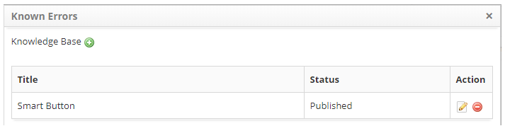

title: Known errors registration
Description: This feature lets you write the known error in the knowledge base.

# Known errors registration

This feature lets you write the known error in the knowledge base.

How to access
-------------

1.  Access the known error logon feature by navigating to the main menu **ITIL
    Processes > Problem Management > Problem Management**.

Preconditions
-------------

1.  Have a registered problem (see knowledge [Problem
    registration]([1]).

Filters
-------

1.  The following filter enables the user to restrict the participation of items
    in the standard feature listing, making it easier to find the desired items:

-   Problem Number.

 

**Figure 1 - Filters screen**

Items list
----------

1.  The following cadastral fields are available to the user to facilitate the
    identification of the desired items in the standard listing of the
    functionality: Number, Title, Contract, Created
    on, Priority, Time limit, User, Status, Current
    Task, Executor Group and Current Responsible.

2.  There are action buttons available to the user in relation to each item in
    the listing, they are: *View*, *Reports* and *Action*.

 

**Figure 2 - Problem listing screen**

Filling in the registration fields
----------------------------------

In this step, the proposed solution for known error correction is evaluated and
the known error log is recorded in the knowledge base, allowing support staff,
including Service Desk, to access the information to assist in the resolution of
incidents or problems

   !!! info "IMPORTANT"

      The group member assigned to register known errors must capture the
      problem and start the activity.

1.  On the **Management** tab, locate the problem record that you want to record
    the known error, click the *Action* button and select the *Start/Run
    Task* option, as shown in the image below:

   

   **Figure 3 - Problem management screen**

2.  The **Problem Registration** screen will appear with the fields filled, with
    the content of the problem selected;

3.  Record the information needed to perform the known error logging task;

    -   In the **Closure** frame, click the *Add an Execution Register* button
        and describe the information about the execution of your activity.

4.  Run a known error log in the knowledge base:

    -   Click the **Processes/Options** tab, and then **Known Errors**, located
        on the right-hand corner of the screen, as shown in the figure below:

    
   
   **Figure 4 - Selection of known errors**

5.  The known error screen is displayed. Click the icon and the Knowledge Base
    screen will appear to record the known error information;

    -   After saving the known error information, click the *Save* button to
        perform the operation and return to the screen of known errors;

    -   Record the necessary information about the known error;

    
   
   **Figure 5 - List of errors with known problems**

   -   To edit the known error information in the knowledge base, simply click on
    the knowledge base icon ;

   -   If you want to remove a known error related to the problem, simply click on
    the error icon .

6.  After recording the known error information, click the *Save and Forward
    Flow* button and advance the flow to perform the operation, where the
    problem will be sent to the resolution phase;

7.  If you want to save only the logged information about the known error and
    keep the current job, click the *Save and Keep the Current Task* button and
    keep the current task;

8.  In both cases above, clicking the *Save* button will automatically record
    the date, time, and user for a future audit.

[1]:/en-us/citsmart-platform-7/processes/problem/register-problem.html

!!! tip "About"

    <b>Product/Version:</b> CITSmart | 8.00 &nbsp;&nbsp;
    <b>Updated:</b>08/28/2019 – Anna Martins
