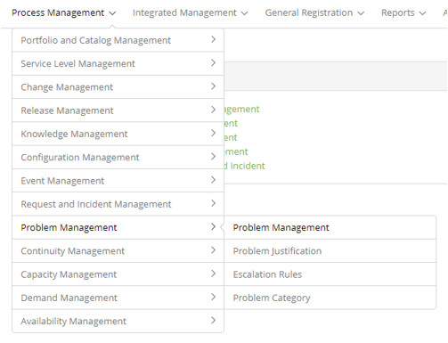

title: Problem management module
Description: Problem management module

# Problem management module

Module objective
----------------

The Problem Management process is responsible for the final resolution and
prevention of the flaws behind the incidents that affect the normal operation of
IT services.

According to ITIL, the main goal of Problem Management is to minimize the
adverse impact of incidents and problems caused by errors in the IT
infrastructure in the business and to prevent recurrence of these errors. This
process seeks to find the root cause of the problems and initiate the action
that will eliminate the error.

Where are the features
----------------------

To access the functionality click on the main menu **Process Management > Problem Management**.

**Figure 1 - Problem Management module menu**

Main feature (in highlight)
---------------------------

In the *See also* section you can access the main functionality(ies) of this
module, in order to obtain a more detailed knowledge.

!!! Abstract "KNOW MORE"

    Depending on your access permission, you can perform a series of actions on
    the problem logs, such as: viewing the problem log information, scheduling
    activity for the problem, catching the problem for resolution, suspending
    the problem response, reactivating the problem, Problem that was suspended
    for attendance, canceling problem registration, performing the attendance of
    the problem and among others.

See also
--------

- [Problem registration](/en-us/citsmart-platform-7/processes/problem/register-problem.html)

!!! tip "About"

    <b>Product/Version:</b> CITSmart | 7.00 &nbsp;&nbsp;
    <b>Updated:</b>08/30/2019 - Anna Martins
