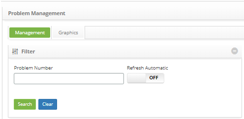
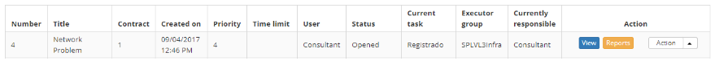
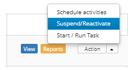

title: Problem reactivation
Description: This feature allows you to re-enable a problem that has been suspended.

# Problem reactivation

This feature allows you to re-enable a problem that has been suspended.

How to access
-------------

1.  Access the problem reactivation feature by navigating the main
    menu **Process Management > Problem Management > Problem
    Management**.

Preconditions
-------------

1.  Have problem registered (see knowledge [Problem registration][1]).

Filters
-------

1.  The following filter enables the user to restrict the participation of items
    in the standard feature listing, making it easier to find the desired items:

-   Problem number.

**Figure 1 - Filters screen**

Items list
----------

1.  The following cadastral fields are available to the user to facilitate the
    identification of the desired items in the standard listing of the
    functionality: Number, Title, Contract, Created on, Priority, Time
    limit, User, Status, Current Task, Executor Group and Current
    Responsible.

2.  There are action buttons available to the user in relation to each item in
    the listing, they are: *View*, *Reports* and *Action*.

**Figure 2 - Problem listing screen**

Filling in the registration fields
----------------------------------

1.  Not applicable.

Reactivating a problem
----------------------

1.  On the **Management** tab, locate the problem record that you want to
    re-enable, click the *Action* button and the *Reactivate* option, as shown
    in the image below:

   
   
   **Figure 3 - Problem management screen**

2.  A message will be displayed to confirm reactivation. Click *OK* to perform
    the operation. The problem status will be updated in the trouble log list.

[1]:/en-us/citsmart-platform-7/processes/problem/register-problem.html

!!! tip "About"

    <b>Product/Version:</b> CITSmart | 8.00 &nbsp;&nbsp;
    <b>Updated:</b>08/28/2019 – Anna Martins

