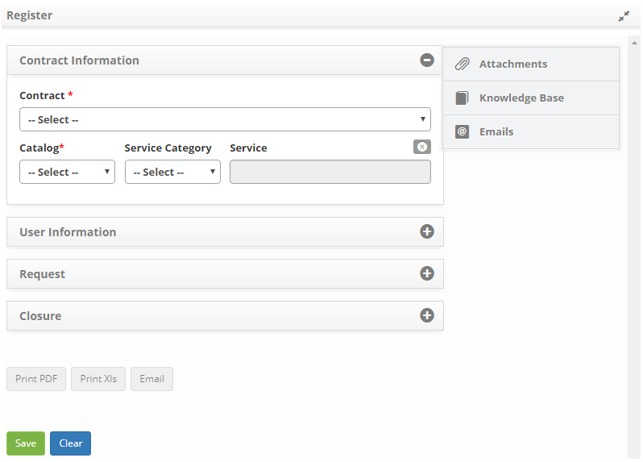
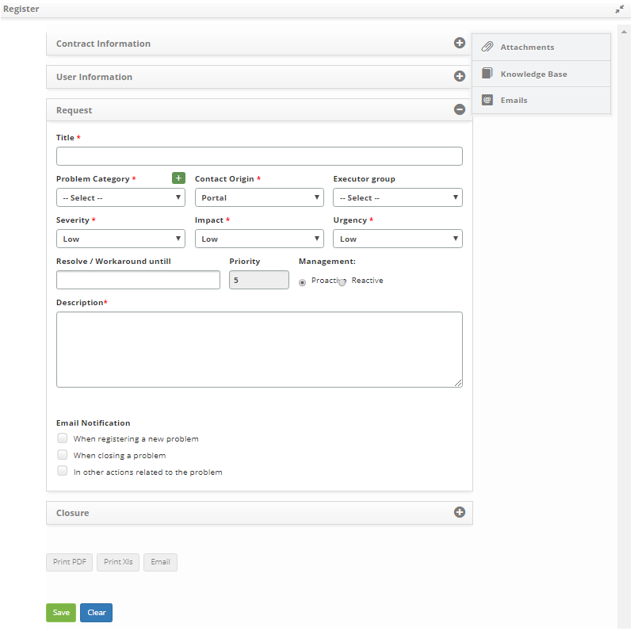
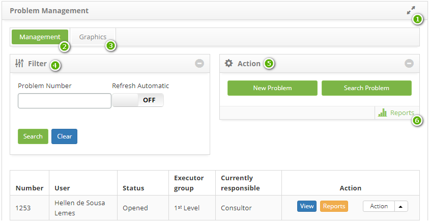

title: Problem registration
Description: This feature is intended to register a problem.

# Problem registration

This feature is intended to register a problem.

How to access
-------------

1.  Access problem logging functionality by navigating the main menu **ITIL
    Processes > Problem Management > Problem Management**. On the **Problem
    Management** tab, click the *New Problem* button.

Preconditions
-------------

1.  Register contract (see knowledge [Contract registration and
    search][1]);

2.  Register unit (see knowledge [Unit registration and
    search][2]);

3.  Register applicant (collaborator) (see knowledge [Staff registration and
    search][3]);

4.  Group membership (see knowledge [Group registration and
    search][4]);

5.  Enter category of problem, which should have the link with the flow
    referring to the problem (see knowledge [Problem category registration and
    search][5]);

6.  Link drive to contract so that the drive is listed on the problem log screen
    (see knowledge [How to relate unit to
    contract?][6]);

7.  Define the flow related to problem management (see knowledge [Workflow
    maintenance][7]);

8.  Register the executor group;

9.  Create the problem template;

10. Link the group to the contracts, associating the applicants (collaborators)
    already registered to this group, so that the contracts and related
    applicants are listed on the problem log screen. If it is necessary to
    create a new employee, it is necessary to include it in the group of the
    applicant in which it is related to the contract so that it can register a
    problem, that is, to have its name listed on the problem registration screen
    (see knowledge [How to relate group to contract?][8]).

Filters
-------

1.  No applicable.

Items list
----------

1.  No applicable.

Filling in the registration fields
----------------------------------

1.  The respective **Problem Registration** screen will be displayed, containing
    a series of steps to follow to complete the registration:

2.  Record the contract information, as indicated below:

   
   
   **Figure 1 - Problem registration screen**

   -   **Contract**: select the contract for which the problem log will be made;

   -   **Catalog**: if you have selected a "contract" type contract, the "Business"
    service catalog information will be displayed in this field and if you have
    selected a contract of type "support contract" or "operational level
    agreement" it will appear In this field the information of the "Technical"
    Service Catalog;

   -   **Service Category**: if you choose to search for services by category,
    select the category of service you want. The service category will identify
    the nature of the service, positioning it within similar groups of service,
    placing it in the hierarchy of its category;

   -   **Service**: select the service for the service catalog. If the service
    catalog is "business", business services will be available in this field for
    selection, but if the service catalog is "technical", the support/technical
    services for selection will be available in this field.

2.  Record the information of the applicant, as indicated below:

   
   
   **Figure 2 - Problem registration screen**

   -   **User**: inform the applicant, that is, the person who is requesting the
    resolution of the problem identified;

   -   **Username**: enter the name of the contact;

   -   **E-mail**: enter the e-mail address of this contact;

   -   **Phone**: enter area code and contact phone number;

   -   **Extension**: enter the extension number of the contact, if any;

   -   **Unit**: select the unit on which the requestor is allocated;

   -   **Location**: enter the location of the unit;

   -   **Observation**: describe the additional details about the contact, if
    necessary.

3.  Record the request information, as indicated below:

   
   
   **Figure 3 - Problem registration screen**

   -   **Title**: set the title for the problem that occurred;

   -   **Problem Category**: enter the category of the problem. This category must
    already be previously registered in the system so that you can select it. If
    the desired category is not found you can register by clicking on the
    category icon problem .

    

   -   **Contact Origin: **enter the source, that is, the source of the problem
    resolution request;

   -   **Executor Group**: inform the group responsible for solving the problem;

   -   **Severity**: define the severity of the problem, that is, the complexity to
    solve the problem;

   -   **Impact**: point out the impact that the problem causes to the business;

   -   **Urgency**: report urgency to solve the problem;

   -   **Resolve/Workaround until**: set the deadline for solving the problem;

   -   **Priority**: is defined after reporting impact and urgency. Priority is
    used to identify the relative importance of the problem and to identify the
    times required for appropriate action to be taken. The priority is from 1 to
    5, with 1 being the highest priority and 5 being the lowest.

   
   
   **Figure 4 - Impact and urgency matrix**

4.  The combination of this information will define the priority needed to
    address the problem.

   -   Management: enter the type of problem management:

       -   **Proactive**: Proactive Problem Management for the prevention of the
        occurrence of Incidents. Worries about preventing incidents from
        occurring. Responsible for addressing similar issues before they happen,
        ensuring that such scenarios are addressed as well;

       -   **Reactive**: from the Incident Management process. Worries about
        solving problems in response to one or more incidents. Performs incident
        review and analysis to identify which groups should be addressed and
        what actions are required to address them;

       -   **Description**: describes the problem with details. This description
        must be objective, including all information necessary to solve the
        problem.

Linking attachments
-------------------

1.  If you want to attach a file to the problem log, do the following:

   -   Click the **Attachments** tab, located in the upper right corner of the
    screen, as shown in the figure below:

   
   
   **Figure 5 - Attachments Guide**

   -   The file attachment screen is displayed, as shown in the figure below:

  
  
  **Figure 6 - Attachments screen**

   -   Click the *Choose File* button and select the desired file;

   -   Enter the description of the file and click the *Add* button;

   -   After adding the file, click the *Close* button to return to the problem log
    screen.

Linking knowledge base
----------------------

1.  If you need to access the knowledge base to verify knowledge about the
    problem, proceed as follows:

   -   Click the **Knowledge Base** tab, located in the upper right corner of the
    screen, as shown in the figure below:

   
   
   **Figure 7 - Knowledge Base Guide**

   -   The Knowledge Base query screen will be displayed as shown in the figure
    below:

   
   
   **Figure 8 - Knowledge Base**

2.  After the data is entered, click the *Save* button to register, where the
    date, time and user will be saved automatically for a future audit;

3.  You will see a message confirming the success of the problem
    registration:

**Figure 9 - Problem record confirmation**

Overview of main screen functions
---------------------------------

**Figure 10 - Problem management screen**

- **1**   : extends the Problem Management screen;

- **2**: Management - the records of problems for service and management are
    presented;

- **3** Graphs - graphs information of problems by situation (in progress,
    suspended and delayed), by priority and by group;

- **4** Filters - displays filters for trouble log search;

- **5** Actions - allows you to register a new problem and perform an advanced
    problem search;

- **6** Reports - displays dynamic reports related to problem management.

[1]:/en-us/citsmart-platform-7/additional-features/contract-management/use/register-contract.html
[2]:/en-us/citsmart-platform-7/plataform-administration/region-and-language/register-unit.html
[3]:/en-us/citsmart-platform-7/initial-settings/access-settings/user/employee.html
[4]:/en-us/citsmart-platform-7/initial-settings/access-settings/user/group.html
[5]:/en-us/citsmart-platform-7/processes/problem/category.html
[6]:/en-us/citsmart-platform-7/processes/tickets/relate-unit.html
[7]:/en-us/citsmart-platform-7/workflow/workflow-management.html
[8]:/en-us/citsmart-platform-7/processes/tickets/relate-group.html

!!! tip "About"

    <b>Product/Version:</b> CITSmart | 8.00 &nbsp;&nbsp;
    <b>Updated:</b>08/28/2019 – Anna Martins
