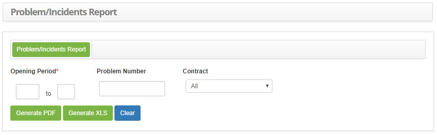
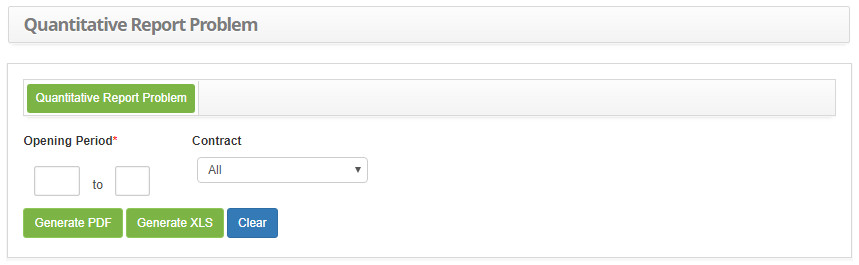
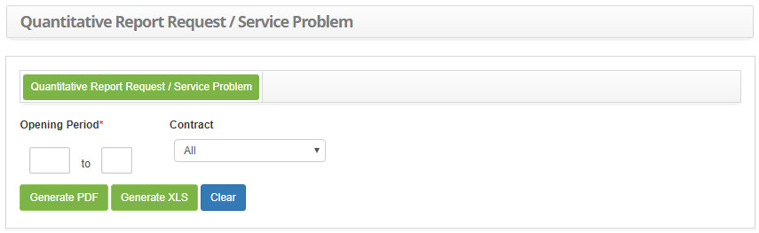

title: Report generation – Problem management
Description: Report generation – Problem management

# Report generation – Problem management

The following topics report on problem management:

-   Problem/Incident Report;

-   Quantitative Problem Report;

-   Quantitative Service Request/Problem Report.

In all cases there are export options:

-   Click the *Generate PDF* button to generate the problem / incident report in
    PDF format.

-   Click the *Generate XLS* button to generate the problem / incident report in
    Excel format.

Generating problem/incident report
----------------------------------

*This report is intended to present incidents related to the problem*.

### How to access

1.  Access Problem/Incident Reporting functionality by navigating the main
    menu **Reports > Problem Management > Problem/Incidents**.

### Filters

1.  The following filter enable the user to restrict the participation of items
    in the standard feature listing, making it easier to locate the desired
    items as shown in the figure below:

    - **Opening Period**: Enter the period you want to check for incidents related to the problem;

    - **Problem Number**: Enter the problem identification number to verify the related incidents;

    - **Contract**: Report the contract regarding the problem, if necessary.

2.  The **Problem/Incident Report** screen will be displayed, as shown in the
    following figure:

    
   
    **Figure 1 - Problem / Incident report generation screen**

3.  Set the filters as needed.

Generating quantitative problem reporting
-----------------------------------------

*This report aims to show how many problems have occurred*.

### How to access

1.  Access the Quantitative Problem Report feature by navigating the main
    menu **Reports > Problem Management > Quantitative Problem**.

### Filters

1.  The following filter enable the user to restrict the participation of items
    in the standard feature listing, making it easier to locate the desired
    items as shown in the figure below:

    - **Opening Period**: Enter the period you want to generate the quantitative problem report;

    - **Contract**: Select the contract, if you want to check the amount of registered issues related to the contract.

2.  The **Quantitative Problem Report Generation** screen will be displayed, as
    shown in the following figure:

    
   
    **Figure 2 - Quantitative problem report generation screen**

3.  Set the filters as needed.

Generating quantitative service request/problem report
------------------------------------------------------

*This report aims to present the number of requests and problems that have been
recorded, per service.*

### How to access

1.  Access the Quantitative Service Request/Problem Report feature by navigating
    the main menu **Reports > Problem Management > Request/Problem per
    Service**.

### Filters

1.  The following filter enable the user to restrict the participation of items
    in the standard feature listing, making it easier to locate the desired
    items as shown in the figure below:

    - **Opening Period**: Inform the desired period to verify the quantity of requests and registered problems, per service;

    - **Contract**: Enter the contract to check the amount of requests and related service issues.

2.  The **Quantitative Service Request / Problem Report Generation** screen will
    be displayed, as shown in the following figure:

    
   
    **Figure 3 - Quantitative report of service/problem generation screen**

3.  Set the filters as needed.

!!! tip "About"

    <b>Product/Version:</b> CITSmart | 7.00 &nbsp;&nbsp;
    <b>Updated:</b>08/30/2019 - Anna Martins
